<div align="center">


# BLogic MCU — TEKNOFEST 2026 Chip Design Competition

### Microcontroller Design Category — Final Submission

</div>

> **Team:** BLogic Mikroelektronik — Ostim Technical University
> **Members:** Berk Muammer Kuzu, Berkin Demircan
> **Application ID:** 772759
> **Repository:** `2026_Cip-Tasarim-Yarismasi-2026_Ostim-BLogic-Mikroelektronik-2026_Ostim-Teknik-Universitesi`

---

<p align="center">
  
</p>

## Table of Contents

1. [Overview](#1-overview)
2. [Key Features](#2-key-features)
3. [System Architecture](#3-system-architecture)
4. [Memory Map](#4-memory-map)
5. [Peripheral Register Map](#5-peripheral-register-map)
6. [Interrupt Map](#6-interrupt-map)
7. [Repository Structure](#7-repository-structure)
8. [Prerequisites & Toolchain Installation](#8-prerequisites--toolchain-installation)
9. [Build & Simulation](#9-build--simulation)
10. [Verification](#10-verification)
11. [AI Accelerator](#11-ai-accelerator)
12. [FPGA Prototyping](#12-fpga-prototyping)
13. [ASIC Flow (sky130)](#13-asic-flow-sky130)
14. [Software Test Suite](#14-software-test-suite)
15. [Design Tools](#15-design-tools)
16. [References](#16-references)
17. [License & Acknowledgments](#17-license--acknowledgments)

---

## 1. Overview

**BLogic MCU** is a 32-bit RISC-V based System-on-Chip (SoC) developed by **BLogic Mikroelektronik (Ostim Technical University)** for the **TEKNOFEST 2026 Chip Design Competition, Microcontroller Design Category**. The system is built around the open-source **CV32E40P** processor core (RV32IMC, 4-stage in-order pipeline) and integrates an AXI4 / AXI4-Lite bus fabric, on-chip SRAMs, a Boot ROM with QSPI boot loader, a full set of peripherals (UART × 2, GPIO, Timer, I²C Master, QSPI Master), and a custom **TFLite Micro Speech** hardware AI accelerator.

The design has been verified through Verilator-based directed and randomized simulation, SystemVerilog Assertions (SVA) protocol checking on every AXI / AXI-Lite interface, a UVM environment covering **four peripheral blocks (8/8 tests passing)**, Spike ISS lockstep co-simulation, the official `riscv-arch-test` suite (46/46), and end-to-end AI accuracy regression (**1000/1000 samples bit-exact**; **|acc<sub>SW</sub> − acc<sub>RTL</sub>| = 0**). SoC-level line coverage is **90.7 %** (branch 88.6 %; the JTAG bridge reaches 100 % under its own testbench), with every remaining uncovered line classified and justified in `verif/coverage_siniflandirma.md`. The design has been physically validated on a **Digilent Genesys 2** FPGA board (Xilinx Kintex-7 `XC7K325T-2FFG900C`) at **50 MHz** with `WNS = +2.433 ns` / `WHS = +0.059 ns` (timing met, zero failing endpoints across 24,260 setup and 24,257 hold endpoints; `jtag_tck` domain WNS +94.976 ns) and `0.330 W` total estimated on-chip power (Vivado vector-less estimate, the tool's own confidence rating is *Low* — §12.4). On the board the firmware boots from QSPI flash and the accelerator classifies live UART-supplied feature vectors: 60 out of 60 randomized vectors matched the bit-exact software reference (`sw/ai_model/kart_sweep_raporu_n60.txt`). The chip also carries the specification's optional JTAG debug interface — a PULP riscv-dbg debug module on an IEEE 1149.1 TAP, connected to the CV32E40P debug port — exercised with OpenOCD and gdb in simulation and, through the board's own USB-JTAG, on the Genesys 2 (§10.10). All figures are taken verbatim from the committed reports under `rtl/fpga/reports/`.

---

## 2. Key Features

| Category | Specification |
|---|---|
| **Processor** | OpenHW Group **CV32E40P** — RV32IMC, 4-stage pipeline, M-mode only, OBI instruction & data ports |
| **Bus Fabric** | PULP `axi_xbar` AXI4 Interconnect + custom AXI4-to-AXI4-Lite bridge + peripheral address decoder |
| **CPU↔Bus** | Custom **OBI-to-AXI4** bridges for both instruction (ID 0) and data (ID 1) ports |
| **Memory** | 1 KB Boot ROM, 8 KB Instruction SRAM, 8 KB Data SRAM, 30 KB AI SRAM (shared via arbiter) |
| **Peripherals** | UART_0 (general I/O), UART_1 (DMA stream → AI SRAM), GPIO (16 inputs + 16 outputs, fixed direction per EK-2), Timer w/ IRQ, I²C Master, QSPI Master (x1/x2/x4 + 3B/4B addressing) |
| **AI Accelerator** | TFLite Micro Speech **Tiny Conv** (Conv2D + ReLU + FC + Argmax), INT8 × INT8 → INT32 MAC, AXI4 master + AXI-Lite slave CSR, hardware interrupt on completion |
| **Boot Flow** | Boot ROM → QSPI Flash loader → Instruction SRAM (M3 flash-boot mode active) |
| **Interrupts** | CV32E40P CLINT-style vector: Timer (bit 16), AI Accelerator (bit 17), UART-stream DMA (bit 18) |
| **Debug** | PULP riscv-dbg debug module (RISC-V Debug 0.13 DTM/DM) on an IEEE 1149.1 JTAG TAP — 5 pins (`jtag_tck_i`, `jtag_tms_i`, `jtag_tdi_i`, `jtag_trst_ni`, `jtag_tdo_o`), **part of the delivered chip** (`JTAG_DEBUG` on in `soc_files.f`, `asic/config.yaml` and the FPGA build); verified in simulation (17-stage TAP/DTM/DM testbench, OpenOCD, gdb), on the Genesys 2 (OpenOCD through the on-board USB-JTAG, hardware breakpoints, alongside the AI demo) and through the sky130 flow — the specification's optional "1x JTAG" item (EK-2, +3 bonus points), §10.10 |
| **Target Frequency** | **50 MHz** (post-implementation, met) |
| **FPGA Platform** | Digilent Genesys 2 — Xilinx Kintex-7 `XC7K325T-2FFG900C` |
| **Source Lang.** | SystemVerilog (RTL) + C / RISC-V Assembly (firmware) + Python (golden vectors & AI model) |

---

## 3. System Architecture

<p align="center">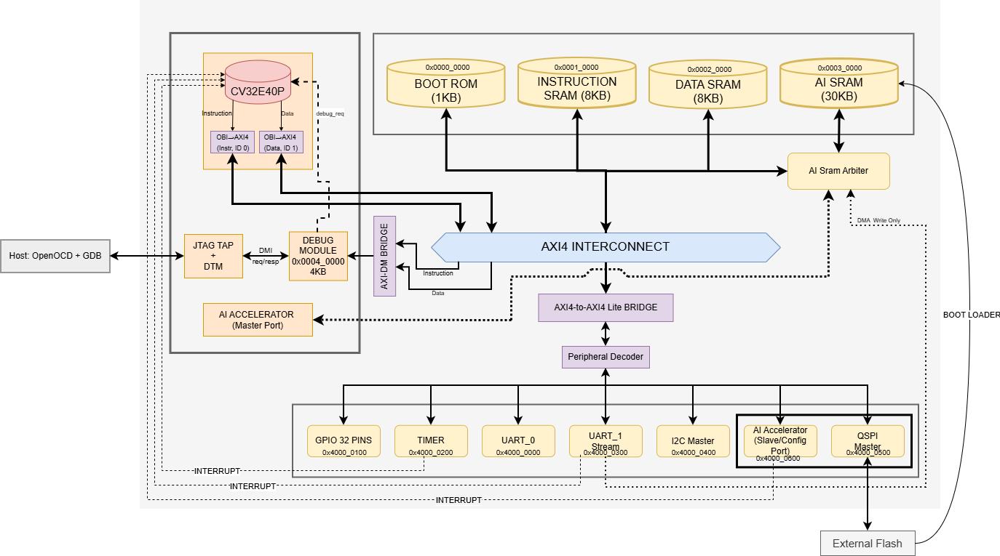</p>
<p align="center"><sub>Delivered configuration (7 September 2026): CV32E40P with its two OBI-to-AXI4 bridges, the AXI4 interconnect, the four memories and the AI SRAM arbiter, the AXI4-Lite peripheral bank, the AI accelerator (master port into the AI SRAM, CSR slave) and the <b>JTAG debug subsystem</b> — host (OpenOCD + gdb) &rarr; TAP + DTM &rarr; DMI &rarr; Debug Module at 0x0004_0000 (4 KB), <code>debug_req</code> into the core, and the AXI-DM bridge that lets the core fetch the debug ROM / program buffer through the interconnect (instruction and data legs). Dotted lines: interrupts and the UART_1 stream DMA path.</sub></p>

### Block Description

- **CV32E40P** is the application processor. Its Instruction OBI port (ID 0) and Data OBI port (ID 1) are bridged to AXI4 by two `obi_to_axi.sv` adapters.
- The **AXI4 Interconnect** (`soc_axi_interconnect.sv`, based on `pulp-platform/axi`) routes master traffic to four AXI4 slaves: Boot ROM, Instruction SRAM, Data SRAM and the **AI SRAM Arbiter**, plus the **AXI4 → AXI4-Lite bridge** that feeds the peripheral subsystem.
- The **AI SRAM Arbiter** multiplexes the 30 KB AI SRAM between the CPU (read/write), the AI Accelerator's master port (read & write during inference) and the UART_1 streaming DMA (write-only path).
- The **Peripheral Decoder** (`periph_decoder.sv`) decodes the 32-bit address bus into seven AXI4-Lite slave channels (UART_0, GPIO, Timer, UART_1 Stream, I²C, QSPI, AI Accelerator CSR).
- Three independent **interrupt sources** feed the CV32E40P irq vector: `timer_irq[16]`, `ai_irq[17]`, `strm_irq[18]`.
- The **QSPI Master** also connects to an **External Flash** through the FPGA's dedicated CCLK/STARTUPE2 path (Boot Loader flow).
- The **JTAG debug subsystem** (PULP `riscv-dbg`): an IEEE 1149.1 TAP (`dmi_jtag_tap`; BSCANE2 on the FPGA) and DTM drive the **Debug Module** through a two-phase CDC; the DM's memory window (`0x0004_0000`, debug ROM, program buffer, `data0`) is a fifth AXI4 slave reached through the `axi_dm_slave` bridge from both CPU ports, `debug_req` enters the CV32E40P debug port and `ndmreset` resets everything except the DM and TAP (§10.10). *(Not yet drawn in the diagram above.)*

---

## 4. Memory Map

| Address Range | Module | Size | Access | Notes |
|---|---|---|---|---|
| `0x0000_0000` – `0x0000_03FF` | **Boot ROM** | 1 KB | RX | First-stage QSPI loader |
| `0x0001_0000` – `0x0001_1FFF` | **Instruction SRAM** | 8 KB | RWX | Firmware is loaded here from flash |
| `0x0002_0000` – `0x0002_1FFF` | **Data SRAM** | 8 KB | RW | `.data`, `.bss`, stack, heap |
| `0x0003_0000` – `0x0003_77FF` | **AI SRAM** | 30 KB | RW | Shared by CPU + AI Accel + UART_1 DMA |
| `0x0004_0000` – `0x0004_0FFF` | **Debug Module** (riscv-dbg) | 4 KB | RWX | Debug ROM (halt address `0x0004_0800`, exception `0x0004_0810`), program buffer, `data0`; reached from both CPU ports via `axi_dm_slave` (§10.10) |
| `0x4000_0000` | **UART_0** (general) | 32 B map | RW | TX/RX, baud-configurable |
| `0x4000_0100` | **GPIO** (16 in / 16 out) | 32 B map | RW | IDR (RO) + ODR (RW) |
| `0x4000_0200` | **Timer** | 32 B map | RW | Auto-reload + IRQ |
| `0x4000_0300` | **UART_1 / AI Stream** | 32 B map | RW | DMA → AI SRAM |
| `0x4000_0400` | **I²C Master** | 32 B map | RW | NBY / ADR / RDR / TDR / CFG |
| `0x4000_0500` | **QSPI Master** | 32 B map | RW | x1 / x2 / x4 + 3B/4B addressing |
| `0x4000_0600` | **AI Accelerator CSR** | 32 B map | RW | CTRL / STATUS / DATA_ADDR / OUT_ADDR |

> The SoC top module accepts `INSTR_SRAM_BYTES` and `DATA_SRAM_BYTES` parameters; defaults are **8 KB / 8 KB** (the official competition configuration). For the `riscv-arch-test` ISA-compliance flow only, these can be expanded to 1 MB / 64 KB via `-G` overrides.

---

## 5. Peripheral Register Map

### 5.1 UART_0 & UART_1 (`0x4000_0000` / `0x4000_0300`)

| Offset | Name | Access | Description |
|---|---|---|---|
| `0x00` | `CPB` | RW | Clock-per-bit (50 MHz / baud); the UART core uses `CPB[18:3]` as its prescaler, so the value is rounded down to a multiple of 8: `434 → 432 → 115,741 baud` (+0.5 %), `217 → 216 → 231,481` (+0.5 %), `5208 → 9600`, `50 → 48 → 1,041,667` (+4.2 %, at the edge of the 8N1 tolerance — 115200 / 230400 are the rates used on the board) |
| `0x04` | `STP` | RW | Stop bit count: `0 = 1`, `1 = 1.5`, `2 = 2` |
| `0x08` | `RDR` | RO | Received data register |
| `0x0C` | `TDR` | RW | Transmit data register |
| `0x10` | `CFG` | RW | bit 0 = TX_START, bit 1 = RX_READY, bit 2 = TX_DONE |

### 5.2 GPIO (`0x4000_0100`)

| Offset | Name | Access | Description |
|---|---|---|---|
| `0x00` | `IDR` | RO | Input Data Register — `IDR[15:0]` = 16 inputs (2-FF synchronized), upper bits read 0 |
| `0x04` | `ODR` | RW | Output Data Register — `ODR[15:0]` = 16 outputs, upper bits ignored (EK-2 fixed 16-in/16-out split) |

### 5.3 Timer (`0x4000_0200`)

| Offset | Name | Access | Description |
|---|---|---|---|
| `0x00` | `PRE` | RW | Prescaler |
| `0x04` | `ARE` | RW | Auto-reload value |
| `0x08` | `CLR` | RW | Clear |
| `0x0C` | `ENA` | RW | Enable |
| `0x10` | `MOD` | RW | Mode |
| `0x14` | `CNT` | RO | Counter value |
| `0x18` | `EVN` | RO | Event counter |
| `0x1C` | `EVC` | RW | Event clear |

### 5.4 I²C Master (`0x4000_0400`)

| Offset | Name | Access | Description |
|---|---|---|---|
| `0x00` | `NBY` | RW | Byte count (auto-rounded) |
| `0x04` | `ADR` | RW | 7-bit Slave address |
| `0x08` | `RDR` | RO | Received data (byte-packed into 32-bit word) |
| `0x0C` | `TDR` | RW | Transmit data |
| `0x10` | `CFG` | RW | TXEN / TXDN / RXEN / RXDN / NACK |

### 5.5 AI Accelerator CSR (`0x4000_0600`)

| Offset | Name | Description |
|---|---|---|
| `0x00` | `CTRL` | bit 0 = START, bit 1 = CLEAR_DONE |
| `0x04` | `STATUS` | bit 0 = BUSY, bit 1 = DONE, bits[7:4] = argmax class |
| `0x08` | `DATA_ADDR` | Input feature vector base in AI SRAM |
| `0x0C` | `OUT_ADDR` | Result word in AI SRAM: one INT32 holding the argmax (0..3); the four FC logits stay inside the accelerator (`STATUS[7:4]` carries the same argmax) |

---

## 6. Interrupt Map

| IRQ Vector | Source | Trigger | Acknowledged via |
|---|---|---|---|
| `irq_i[16]` | **Timer** | Auto-reload overflow | Timer `EVC` register |
| `irq_i[17]` | **AI Accelerator** | `STATUS.DONE` rising edge (level-sensitive) | `CTRL.CLEAR_DONE` |
| `irq_i[18]` | **UART_1 Stream DMA** | DMA transfer complete (`STRM_LEN` bytes landed) | one-cycle pulse, no acknowledge; the delivered firmware polls `STRM_STAT` and leaves `mie[18]` clear |

> The IRQ vector is built in `soc_top.sv` as `{13'd0, strm_irq, ai_irq, timer_irq, 16'd0}` and routed to `CV32E40P.irq_i`. `mtvec_addr_i` is tied to `0x0001_0000` in `soc_top.sv`; `crt0.S` does **not** write `mtvec` at run time — it places the vector table at the start of instruction memory (slot 0 = exceptions, slot 16 = timer, slot 17 = AI, slot 18 = stream) and also provides a `mcause`-decoding dispatcher so the design works in both direct and vectored trap modes.

---

## 7. Repository Structure

```
2026_Cip-Tasarim-Yarismasi-2026_Ostim-BLogic-Mikroelektronik-2026_Ostim-Teknik-Universitesi/
├── rtl/                                  # All synthesizable RTL
│   ├── soc_top.sv                        # SoC top level (parameterizable SRAM sizes)
│   ├── fpga_top.sv                       # FPGA wrapper (IBUFDS + MMCM + STARTUPE2)
│   ├── core/cv32e40p/                    # CV32E40P RISC-V core (vendored)
│   ├── bus/
│   │   ├── obi_to_axi.sv                 # OBI ↔ AXI4 bridges (CPU side)
│   │   ├── soc_axi_interconnect.sv       # AXI4 crossbar
│   │   ├── axi4_to_axilite_bridge.sv     # AXI4 → AXI4-Lite (peripheral feed)
│   │   ├── periph_decoder.sv             # Address decoder (7 AXI4-Lite slaves)
│   │   └── axi/                          # PULP-platform AXI library
│   ├── peripherals/
│   │   ├── uart_axil.sv                  # UART_0 (general)
│   │   ├── uart_stream_axil.sv           # UART_1 + DMA → AI SRAM
│   │   ├── uart_tx.v / uart_rx.v / uart.v
│   │   ├── gpio_axil.sv                  # 32-pin GPIO
│   │   ├── timer_axil.sv                 # Timer + IRQ
│   │   ├── i2c_master_axil.sv            # I²C Master
│   │   ├── qspi_master_axil.sv           # QSPI Master (x1/x2/x4 + 3B/4B)
│   │   └── verilog-uart/                 # Alex Forencich UART (reference)
│   ├── ai_accelerator/
│   │   ├── ai_accelerator.sv             # Tiny Conv hardware
│   │   └── ai_sram_arbiter.sv            # CPU / Accel / DMA arbiter
│   ├── asic/                             # ASIC-only RTL (asic_top, boot ROM, SRAM macro wrappers)
│   ├── debug/                            # JTAG debug subsystem (delivered chip): axi_dm_slave bridge, vendored riscv-dbg /
│   │                                     #   common_cells v1.38.0 / tech_cells_generic (VENDOR.md), DPI remote_bitbang bridge,
│   │                                     #   OpenOCD/gdb scripts + evidence logs, sky130 exploration runs (asic_jtag_sentez/)
│   └── fpga/                             # FPGA build & board files: build_genesys2.tcl (reads soc_files.f), genesys2.xdc,
│                                         #   fpga_top.bit + reports/, fpga_top_m2_demo.bit (JTAG-less SRAM-boot backup)
├── sw/
│   ├── common/
│   │   ├── crt0.S                        # C runtime + IRQ vector table
│   │   └── link.ld                       # Linker script (8 KB / 8 KB)
│   ├── drivers/
│   │   ├── blogic_mcu.h                  # Peripheral register definitions
│   │   └── qspi.h                        # QSPI driver helpers
│   ├── bootloader/                       # 1 KB QSPI boot ROM + flash helper
│   │   ├── bootloader.S, bootloader.ld
│   │   ├── bootrom.hex                   # Pre-built boot ROM image
│   │   ├── flash_helloworld.hex          # Example payload image
│   │   └── build.py
│   ├── tests/                            # 30 standalone firmware tests (full list: §14)
│   │   ├── uart_hello.c, uart_loopback.c, uart_baud_sweep.c, uart_add_test.c
│   │   ├── uart_stp_reg_test.c, uart1_strm_test.c, timer_irq_test.c
│   │   ├── gpio_led_test.c, hello_blink.c, led_only.c, minimal_test.c
│   │   ├── isa_compliance_test.c, lockstep_deep.c, boot_flash_hello.c
│   │   ├── qspi_test.c, qspi_modes_test.c, qspi_fifo_err_test.c, qspi_rdpath_test.c
│   │   ├── i2c_system_test.c, i2c_soc_test.c, csr_negatif_test.c
│   │   ├── ai_micro_speech_test.c, ai_irq_test.c, ai_sw_reference.c, ai_sat_test.c
│   └── ai_model/                         # AI golden vectors & accuracy harness
│       ├── micro_speech_quantized.tflite # Reference model
│       ├── extract_weights.py            # → weights/bias .hex
│       ├── generate_golden.py            # → input/conv_out/output .hex
│       ├── fetch_real_features.py        # EK-3 real WAV features (yes/no)
│       ├── generate_ai_sram_init.py      # Single combined ai_sram_init.hex
│       ├── run_accuracy_window.py        # EK-1 "10% window" 40-sample pipeline
│       ├── tiny_conv_reference.py        # RTL-accurate Python model
│       ├── accuracy_report_n1000.txt     # N=1000 accuracy evidence (committed)
│       └── golden_vectors/               # Generated hex files
├── verif/
│   ├── tb/                               # Verilator testbenches
│   │   ├── sim_main.cpp                  # C++ harness (UART monitor, golden match)
│   │   ├── ai_accel_tb.sv                # Standalone AI accelerator TB
│   │   ├── boot_flow_test_tb.sv          # Full Boot ROM → QSPI → SRAM flow
│   │   ├── qspi_modes_tb.sv              # QSPI x1/x2/x4 + 4-byte addressing
│   │   ├── i2c_master_tb.sv, i2c_system_tb.sv
│   │   ├── uart_stp_tb.sv                # Stop-bit 1 / 1.5 / 2
│   │   ├── uart_stream_tb.sv             # DMA → AI SRAM 5-scenario test
│   │   ├── jtag_smoke_tb.sv              # riscv-dbg TAP/DTM/DM, 17 stages (make jtag-sim)
│   │   ├── jtag_openocd_tb.sv            # SimJTAG + DPI bridge for the OpenOCD/gdb demos
│   │   ├── axi_dm_slave_tb.sv            # Debug-module bridge unit TB, 6 scenarios (make jtag-bridge-sim)
│   │   ├── asic_top_boot_tb.sv           # asic_top + 27 macro models: boot + AI, argmax check (make asic-top-sim)
│   │   ├── xilinx_prim_stubs.sv          # Lint-only BSCANE2/MMCM/BUFG shells (make lint-fpga)
│   ├── sva/                              # SystemVerilog Assertions
│   │   ├── axi_lite_protocol_checker.sv
│   │   ├── axi4_protocol_checker.sv
│   │   ├── soc_protocol_bind.sv          # 10-interface protocol bind
│   │   └── ai_accel_checker_bind.sv
│   ├── uvm/                              # UVM — 4 blocks (GPIO / Timer / UART_0 / I2C), 8 tests
│   │   ├── axi_lite_if.sv
│   │   ├── axi_lite_uvm_pkg.sv           # block-agnostic agent + GPIO env/tests
│   │   ├── periph_uvm_pkg.sv             # Timer/UART_0/I2C scoreboards + 6 tests
│   │   └── tb_top.sv, tb_timer_top.sv, tb_uart_top.sv, tb_i2c_top.sv
│   ├── uvm-lib/                          # Vendored UVM library (no clone needed)
│   ├── spike/                            # Spike ISS lockstep trace compare
│   │   └── compare_traces.py
│   ├── arch_tests/                       # riscv-arch-test glue (link.ld + htif.S)
│   ├── models/                           # Verification models
│   │   ├── spi_flash_model.sv            # QSPI flash device
│   │   ├── i2c_slave_model.sv            # I²C echo slave
│   │   └── xilinx_prims_stub.sv          # IBUFDS/MMCM stubs (Verilator)
│   ├── coverage_summary.txt              # SoC line + branch coverage (15 tests, 90.7 % / 88.6 %; JTAG bridge 100 % via jtag-cov)
│   ├── coverage_tb_summary.txt           # Per-module block-TB coverage
│   ├── coverage_siniflandirma.md         # Uncovered-line classification (A/B/C, per-line evidence)
│   ├── perf_summary.txt                  # HW vs SW speedup measurement (21.0x)
│   ├── jtag_cov_waivers.vlt              # jtag-sim coverage waiver (testbench file only)
│   └── coverage_waivers.vlt              # Vendor (CV32E40P) waivers
├── teknotest/                            # TEKNOFEST jury reference DDK testbench
│   ├── tb/teknotest_tb.sv
│   ├── user_files/                       # Wrapper + RTL list for jury sim
│   └── scripts/create_vivado_proj.tcl
├── asic/                                 # DDK "Final İstenen Çıktılar" delivery tree (Tablo 8)
│   ├── README.md                         # §9.1–9.13 master delivery document
│   ├── Makefile                          # make pdk / asic_run / asic_verify / asic_clean
│   ├── config.yaml + filelist.f          # LibreLane Classic config + RTL file list (84 files incl. riscv-dbg;
│   │                                     #   JTAG_DEBUG / FC1_FIX / I2C_SDA_SYNC defines; 4 CTS settings)
│   ├── constraints/design.sdc            # PnR SDC (PNR_SDC_FILE): clk 20 ns = 50 MHz target + jtag_tck 100 ns, asynchronous groups
│   ├── constraints/design_signoff.sdc    # signoff SDC (SIGNOFF_SDC_FILE): identical except clk 37 ns = verified 27.0 MHz
│   ├── THIRD_PARTY.md + licenses/        # third-party inventory + licence copies (riscv-dbg, common_cells, tech_cells_generic, ...)
│   ├── environment/                      # flake.nix + flake.lock + versions.txt
│   ├── macros/                           # SRAM GDS / LEF / LIB / Verilog / SPICE views
│   ├── reports/ + results/ + checksums/  # filled by collect_outputs.sh after the run
│   └── run/                              # transient LibreLane workspace (.gitkeep only)
├── docs/
│   ├── verification_and_test_plan.md     # Full verification & test plan (methods, results, traceability)
│   └── oznitelik_vektoru_formati.md      # AI input-vector contract (K13: frame format + handshake)
├── scripts/
│   ├── elf2hex.py                        # ELF → $readmemh hex
│   ├── run_regression.sh                 # 6-test regression (UART x3 + Spike lockstep x2 + QSPI)
│   ├── run_coverage.sh                   # SoC coverage harness (15 tests, annotate + summary)
│   ├── run_coverage_tb.sh                # per-module block-TB coverage
│   ├── gen_perf_report.py                # soc-perf → verif/perf_summary.txt
│   ├── arch_test_size_check.sh           # 8 KB budget audit for arch-test
│   ├── run_jtag_openocd.sh, run_jtag_gdb.sh   # OpenOCD / gdb end-to-end demos on the Verilator model
│   ├── run_jtag_board.sh, jtag_kart_wsl.ps1   # OpenOCD on the Genesys 2 (usbipd -> WSL), make jtag-board
│   ├── kart_jtag_entegrasyon.py               # JTAG + AI inference together on the board
│   ├── jtag_define_off_equiv.sh + jtag_equiv_expected_diffs/   # isolation proof (make jtag-equiv)
│   └── jtag_asic_config.py, vm_jtag_asic.sh, jtag_asic_cmp.py  # sky130 exploration tooling (historical, §10.10)
├── images/                               # README figures
├── Makefile                              # Top-level thin wrapper
├── Makefile.verilator                    # Verilator build + sim
├── Makefile.uvm                          # UVM build
├── soc_files.f                           # Single source of truth for the RTL list + delivery defines (JTAG_DEBUG, FC1_FIX, I2C_SDA_SYNC)
├── bootrom.hex                           # Pre-built top-level boot ROM image
├── run_teknotest_2021.tcl                # Jury sim entry point
└── README.md                             # (this file)
```

---

## 8. Prerequisites & Toolchain Installation

The project is developed and tested on **Ubuntu 24.04 LTS** (native or WSL2 on Windows 11). All commands below assume a recent Debian / Ubuntu system.

### 8.1 System Packages

```bash
sudo apt-get update
sudo apt-get install -y \
    build-essential gcc g++ make autoconf automake libtool \
    bison flex git ccache help2man perl python3 python3-pip python3-venv \
    libfl-dev libfl2 zlib1g zlib1g-dev libgoogle-perftools-dev \
    numactl perl-doc libssl-dev curl wget unzip xz-utils \
    device-tree-compiler libboost-regex-dev gtkwave
```

### 8.2 Verilator (≥ 5.0)

The repository is verified with **Verilator 5.049 devel (rev `v5.048-135-g99a35fee8`)**. UVM and `--timing` require a 5.x build, so packaged Ubuntu 24.04 versions (4.x) are **not sufficient**. Releases **older than v5.048 will not build the CV32E40P core**: `cv32e40p_cs_registers.sv` triggers `%Error-BLKANDNBLK` (blocking + non-blocking assignment to `mhpmcounter_q`). Check out the exact commit below so that coverage figures match the ones reported in this README.

```bash
git clone https://github.com/verilator/verilator.git
cd verilator
git checkout 99a35fee8           # v5.049 devel - exact revision used for all reported results
autoconf
./configure --prefix=/usr/local
make -j$(nproc)
sudo make install
verilator --version              # -> Verilator 5.049 devel rev v5.048-135-g99a35fee8
```

> **`deneme/uvm` branch — UVM 2020-3.1 on Verilator ≥ 5.052.** On this trial branch the UVM flow (`make uvm`, `Makefile.uvm`) uses the vendored **Accellera UVM 2020-3.1** (`verilator/uvm` commit `656f20d`) and therefore needs **Verilator 5.052 or newer**; everything else in the repository still builds with the 5.049 revision above. Install it side by side, without touching `/usr/local`:
>
> ```bash
> bash scripts/install_verilator.sh      # -> ~/tools/verilator-5.052 (about 15-25 min)
> ```
>
> `Makefile.uvm` picks `~/tools/verilator-5.052/bin/verilator` automatically (override with `make uvm VERILATOR=<path>`); its `check_verilator` gate stops with a clear message when an older Verilator is found. Constrained randomization calls the **z3** SMT solver at run time (`sudo apt install z3`); the same gate stops when `z3` is not on `PATH`.

### 8.3 RISC-V GNU Toolchain (rv32imc / ilp32)

Two installation options. Pre-built (fastest) is recommended:

**Option A — Pre-built (xPack):**

```bash
cd /tmp
wget https://github.com/xpack-dev-tools/riscv-none-elf-gcc-xpack/releases/download/v13.2.0-2/xpack-riscv-none-elf-gcc-13.2.0-2-linux-x64.tar.gz
sudo mkdir -p /opt/riscv && sudo tar -xzf xpack-riscv-none-elf-gcc-*.tar.gz -C /opt/riscv --strip-components=1
echo 'export PATH=/opt/riscv/bin:$PATH' >> ~/.bashrc
source ~/.bashrc
# The Makefile expects the "riscv32-unknown-elf-*" prefix; create symlinks:
for tool in gcc g++ ld as objcopy objdump size readelf nm ar; do \
    sudo ln -sf /opt/riscv/bin/riscv-none-elf-$tool /usr/local/bin/riscv32-unknown-elf-$tool; \
done
riscv32-unknown-elf-gcc --version
```

**Option B — Build from source (full control, takes ~30 min):**

```bash
sudo mkdir -p /opt/riscv && sudo chown $USER:$USER /opt/riscv
git clone --depth 1 https://github.com/riscv-collab/riscv-gnu-toolchain.git
cd riscv-gnu-toolchain
./configure --prefix=/opt/riscv --with-arch=rv32imc --with-abi=ilp32
make -j$(nproc)
echo 'export PATH=/opt/riscv/bin:$PATH' >> ~/.bashrc
source ~/.bashrc
```

### 8.4 Spike RISC-V ISS (Lockstep Co-simulation)

Spike is required for the **Test 3: Spike ISS Lockstep** regression.

```bash
git clone https://github.com/riscv-software-src/riscv-isa-sim.git
cd riscv-isa-sim
mkdir build && cd build
../configure --prefix=/opt/riscv --with-isa=RV32IMC
make -j$(nproc)
sudo make install
spike --help
```

### 8.5 Python Dependencies (AI golden vectors)

The AI flow (`sw/ai_model/*.py`) depends on **NumPy** and **TensorFlow** (or the smaller `tflite-runtime`). A Python virtual-env is strongly recommended.

```bash
cd <repo-root>
python3 -m venv .venv
source .venv/bin/activate

# Core
pip install --upgrade pip
pip install numpy

# Choose ONE of the following two interpreters:

# (1) Full TensorFlow (~500 MB) — required by run_accuracy_window.py for
#     softmax-preceding logit extraction (experimental_preserve_all_tensors)
pip install tensorflow

# (2) tflite-runtime (much smaller, only TFLite Interpreter)
#     Sufficient for extract_weights.py + generate_golden.py
pip install tflite-runtime
```

The `fetch_real_features.py` and `generate_ai_sram_init.py` scripts only use the Python standard library — no extra dependencies.

| Python script | Required packages | Output |
|---|---|---|
| `extract_weights.py` | `numpy`, `tensorflow` *or* `tflite-runtime` | `weights_conv.hex`, `bias_conv.hex`, `weights_fc.hex`, `bias_fc.hex`, `quant_params.{h,hex}` |
| `generate_golden.py` | `numpy`, `tensorflow` *or* `tflite-runtime` | `input_{cls}.hex`, `conv_out_{cls}.hex`, `output_{cls}.hex` |
| `fetch_real_features.py` | stdlib only | `input_{yes,no}_real.hex`, `conv_out_*`, `output_*` |
| `generate_ai_sram_init.py` | stdlib only | `ai_sram_init.hex` (7680 lines for SoC preload) |
| `run_accuracy_window.py` | `numpy`, `tensorflow` (preferred) | `accuracy_report.txt` (generated, untracked), 40-sample golden batch; `--n=1000` writes `accuracy_report_n1000.txt` |
| `tiny_conv_reference.py` | `numpy` | RTL-faithful Python model (debugging) |
| `scripts/elf2hex.py` | stdlib only | `$readmemh`-compatible hex |

### 8.6 Xilinx Vivado (FPGA only)

For the Genesys 2 FPGA flow you also need **Vivado 2021.2** (verified) or any 2021.2+ release that supports the Kintex-7 `XC7K325T-2FFG900C` part. Vivado must be on `PATH`:

```bash
source /tools/Xilinx/Vivado/2021.2/settings64.sh
vivado -version
```

### 8.7 `riscv-arch-test` — vendored

The RV32I + RV32M test sources (38 + 8 `.S` files), the `env/` headers and the
`target/blogic/` glue (`link.ld`, `htif.S`, `link_spike.ld`) are **committed
under `verif/arch_tests/`** — no external clone is needed for `make arch-test`.
Suite provenance is pinned in `asic/THIRD_PARTY.md` via a header fingerprint of
`verif/arch_tests/suite/env/arch_test.h`.

### 8.8 OpenOCD & gdb-multiarch (host tools for the JTAG debug subsystem — optional to install)

The JTAG debug subsystem (§10.10) is part of the delivered chip; OpenOCD and gdb are the
**host-side debugger software** that drives it — in simulation through the Verilator
model's `remote_bitbang` bridge (no probe hardware needed) and on the Genesys 2 through
the board's own USB-JTAG. Both tools come straight from the Ubuntu 24.04 archive; the
RISC-V target support is built into them:

```bash
sudo apt-get install -y openocd gdb-multiarch iproute2
openocd --version          # -> Open On-Chip Debugger 0.12.0 (RISC-V target included)
gdb-multiarch --version    # -> GNU gdb 15.1  (use: set architecture riscv:rv32)
```

`gdb-multiarch` is used because the `/opt/riscv` toolchain of §8.3 ships without a
`riscv32-unknown-elf-gdb`; the multi-target build debugs the same RV32 ELF over
OpenOCD's gdb server (`target remote :3333`). The debug-module RTL itself
(PULP `riscv-dbg`, the `common_cells` CDC cells and `tech_cells_generic` clock
cells) is **vendored under `rtl/debug/vendor/`** with exact commit/tag pins and
licences recorded in `rtl/debug/VENDOR.md` (licence copies in `asic/licenses/`) —
nothing to install. Installing the two tools is optional: `make test-all` (18
components, including `jtag-sim` and `jtag-bridge-sim`) needs only Verilator, and
`make jtag-gates` skips `jtag-openocd` / `jtag-gdb` with a `SKIP` note when they are
absent. On the board, OpenOCD runs inside WSL with the FT2232H attached through usbipd
(`scripts/jtag_kart_wsl.ps1`, §12.7 D).

---

## 9. Build & Simulation

The top-level `Makefile` is a thin wrapper that dispatches to `Makefile.verilator` (most targets) and `Makefile.uvm` (UVM only). Every target writes structured logs under `logs/` and prints `result=PASS` / `result=FAIL` keys for CI parsing.

### 9.1 Quick Start

```bash
# 1. Compile firmware and run the default UART_0 Hello World simulation
make compile
make sim

# 2. Run the full regression (UART × 3 baud, Spike lockstep, QSPI flash)
make regression

# 3. Run absolutely everything (regression + boot + AI + ISA + UVM + JTAG + …) — 18 components
make test-all
```

### 9.2 Make Target Reference

| Target | What it does |
|---|---|
| `make compile` | Build firmware ELF, generate `instr_mem.hex` + `data_mem.hex` |
| `make verilate` | Run Verilator on `soc_files.f`, build `obj_dir/blogic_sim` |
| `make sim` | End-to-end simulation, default `FW_SRC=sw/tests/uart_hello.c` |
| `make sim TRACE=1` | Same, with VCD waveform dump |
| `make sim COVERAGE=1` | Same, with line + branch coverage instrumentation |
| `make sim FW_SRC=sw/tests/gpio_led_test.c` | Swap firmware source |
| `make regression` | 6-test regression: UART_TX_115200 + UART_TX_1M + UART_TX_9600 + Spike lockstep (minimal + deep) + QSPI_Flash |
| `make uart-baud` | EK-2 multi-baud proof: 115200 → 1 Mbps → 9600 sweep in a single run |
| `make uart-stp` | EK-2 stop-bit 1 / 1.5 / 2 verification (standalone `uart_axil` TB) |
| `make uart-stream` | UART_1 DMA → AI SRAM, 5 scenarios (A–E) |
| `make boot` | Full QSPI boot flow (Boot ROM → flash → SRAM → user code) |
| `make asic-sram-sim` | Same boot flow, but with the **delivered SRAM macro Verilog models** (`ASIC_SRAM_MACRO`) — DDK §1.3 functional-verification proof |
| `make asic-top-sim` | Full-stack **functional** run of the ASIC top module on the **delivered RTL** (`soc_files.f` defines: `JTAG_DEBUG`, `FC1_FIX`, `I2C_SDA_SYNC`): DUT = `asic_top` + all **27 macro instances**; flash boot + conv layer bit-exact vs golden (FNV-1a checksum) **and** FC argmax == 2 ("yes") + result word (`+CHECK_ARGMAX`) — the proof that erratum FC-1 is fixed in the delivered RTL (negative control, 6 Sep 2026: the same run fails on RTL without `FC1_FIX`; `asic/README.md` §9.5) |
| `make lint` | ASIC lint of the delivered configuration: `asic_top` on `asic/filelist.f` (its six defines included), MODDUP/PINMISSING deliberately enabled, any `%Error` fails |
| `make lint-fpga` | `fpga_top` lint with the BSCANE2 TAP (`dmi_bscane_tap.sv` swapped in for `dmi_jtag_tap.sv`) and lint-only Xilinx primitive shells (`verif/tb/xilinx_prim_stubs.sv`) |
| `make qspi-modes` | QSPI x1 / x2 / x4 data-phase + 3B/4B addressing |
| `make i2c-sys` | I²C system test (NBY rounding, ADR mask, TX/RX echo, NACK) |
| `make ai` | Standalone AI accelerator TB (6 scenarios: 2 real audio + 4 synthetic) |
| `make ai-acc` | EK-1 accuracy window: regenerate + simulate + auto-report |
| `make soc-ai` | SoC-level AI inference C test (polling) |
| `make soc-ai-irq` | SoC-level AI **interrupt** flow test (ISR) |
| `make soc-perf` | HW vs SW speedup measurement (same SoC, same `mcycle`) |
| `make arch-test` | Official `riscv-arch-test` ISA compliance (default `ARCH_EXT=I`) |
| `make qspi-err` | QSPI FIFO overflow / flush / status error paths (25 checks) |
| `make uvm` | UVM — 4 blocks (GPIO + Timer + UART_0 + I2C), 8 tests, directed + constrained-random |
| `make jtag-sim` | riscv-dbg JTAG subsystem on the delivered build (`soc_files.f`): pure-SV TAP bit-bang, 17 stages (IDCODE → DMI → halt → abstract/progbuf → step/trigger → ndmreset, then DMI back-pressure, `cmderr` paths, SBA tie-off, TAP corner cases, ISRAM write + `ebreak`, DM region) — no external tool; component 17 of `make test-all` |
| `make jtag-bridge-sim` | `axi_dm_slave` unit TB with the real `dm_top`: arbitration, R/B channel hold, `w_strb`, reset with a request in flight — 6 scenarios + timing-contract SVA; component 18 of `make test-all` |
| `make jtag-openocd-build` | Builds the OpenOCD-driven simulation (`SimJTAG` + DPI `remote_bitbang` server on `localhost:9999`) |
| `make jtag-openocd` | End-to-end **OpenOCD 0.12** demo: halt, register write/read, progbuf memory access, hw breakpoint, `reset halt` — evidence log in `rtl/debug/openocd/`. The runner (and `make jtag-gdb`) rebuilds the simulation when the binary is older than any RTL / TB / firmware source (`scripts/jtag_sim_stale.sh`) |
| `make jtag-gdb` | **gdb-multiarch** over OpenOCD: `reset halt` → `break *main` → `stepi` → register/memory write-back (§8.8 tools) |
| `make jtag-equiv` | **Isolation proof**: with `JTAG_DEBUG`, `FC1_FIX` and `I2C_SDA_SYNC` all off, the preprocessed RTL equals commit `73d8dcd` (the RTL of the 14 August signed run) — `scripts/jtag_define_off_equiv.sh`, diff-of-diffs against `scripts/jtag_equiv_expected_diffs/` |
| `make jtag-cov` | Line coverage of `jtag-sim`, committed report `rtl/debug/sim/jtag_cov_summary.txt` |
| `make jtag-gates` | JTAG package: `jtag-sim`, `jtag-bridge-sim`, `lint-fpga`, `jtag-equiv`, plus the OpenOCD/gdb end-to-end demos when the tools are installed (`SKIP` otherwise) |
| `make jtag-board` | **OpenOCD on the real Genesys 2** through the on-board USB-JTAG (BSCANE2 tunnel): halt, register and memory read/write, single-step, CSR, hardware breakpoint, `reset halt`/`reset run` — `scripts/run_jtag_board.sh`, evidence `rtl/debug/openocd/demo_run_board_2026-09-06.log` |
| `scripts/kart_jtag_entegrasyon.py` | **JTAG + AI inference together on the board**: halt/inspect/resume leaves results bit-identical; a hardware breakpoint on `run_hw` catches the UART-delivered vector before inference — evidence `rtl/debug/openocd/demo_run_board_entegrasyon_2026-09-06.log` |
| `make demo-harness-sim` | **TEKNOFEST jury-tool path in simulation**: demo firmware v2 on the Verilator model, 13 stream scenarios injected gaplessly on UART_1 at 230400 with the `team_icd.json` frame (valid / zero / saturated / alternating vectors, truncated, oversized, bad CRC, `BLG` decoy, back-to-back ×3); the 14 `RESULT:` lines must equal the bit-exact software reference in order → `[HARNESS-SIM] PASS` (§12.6; passed 7 September 2026: 14/14, all 30,560 bytes received, only the truncated and the bad-CRC frames rejected) |
| `make demo-harness-dataset` / `make demo-harness-sim-dataset` | **Own regression set in the jury tool's format**: `DS_N` vectors (default 200; 1000 in 52 s) from the `kart_sweep.py` generator with the bit-exact software reference as `golden`, written as `manifest.csv` + `vectors/*.bin` for `demo_harness.py run --manifest`; the `-sim-dataset` target streams `DS_K` of them (default 10) through UART_1 in simulation and checks the `RESULT:` lines against the manifest → `[HARNESS-SIM] PASS` **10/10** (8 September 2026: seeded 10-vector subset of the 200-vector set, all 19,680 bytes received, `ok=10 bad=0`, 6.5 min on the laptop) (§12.6) |
| `make test-full` | **Everything that runs locally in one command**: `test-all` (18) + `lint` + `lint-fpga` + `jtag-gates` + `asic-sram-sim` + `asic-top-sim` + `boot-real` + `isa-compliance` + `ai-uart-load`, with a second summary table (~40 min). Only the board demo (`jtag-board`) and the VM flow (`asic_run`) stay outside |
| `verif/questa/wave.bat <test>` (Windows) / `verif/questa/wave.sh <test>`; headless: `verif/questa/batch.ps1` / `batch.sh` | **Questa / ModelSim waveform flow** - validated on Questa Sim-64 10.7c, **21/21 tests pass** (6 September 2026, run record in `verif/questa/README.md`): recompiles the delivered configuration from `soc_files.f`, loads the chosen testbench (the ten SystemVerilog testbenches and, through `verif/questa/questa_soc_tb.sv`, the eleven firmware-driven SoC tests) with a ready-made wave window and runs it to its verdict; firmware bundles come from `make questa-pack` and are committed under `verif/questa/fw/` — `verif/questa/README.md` |
| `make coverage` | SoC line + branch coverage (15 self-checking C tests, single build) |
| `make coverage-tb` | Per-module block-testbench coverage |
| `make spike` | Run firmware directly on Spike ISS |
| `make test-all` | The 16 SoC components from `regression` to `uvm` plus `jtag-sim` and `jtag-bridge-sim` — **18 components** — + summary table (OpenOCD/gdb demos and lint gates: `make jtag-gates`, `make lint`, `make lint-fpga`) |
| `make clean` | Remove `obj_dir/` and `build/` |
| `make logs-clean` | Remove `logs/` |
| `make help` | Print this list |

### 9.3 Manual Build (without Make)

```bash
# 1. Software compilation
riscv32-unknown-elf-gcc \
    -march=rv32imc -mabi=ilp32 -nostdlib -O2 \
    -T sw/common/link.ld sw/common/crt0.S sw/tests/uart_hello.c \
    -o build/test.elf

# 2. Hex generation (instruction + data sections)
riscv32-unknown-elf-objcopy -O binary -j .text.init -j .text build/test.elf build/instr.bin
python3 scripts/elf2hex.py build/instr.bin build/instr_mem.hex
riscv32-unknown-elf-objcopy -O binary -j .rodata -j .data build/test.elf build/data.bin
python3 scripts/elf2hex.py build/data.bin build/data_mem.hex

# 3. RTL elaboration & C++ build
verilator --cc --timing --top-module soc_top \
    -Wno-fatal -Wno-TIMESCALEMOD -Wno-WIDTHEXPAND -Wno-WIDTHTRUNC \
    -Wno-MODDUP -Wno-CASEINCOMPLETE -Wno-UNSIGNED \
    -DVERILATOR -public-flat-rw \
    --Mdir obj_dir -f soc_files.f --exe verif/tb/sim_main.cpp -o blogic_sim
make -C obj_dir -f Vsoc_top.mk blogic_sim -j$(nproc)

# 4. Stage hex files + run
cp build/instr_mem.hex obj_dir/firmware.hex
cp build/data_mem.hex  obj_dir/data_mem.hex
cd obj_dir && ./blogic_sim +CPB=434
```

---

## 10. Verification

### 10.1 Methodology

| Layer | Tool / Style | Purpose |
|---|---|---|
| **Unit RTL sim** | Verilator 5.049 devel, SystemVerilog | Per-module testbenches (`verif/tb/`) |
| **SoC integration sim** | Verilator + `sim_main.cpp` | Full SoC, UART golden-string monitor |
| **ISA compliance** | `riscv-arch-test` repo | RV32I / M extension self-tests |
| **Lockstep** | Spike ISS + Python diff (`verif/spike/compare_traces.py`) | Cycle-by-cycle PC + commit trace |
| **Bus protocol** | SystemVerilog Assertions (SVA) bound to 10 AXI / AXI-Lite interfaces | Protocol-level legality |
| **UVM** | Vendored UVM (`verif/uvm-lib`) + block-agnostic AXI-Lite agent | 4 blocks (GPIO / Timer / UART_0 / I2C), directed + constrained-random, reference-model scoreboards |
| **AI accuracy** | Python `run_accuracy_window.py` + RTL TB | 1000-sample bit-exact SW vs RTL match |
| **Coverage** | Verilator `--coverage-line` + uncovered-line classification | SoC 90.7 % line / 88.6 % branch on the delivered configuration (JTAG bridge 100 % under `make jtag-cov`); every remaining line justified (`verif/coverage_siniflandirma.md`) |

### 10.2 Regression Test Suite

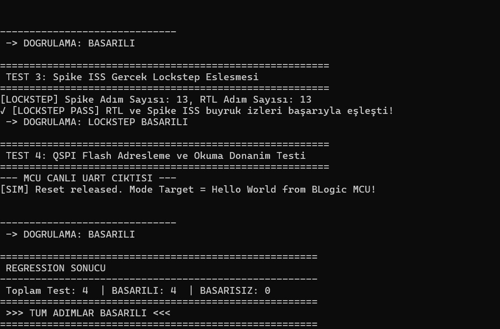
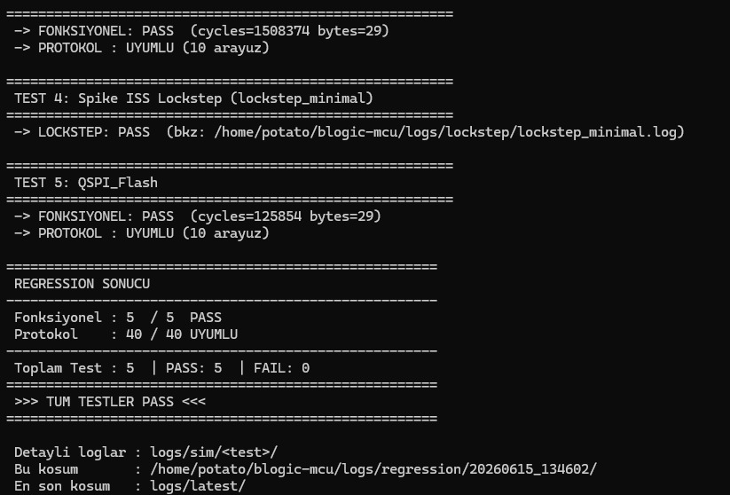

```bash
make regression
```

| # | Test | Firmware | Outcome |
|---|---|---|---|
| 1 | UART TX @ 115200 baud | `sw/tests/uart_hello.c` (CPB=434) | **PASS** |
| 2 | UART TX @ 1 Mbps | `sw/tests/uart_hello.c` (CPB=50) | **PASS** |
| 3 | UART TX @ 9600 baud | `sw/tests/uart_hello.c` (CPB=5208) | **PASS** |
| 4 | Spike ISS Lockstep (minimal) | `sw/tests/minimal_test.c` | **PASS** |
| 5 | Spike ISS Lockstep (deep, 319,995 PC records) | `sw/tests/lockstep_deep.c` | **PASS** |
| 6 | QSPI Flash addressing | `sw/tests/qspi_test.c` | **PASS** |
| — | **AXI / AXI-Lite Protocol Compliance** | 10 interfaces, every cycle | **40 / 40 COMPLIANT** (40 = protocol-checker report blocks emitted across the six runs, all clean) |

### 10.3 ISA Compliance (RV32IMC, 31/31 PASS)

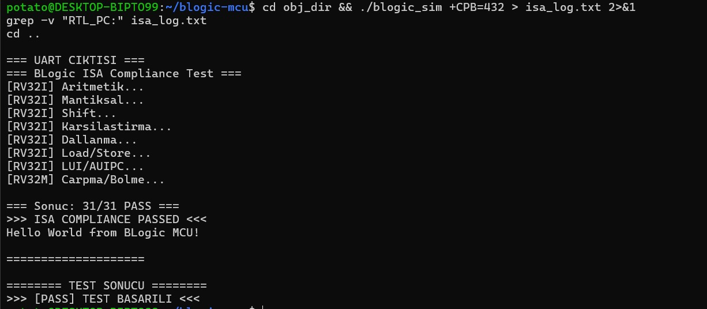

The C-level smoke test (`sw/tests/isa_compliance_test.c`) covers the RV32IMC subset across 31 directed tests:

| Group | Coverage |
|---|---|
| RV32I — Arithmetic | `ADD`, `SUB`, `ADDI`, `SLT/SLTI/SLTU/SLTIU` |
| RV32I — Logical | `AND/OR/XOR` + immediates |
| RV32I — Shifts | `SLL/SRL/SRA` + immediates |
| RV32I — Comparison | `BEQ/BNE/BLT/BGE/BLTU/BGEU` |
| RV32I — Branches | Forward & backward, taken & not taken |
| RV32I — Load/Store | `LB/LH/LW/LBU/LHU` + `SB/SH/SW` (alignment) |
| RV32I — `LUI` / `AUIPC` | PC-relative + upper-immediate construction |
| RV32M — Mult/Div | `MUL/MULH/MULHU/MULHSU`, `DIV/DIVU/REM/REMU` |

> **Result:** `31 / 31 PASS`, golden string `Hello World from BLogic MCU!` emitted.

For the full official `riscv-arch-test` suite use `make arch-test ARCH_EXT=I` (then `M`).

### 10.4 AXI / AXI-Lite Protocol Checker (SVA)

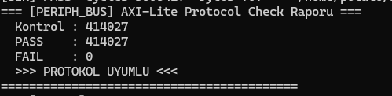

`verif/sva/soc_protocol_bind.sv` instantiates two checker modules (`axi_lite_protocol_checker.sv` and `axi4_protocol_checker.sv`) on **all 10** bus interfaces. Every clock cycle, the checkers validate VALID/READY handshakes, address alignment, byte-strobe legality, response codes, and outstanding-transaction bounds.

| # | Interface | Type | Address |
|---|---|---|---|
| 1 | Periph master | AXI-Lite | (bridge output) |
| 2 | UART_0 slave | AXI-Lite | `0x4000_0000` |
| 3 | GPIO slave | AXI-Lite | `0x4000_0100` |
| 4 | Timer slave | AXI-Lite | `0x4000_0200` |
| 5 | UART_1 slave | AXI-Lite | `0x4000_0300` |
| 6 | I²C slave | AXI-Lite | `0x4000_0400` |
| 7 | QSPI slave | AXI-Lite | `0x4000_0500` |
| 8 | AI Accel CSR | AXI-Lite | `0x4000_0600` |
| 9 | AI Accel master | AXI4 | (AI SRAM) |
| 10 | UART_1 master | AXI4 | (AI SRAM, write-only DMA) |

In the AI integration test alone, `414027` AXI-Lite transactions were validated with **0 protocol violations**.

### 10.5 UART Stop-Bit, Baud Sweep & Stream Tests

| Test | What it proves | Verdict |
|---|---|---|
| `make uart-baud` | One firmware sweeps **115200 → 1 Mbps → 9600** with `CPB` switched at run time (EK-2 multi-baud requirement); baud error +0.47 % / +4.17 % / +0.01 %; 56,651 protocol checks clean | **3 / 3 phases PASS** |
| `make uart-stp` | Stop-bit **1 / 1.5 / 2** selectability — 4 `STP` settings measured start-to-start (frame lengths 4336 / 4552 / 4768 cycles), hardware-guaranteed extension | **4 / 4 PASS** |
| `make uart-stream` | UART_1 DMA → AI SRAM, scenarios **A–E**: basic 16 B · partial-word `wstrb` · busy `SADR` latch · mid-transfer ABORT + restart · DMA-off passthrough | **5 / 5 PASS** |

<p align="center">
  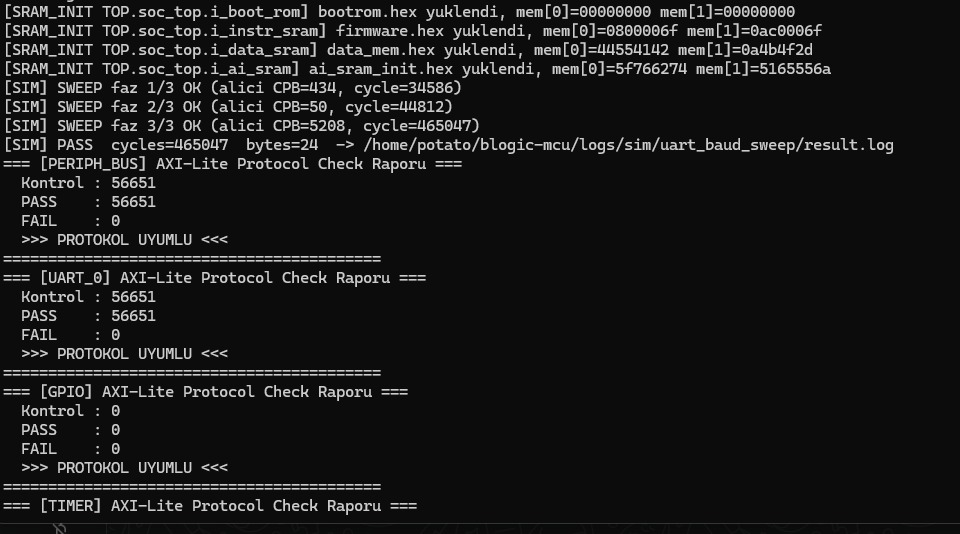
  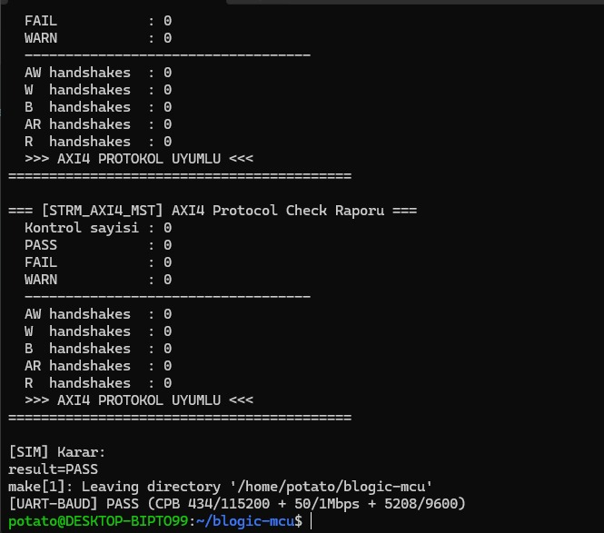
</p>
<p align="center"><sub><code>make uart-baud</code> — three-phase sweep (left) and final verdict (right)</sub></p>

<p align="center">
  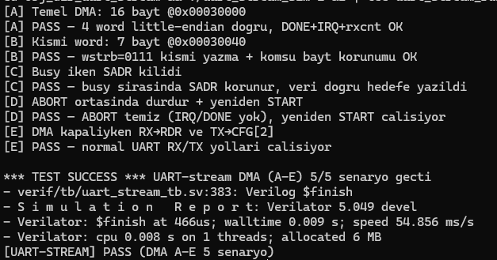
</p>
<p align="center"><sub><code>make uart-stream</code> — DMA scenarios A–E, 5 / 5 PASS</sub></p>

### 10.6 QSPI Master — x1/x2/x4 + 4-Byte Addressing

| Test | What it proves | Verdict |
|---|---|---|
| `make qspi-modes` | All three data-phase widths (**x1 / x2 / x4**) with both **3-byte and 4-byte** addressing, T1–T6 incl. the upper-address-byte proof; **70,825** AXI-Lite transactions checked, 0 violations | **6 / 6 PASS** |
| `make qspi-err` | Error / boundary family: TX-FIFO overflow flag, `CCR[31]` status clear, TX/RX flush, register read-back, write direction, command-only and x4-write paths | **25 / 25 PASS** |
| `qspi_rdpath_test` (in `make coverage`) | Read-direction family: multi-byte word packing (full words + 2 B / 3 B tails), dummy cycles, address-less commands (RDSR / RES), sector erase, 4-byte `READ4`, x2 / x4 reads, dual-PP write — strict `0xAA`-pattern checks on every x1 path | **11 / 11 cases PASS** |

<p align="center">
  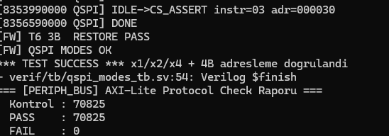
</p>
<p align="center"><sub><code>make qspi-modes</code> — final verdict (tool output "PROTOKOL UYUMLU" = protocol compliant)</sub></p>

### 10.7 I²C — Block, SoC and UVM Layers

| Layer | Test | What it proves | Verdict |
|---|---|---|---|
| Block TB | `make i2c-sys` | Master against `verif/models/i2c_slave_model.sv` (echo slave): `NBY` rounding (0/1/3/4), 7-bit `ADR` mask, 1- and 4-byte TX + echo RX with `RDR` byte packing, synthetic NACK injection — **9,716** AXI-Lite transactions clean | **PASS** |
| SoC | `i2c_soc_test` (in `make coverage`) | The same engine driven from the CPU through the full AXI path: register semantics, 4-byte TX/RX, negative (unmapped / read-only) accesses | **PASS** |
| UVM | `i2c_directed_test` + `i2c_random_test` | Reference-model scoreboard, NBY clamping, and the **no-slave NACK path** for both TX and RX (`NACK_ERR` flag set, `RDR` left clean) | **PASS** |

Block-TB verdict string: `*** TEST SUCCESS *** I2C SISTEM YOLU DOGRULANDI` (system path verified).

<p align="center">
  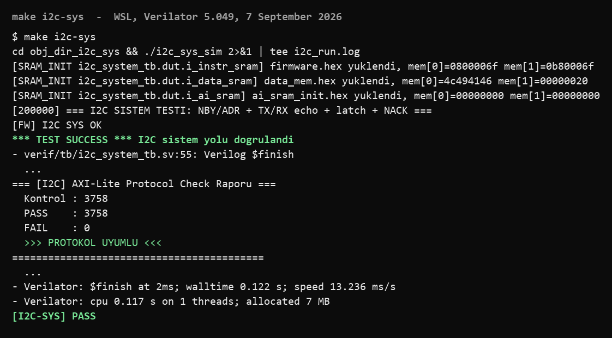
</p>
<p align="center"><sub><code>make i2c-sys</code> (7 September 2026, delivered configuration): the block test verdict <code>*** TEST SUCCESS *** I2C sistem yolu dogrulandi</code> (system path verified), the I²C AXI-Lite protocol checker with <b>3,758 / 3,758</b> checks and 0 failures (<code>PROTOKOL UYUMLU</code> = protocol compliant), and the Makefile verdict <code>[I2C-SYS] PASS</code>; rendered from the captured terminal log.</sub></p>

### 10.8 Coverage Report

All SoC-level numbers in this section are from the **2026-09-06** clean run on the delivered configuration (Verilator 5.049, Spike enabled); the module-level table is the 2026-09-01 run (`verif/coverage_tb_summary.txt`).

<p align="center">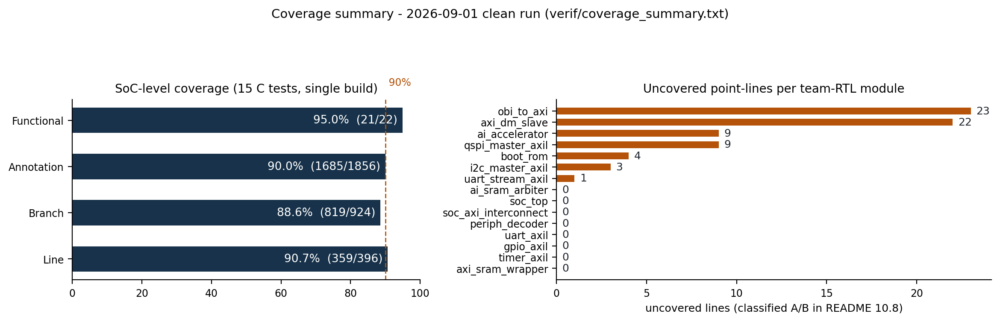</p>
<p align="center"><sub>Left: SoC-level coverage vs. the 90% mark. Right: uncovered point-lines per team-RTL module (A/B classification below). Rendered from <code>verif/coverage_summary.txt</code> by <code>scripts/coverage_chart.py</code>.</sub></p>

Coverage is measured at **two levels**, because Verilator merges `.dat` files by
hierarchical path: in the SoC build a peripheral lives under `TOP.soc_top.i_qspi`,
while in its standalone bench it lives under `TOP.qspi_modes_tb`. Merging both into
one percentage double-counts the same lines and understates the result, so the two
levels are reported separately.

#### SoC level — `make coverage`

**Fifteen** self-checking C tests on a single instrumented SoC build, fixed
denominator. Four of them (`i2c_soc_test`, `qspi_rdpath_test`,
`csr_negatif_test`, `ai_sat_test`) were written from a line-by-line
classification of everything the first eleven left uncovered — the full
uncovered-line audit, with per-line evidence and A/B/C verdicts, is
committed as **`verif/coverage_siniflandirma.md`**.

**Scope:** design RTL only (15 files, the JTAG bridge `axi_dm_slave.sv`
included). Excluded via `verif/coverage_waivers.vlt`: CV32E40P / PULP and
riscv-dbg vendor code, testbenches, behavioural models, SVA checkers and
covergroup binds — these are verification infrastructure, not design under test.
The C tests never drive the TAP, so the JTAG bridge shows only its idle-state
lines here; its full measurement (100 % of `axi_dm_slave.sv`, plus the vendor
riscv-dbg files) comes from the 17-stage JTAG testbench, `make jtag-cov`,
and is appended to the same summary.

| Metric | Result (6 September 2026, delivered configuration) |
|---|---|
| **Line coverage** | **90.7 %** (359 / 396) |
| **Branch coverage** | **88.6 %** (819 / 924) |
| Lines fully covered (annotation) | 90.0 % (1685 / 1856) |
| JTAG bridge `axi_dm_slave.sv` via `make jtag-cov` | **100 %** (49 / 49); riscv-dbg `dmi_jtag_tap` 99.1 %, `dm_mem` 96.3 %, `dmi_jtag` 90.3 %, `dm_csrs` 81.3 % |

Before the JTAG bridge entered the denominator (1 September 2026, 14 files)
the same 15 tests measured 91.1 % line / 91.3 % branch; the 22 idle-only
lines of `axi_dm_slave.sv` account for the whole difference.

<p align="center">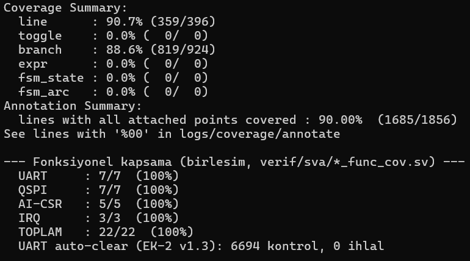</p>
<p align="center"><sub><code>make coverage</code>, run of 9 September 2026 — line <b>90.7 %</b> (359/396), branch <b>88.6 %</b> (819/924), annotation 90.0 % (1685/1856), functional coverage <b>22/22</b> (UART 7/7, QSPI 7/7, AI-CSR 5/5, IRQ 3/3) and the EK-2 v1.3 <code>CFG[0]</code> auto-clear proof (6,694 checks, 0 violations). Verbatim from <code>verif/coverage_summary.txt</code>.</sub></p>

Every remaining uncovered line falls into one of three documented classes
(`verif/coverage_siniflandirma.md`):

| Class | Lines | Meaning |
|---|---|---|
| **A — structurally unreachable** | 42 | e.g. all 23 lines of `obi_to_axi.sv` (AW/W channel-skew states: every slave asserts both readies in the same cycle — measured over 411 k writes / 49.7 k stalls, never split), FSM `default` arms, Verilator's function-`return` annotation artefact in `rq_round_sat` (saturation itself is *functionally proven* by `ai_sat_test`: 2 × 1000 conv words bit-exact at 0x7F / 0x80) |
| **B — fault-injection only** | 2 | I²C NACK branch — covered at block level by the UVM `i2c_directed_test` (no-slave NACK path) |
| **C — single accepted exception** | 5 | QSPI dummy-cycles-with-TX combination (legal but exotic; deliberately left open and documented) |

Per-file uncovered counts after the 15-test run: `obi_to_axi` 23 (A),
`axi_dm_slave` 22 (TAP idle in the C tests; 0 under `make jtag-cov`),
`ai_accelerator` 9 (A), `qspi_master_axil` 9 (4 A + 5 C), `boot_rom` 4 (A),
`i2c_master_axil` 3 (2 B + 1 A), `uart_stream_axil` 1 (A) — **`uart_axil`,
`gpio_axil`, `timer_axil`, `ai_sram_arbiter`, `periph_decoder`,
`soc_axi_interconnect`, `soc_top` and `axi_sram_wrapper` are all at 0**.

Annotated sources: `logs/coverage/annotate/` (`%`-prefixed lines are uncovered;
`--annotate-all` writes fully-covered files too, so "absent" unambiguously means
"not instrumented" — e.g. the purely structural `axi4_to_axilite_bridge.sv`;
`soc_top.sv` now carries the ten line points of its JTAG reset/debug-request
logic, all covered). Committed summary: `verif/coverage_summary.txt`.

#### Module level — `make coverage-tb`

Each standalone testbench exercises its target module with the scenarios that
module was designed for, so this table reflects how thoroughly each block is
actually verified.

| Testbench | Target module | Covered / total | Ratio |
|---|---|---|---|
| `boot` | `axi_sram_wrapper.sv` | 31 / 31 | **100.0 %** |
| `i2c-sys` | `i2c_master_axil.sv` | 180 / 184 | **97.8 %** |
| `ai` | `ai_accelerator.sv` | 404 / 418 | **96.7 %** |
| `uart-stream` | `uart_stream_axil.sv` | 140 / 147 | **95.2 %** |
| `uart-stp` | `uart_axil.sv` | 98 / 105 | **93.3 %** |
| `qspi-modes` | `qspi_master_axil.sv` | 226 / 311 | **72.7 %** |

Committed summary: `verif/coverage_tb_summary.txt`.

#### Functional coverage

SVA-based covergroups are bound to the UART, QSPI, AI-accelerator CSR and IRQ
interfaces (`verif/sva/*_func_cov.sv`). Over a full `make coverage` run the merged
covergroups reach **21 / 22 bins (95 %)**: UART 6 / 7 (CPB 434 / 50 / 5208 and
stop-bit codes 00 / 01 / 10; the reserved code 11 is programmed by no test),
QSPI 7 / 7, AI-CSR 5 / 5, IRQ 3 / 3 (timer irq16, AI irq17, stream irq18). The
UART auto-clear checker (EK-2 v1.3) logs **6432 checks, 0 violations**. (Until
6 September the summary script took the best single test instead of the union
over tests and reported UART 5 / 7 — the union is what the script has always
documented as the meaningful figure.)

### 10.9 UVM Testbench — 4 Blocks, 8 Tests

```bash
make uvm                             # clean build + all 8 tests (also part of make test-all)
make -f Makefile.uvm directed        # GPIO directed only
make -f Makefile.uvm timer_directed  # Timer directed only
make -f Makefile.uvm uart_directed   # UART_0 directed only
make -f Makefile.uvm i2c_directed    # I2C directed only  (plus *_random variants)
```

One block-agnostic AXI-Lite agent (driver, monitor with procedural protocol
checks, sequencer — `verif/uvm/axi_lite_uvm_pkg.sv`) drives four different DUTs;
`verif/uvm/periph_uvm_pkg.sv` adds reference-model scoreboards and per-block
tests. Each block builds with its own `tb_*_top.sv` wrapper.

**Toolchain on this branch (`deneme/uvm`).** The environment runs on **Accellera UVM 2020-3.1** (IEEE 1800.2-2020, `verilator/uvm` commit `656f20d`; provenance in `verif/uvm-lib/KAYNAK.md`) compiled by **Verilator 5.052**. The earlier `795b5f2` fork carried Verilator-specific workarounds and the build suppressed `CONSTRAINTIGN`, so the random sequences bypassed the solver with `$urandom`. With 5.052 they use the real constraint solver: every address and data word comes from `randomize()`, the address is bound to the block's register pool with an `inside` constraint, and a failed or out-of-pool solution is a `uvm_error`, not a silent fallback.

One measured tool limit remains: **Verilator 5.052 does not apply `dist` weights.** A single-variable `dist {1 := 60, 0 := 40}` gave 52 % over 2,000 draws, and inside an implication the write ratio followed the pool sizes instead of the weights (3/9 for UART and I²C, 6/14 for the Timer). The read/write direction is therefore drawn procedurally with the intended 60 % write probability; the achieved ratio is reported on every run and a deviation of more than 25 points fails the test, so the weighting cannot silently break again. The I²C block now builds with full line + toggle coverage like the other three; the 5.049 toggle-instrumentation internal error is gone.

**DPI and seeds.** The UVM DPI layer is enabled: `uvm_dpi.cc`, including the Verilator VPI back-end added in `656f20d`, is compiled with `--vpi`, so `+UVM_TESTNAME` is read through DPI and the component-name checks run; UVM 2020-3.1 had warned on every run that its `UVM_NO_DPI` mode may be removed. `make uvm` runs the four directed tests once and each of the four random tests with three seeds (`UVM_SEEDS ?= 1 2 3`, passed as `+verilator+seed+N`), 16 runs in total; `make uvm UVM_SEEDS="1 2 3 4 5"` widens the sweep.

| Test | What it proves | Result |
|---|---|---|
| `gpio_directed_test` | IDR/ODR R/W, mask checks against reference model | **PASS** |
| `gpio_random_test` | 50 constrained-random transactions, scoreboard | **PASS** |
| `timer_directed_test` | reset values, read-backs, CLR, counting (CNT strictly increases), event accumulate + EVC clear | **PASS** |
| `timer_random_test` | 60 constrained-random R/W over the full register map (solver-chosen addresses, 60 % writes) | **PASS** |
| `uart_directed_test` | reset values (CPB = 434), 1 Mbps CPB read-back, STP modes, TDR flow and **CFG[0] hardware auto-clear after TX (EK-2 v1.3)** | **PASS** |
| `uart_random_test` | 60 constrained-random R/W against the UART reference model | **PASS** |
| `i2c_directed_test` | NBY clamping (0→1, 7→4), read-backs, **no-slave NACK path for both TX and RX** (`TX_DONE`/`RX_DONE` + `NACK_ERR`, RDR left clean) | **PASS** |
| `i2c_random_test` | 60 constrained-random R/W against the I²C reference model | **PASS** |

**Regression result: 16 PASS, 0 FAIL**: 8 tests, the four random ones with three seeds each (`UVM_ERROR : 0`, `UVM_FATAL : 0` and `UVM_WARNING : 0` in every
run; protocol monitor reports 0 violations in all 16).

<p align="center">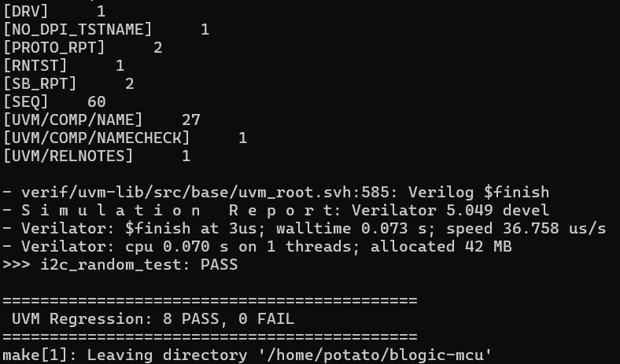</p>
<p align="center"><sub><code>make uvm</code>, main-branch run of 9 September 2026 on Verilator 5.049 — the four block environments, 8 tests, <b>8 PASS / 0 FAIL</b>; <code>UVM_ERROR : 0</code> and <code>UVM_FATAL : 0</code> in every run.</sub></p>

The UVM library is vendored under `verif/uvm-lib` — no external clone is needed (see `verif/uvm-lib/KAYNAK.md`).

---

### 10.10 JTAG Debug Subsystem (riscv-dbg, OpenOCD, gdb) — part of the delivered chip

> **Status (6 September 2026): the JTAG debug subsystem is part of the delivered chip.**
> The competition specification lists "1x JTAG (Opsiyonel)" and, in EK-2, an optional
> debug module reached through an on-chip JTAG TAP controller and connected to the
> CV32E40P debug port (+3 bonus points), naming pulp-platform/riscv-dbg as the suggested
> open-source implementation — that is exactly what is integrated here. The `JTAG_DEBUG`,
> `FC1_FIX` and `I2C_SDA_SYNC` defines are enabled at every official entry point:
> `soc_files.f` (every simulation target and `make lint-fpga`), `asic/config.yaml` +
> `asic/filelist.f` (the sky130 flow and `make lint`; the file list is generated from
> the config with `check_filelist.py --generate`) and `rtl/fpga/build_genesys2.tcl`
> (reads `soc_files.f` and turns its `+define` lines into synthesis defines). The
> `ifdef` guards stay in the RTL only as isolation evidence: `make jtag-equiv`
> preprocesses the RTL with all three defines off and shows it identical to commit
> `73d8dcd`, the RTL of the 14 August 2026 signed run (`asic_top` and
> `ai_accelerator` byte-identical; `soc_top` and the crossbar identical after constant
> folding of the tied-off DM signals and the `sys_rst_n` alias — rules in
> `scripts/jtag_equiv_expected.sed`, residual diff 0 lines for the chip RTL;
> `fpga_top`, which is not part of the chip, additionally carries the 12 lines of
> the FPGA-only OLED pins added on 6 September for the demo firmware, stored as its
> expected diff). The official ASIC run of
> this configuration was `RUN_final_2026-09-06`, superseded on 9 September 2026 by the
> delivered run `RUN_hold035_2026-09-09` (same CTS settings plus the hold-repair settings
> of `asic/README.md` §9.7; §13.7); the
> 14 August run is the historical reference of the exploration tables below. Two
> accepted limitations of the delivered chip are documented at the end of this section
> and in `asic/README.md` §9.9/9. The development history (branch `deneme/jtag`) is in
> `rtl/debug/JTAG_DENEME_PLANI.md` and the git log.

**What was integrated.** PULP `riscv-dbg` (RISC-V Debug Spec 0.13: JTAG TAP, DTM,
Debug Module) mapped at `0x0004_0000` (4 KB). A new bridge `rtl/debug/axi_dm_slave.sv`
arbitrates the CPU's instruction and data AXI ports onto the DM's single memory port
(debug-ROM fetches and `data0`/`progbuf` accesses; since 3 September the accepted
request is registered first and presented to the DM one cycle later — address at T,
DM at T+1, response at T+2 — so every crossbar path ends in this module's flip-flops,
see the SS timing finding below), the crossbar gained the DM legs,
`dm_halt_addr = 0x40800`, `dm_exception_addr = 0x40810`, `debug_req` drives the
CV32E40P, and `ndmreset` resets the whole SoC except the DM and TAP. Memory access
is *program-buffer only* (SBA tied off to an error-completing stub);
IDCODE `0x0B1061C1`.

| Evidence | Tool | Result |
|---|---|---|
| `make jtag-sim` | pure-SV TAP bit-bang | **17/17**: (1-9) UART, IDCODE, DTMCS, DMI→DM, halt (`debug_halted_o`), abstract-command GPR round-trip + progbuf `sw`/`lw` to DSRAM + `dpc`, resume, single-step (`dcsr.cause=4`) + hardware trigger breakpoint (`cause=2`), `ndmreset` → halt at `0x00010000` → firmware restarts (greeting printed twice); (10) DMI back-pressure: `op=3`, `dtmcs.dmistat=3`, `dmireset` **and** `dmihardreset`, DM `CmdErrBusy` + `abstractcs` W1C; (11) `cmderr=3` from a progbuf exception, an FPR access without an FPU and a non-existent CSR — with the `dm_exception_addr` (`0x0004_0810`) path proven white-box; (12) `cmderr=2` for `aarsize=3` / `AccessMemory` / reserved `regno`, `cmderr=4` for a command while running, `aarsize=0/1` byte/half stores through the bridge's `be` path; (13) SBA: `sbcs` discovery, the error-completing tie-off (`sberror=2`), `sbaccess=3` → `sberror=4`, W1C, no hang; (14) DM discovery: `dmcontrol` WARL, `hartinfo=0x00212380`, `abstractcs`, `haltsum0..3`, `nextdm`, `progbuf0..7`, `data1`, `tinfo`, `transfer+postexec`, `resumereq` auto-clear; (15) TAP corners: IR capture `0b00101`, BYPASS/undefined IR, Pause/Exit2 (DR **and** IR), back-to-back scans without Run-Test/Idle, TLR and TRST recovery mid-traffic; (16) writing the **instruction** SRAM from the debugger, proven by executing it, plus `dcsr.ebreakm` → debug entry (`cause=1`); (17) DM-region behaviour — see known limitations. Component 17 of `make test-all` |
| `make jtag-bridge-sim` | Verilator, directed unit TB | **6/6** for `axi_dm_slave` (`verif/tb/axi_dm_slave_tb.sv` + real `dm_top`): arbitration (data read/write beats instruction fetch), R and B channel hold with `r_ready`/`b_ready` low — the `resp_pending` case that the end-to-end runs **never** reach — `w_strb` byte enables reaching `dm_be_o`, and reset with a request in flight. The old second SVA was a structural tautology and was replaced by a request/response timing contract (`req_q` one cycle, exactly one response channel at T+2). Component 18 of `make test-all` |
| `make regression` / `make test-all` on the delivered build | Verilator + Spike | since 6 September every simulation target compiles the delivered configuration from `soc_files.f` (`JTAG_DEBUG`, `FC1_FIX`, `I2C_SDA_SYNC`); the six regression firmwares (`uart_hello`, `ai_micro_speech`, `ai_irq`, `timer_irq`, `uart1_strm`, `qspi`) were first shown to pass **6/6** on a `+define+JTAG_DEBUG` model on 3 September (then a separate `regression-jtag` target) — the debug hardware does not disturb normal firmware. `jtag-sim` and `jtag-bridge-sim` are components 17 and 18 of `make test-all`. The whole 18-component package plus `make jtag-gates` (6/6) was reproduced on a second machine on 6 September 2026 (commit `2f85f97`; WSL2 Ubuntu 24.04, Verilator 5.049, Spike 1.1.1-dev): **18/18**, `soc-perf` unchanged (459,016 cycles, 21.0x). `spike` must be on `PATH`, otherwise the two lockstep sub-tests fail with `Spike kayit: 0` |
| `make lint` / `make lint-fpga` | Verilator lint | `asic_top` on the delivery file list (`asic/filelist.f`, its six defines included) and `fpga_top` (BSCANE2 TAP `dmi_bscane_tap.sv` swapped in for `dmi_jtag_tap.sv`, plus `verif/tb/xilinx_prim_stubs.sv` — lint-only BSCANE2/IBUFDS/BUFG/MMCME2_BASE/STARTUPE2 shells), **MODDUP/PINMISSING enabled**: 0 errors; the 3 `PINMISSING` are the unconnected CV32E40P `debug_*_o` status pins, present before the debug module too |
| `make jtag-equiv` | `verilator -E -P` + `git show 73d8dcd:` | scripted **isolation proof** — with `JTAG_DEBUG`, `FC1_FIX` and `I2C_SDA_SYNC` all off, the preprocessed RTL equals the RTL of the 14 August signed run (`scripts/jtag_define_off_equiv.sh`), reference = commit `73d8dcd` (the last pre-merge `main` commit; `EQUIV_REF=` overrides): `asic_top` and `ai_accelerator` differ by **0 lines**; `soc_top` (51 raw) and the crossbar (20 raw) reduce to **0** after the documented constant-folding rules (`scripts/jtag_equiv_expected.sed`: tied-off DM signals, the `sys_rst_n` alias); `fpga_top` — the FPGA wrapper, not part of the chip — carries **12 lines**, the OLED pins and their `gpio_out` assigns added on 6 September for the demo firmware, stored as its expected diff (`scripts/jtag_equiv_expected_diffs/rtl_fpga_top.sv.diff`, rationale in `scripts/jtag_equiv_known_diffs.txt`). The four chip-RTL expected diffs are **empty** — the `i2c_sda_i` 2FF synchroniser and the FC-1 `co_re` fix sit behind `I2C_SDA_SYNC` / `FC1_FIX`, both **on** in the delivered configuration like `JTAG_DEBUG`; the gate turns all three off. So everything added to the chip RTL since the 14 August run lives inside the three `ifdef`s and nothing else changed. The gate is a **diff of diffs**: the remaining diff must match the stored expected diff in `scripts/jtag_equiv_expected_diffs/` byte for byte, so a new, changed or vanished difference all fail. (The first version matched line patterns instead, with entries as generic as `^ *end$`, which could have absorbed an unrelated real change; `scripts/jtag_equiv_known_diffs.txt` is now documentation only. Negative control: adding one wire to `asic_top.sv` outside the `ifdef` makes the gate exit 1 and print that line.) Updating the baseline needs an explicit `--kaydet` run |
| `make jtag-openocd` | OpenOCD 0.12 via `remote_bitbang` | halt, `a0` write/read-back `0x12345678`, `mww`/`mdw 0x21000` → `cafef00d 11223344`, `bp <pc> 4 hw` hit, `reset halt` → `pc=0x00010000`, and since 3 September also `step` (hardware single-step, `pc` +2), explicit CSR reads (`mstatus`, `misa`), an 8-word block read (OpenOCD's `abstractauto` path), a peripheral MMIO write (`UART0.TDR` → an `A` in the sim log), the **negative** watchpoint case (CV32E40P has no data trigger) and `reset run` (ndmreset without `haltreq`, third greeting). Exit codes of OpenOCD and the sim are part of the verdict — `rtl/debug/openocd/demo_run_2026-09-02.log`, latest run `rtl/debug/openocd/demo_run_v4_openocd_2026-09-06.log` (+ `…_openocd_sim_…` for the UART side, `…_gdb_…` for `make jtag-gdb`; 6 September, after the runner learned to rebuild a stale simulation binary) |
| `make jtag-gdb` | xPack `riscv32-unknown-elf-gdb` 13.2 (as `gdb-multiarch`) over OpenOCD `:3333` | `reset halt` → `Breakpoint 1, 0x000100e8 in main ()` → `stepi`×3 → `$a0 = 0x0badcafe`, `*0x21000 = 0x600df00d`, `$mstatus`/`$misa`. **Exit codes are now part of the verdict**: gdb 0, OpenOCD 0, sim 0. Previously the script's closing `python` block silently never ran (this gdb has no Python), so gdb exited 1 and OpenOCD was killed with SIGTERM (143) while the verdict still said PASS; the runner now closes OpenOCD itself over telnet `:4444` and `GDB=…` selects the binary — `rtl/debug/openocd/demo_run_gdb_2026-09-02.log`, latest run `rtl/debug/openocd/demo_run_v3_gdb_2026-09-03.log` |
| `make jtag-board` | OpenOCD 0.12 (WSL, `ftdi` driver) → on-board FT2232H **channel B** → Kintex-7 TAP → `BSCANE2` USER3/USER4 → riscv-dbg DTM | **PASS on hardware, 6 September 2026** (`rtl/debug/openocd/demo_run_board_2026-09-06.log`): TAP `0x43651093` found, hart halted inside the flash-booted demo firmware at `pc=0x000104fe`, `a0` write/read-back `0x12345678`, `step` `0x104fe → 0x10500` (+2, compressed), `misa = 0x40001104` (RV32IMC), `mww`/`mdw 0x21000` → `cafef00d 11223344`, 8-word block, UART0 MMIO write, resume/halt, **hardware breakpoint hit**, watchpoint refused as expected (no data trigger), `reset halt` catches `pc=0x00000000` in the boot ROM, `reset run`. OpenOCD exit 0. The board's JTAG is on the FT2232H's *second* channel; channel 0 reads all zeros — measured, now fixed in `genesys2_bscan.cfg` |
| `scripts/kart_jtag_entegrasyon.py` (Windows, COM7 + OpenOCD telnet) | JTAG **and** the AI demo on the same board at the same time | **PASS on hardware, 6 September 2026** (`rtl/debug/openocd/demo_run_board_entegrasyon_2026-09-06.log`): (0) the DSRAM data region read over JTAG equals `firmware_flash.bin[0x8000]`, and a data-port read of `0x0001_0000` returns the same words — the documented ISRAM-is-write-only-from-the-data-port aliasing, now observed on silicon-equivalent hardware; (1) two golden vectors over UART give `yes`/`no` at 459,062 cycles; (2) halt in the idle loop (`pc=0x000104fa`), read the AI CSR block (`CTRL=0`, `STATUS=0x30`, `DATA_ADDR=0x30000`, `OUT_ADDR=0x35a58`), write and read back a DSRAM scratch word, resume — the next inference is bit-identical; (3) hardware breakpoint on `run_hw` (`0x0001015a` in the firmware of that day; the current demo firmware v1 places `run_hw` at `0x000104b8`, which is the script's default now — re-derive with `riscv32-unknown-elf-nm` whenever the firmware changes; the address was located by matching the code bytes in the committed flash image): the vector arrives over UART, the checksum passes, and the core stops **before** the accelerator starts, with the 1,960 received bytes already visible in the AI input SRAM; `rbp` + resume then completes the inference with the same result; (4) a final vector confirms the system is untouched. Triggers can only be set while halted — the script halts before `bp`/`rbp` |
| `make jtag-cov` | Verilator + `verilator_coverage` | line coverage, now with a **committed** report (`rtl/debug/sim/jtag_cov_summary.txt`, `jtag_cov.info`; the run log itself goes to `logs/jtag/` and is not tracked). New RTL: `axi_dm_slave` 49/49, crossbar 104/104 (DM legs included), `soc_top` JTAG block 10/10 = **100 %**. Vendored riscv-dbg after stages 10-17: `dm_mem` 96.3 % (was 85 %), `dmi_jtag_tap` 99.1 % (was 82 %), `dmi_jtag` 90.3 %, `dm_csrs` 81.3 %, `dm_sba` 80.8 % (was 0 %), `dmi_cdc` 100 % |

Re-run on 3 September with the **registered** `axi_dm_slave` (request at T, DM at
T+1, response at T+2): `make jtag-sim` 9/9 at that point (17/17 after the test
extension below), `make jtag-openocd` PASS
(`demo_run_v2_openocd_2026-09-03.log`), `make jtag-gdb` PASS with the xPack
`riscv32-unknown-elf-gdb` 13.2 standing in for `gdb-multiarch`
(`demo_run_v2_gdb_2026-09-03.log`: `Breakpoint 1, 0x000100e8 in main ()`, `stepi`×3,
`a0` = `0x0badcafe`, `*0x21000` = `0x600df00d`); `make regression` on the JTAG-less build of that day:
the 4 functional tests PASS, the 2 Spike lock-step tests could not run on the laptop
(no Spike installed — they are the 6/6 of the regression row above on the team machine that has it).
The same day the test suite was extended along the gaps found in a coverage review:
`make jtag-sim` 9 → **17** stages, the new `make jtag-bridge-sim`, `make jtag-equiv` and
`make jtag-cov` targets, a JTAG-build regression and `asic_top`/`fpga_top` lint gates
(today `make lint` / `make lint-fpga` on the delivered configuration), and
the gdb/OpenOCD demos gained real-debugger paths (`step`, block reads, CSR, MMIO,
`reset run`, the negative watchpoint) together with exit-code checks in both verdicts.

Known limitations, documented rather than hidden: the firmware is built without `-g`
(the gdb demo uses `stepi`/`x/i`); CV32E40P has a single hardware trigger, so a
breakpoint must be deleted before single-stepping and **data watchpoints are
impossible** (`wp` returns *resource not available*, shown in the OpenOCD demo);
the instruction SRAM is write-only from the data port (the crossbar's data-port read
decode has no ISRAM leg, so a `0x0001_xxxx` read falls to the DSRAM alias: the debugger
can download code into ISRAM but not read it back, and gdb reads `.text` from the ELF
with `trust-readonly-sections on`), therefore gdb is configured
for **hardware** breakpoints only (`gdb_breakpoint_override hard`) — a software
breakpoint would read the “old” instruction from the DSRAM alias and corrupt the
code; System Bus Access is **not** wired (the tie-off completes every SBA request
with `sberror=2`, so a host without `riscv set_mem_access progbuf` gets errors, not
a hang); the `remote_bitbang` link runs at ~11 ms of simulated time per wall-clock
second.

The dated run log of `make jtag-cov` is written to `logs/jtag/` (untracked, like every
other run log); only the report files under `rtl/debug/sim/` (`jtag_cov_summary.txt`,
`jtag_cov.info`) are committed.

Two DM-region findings from stage 17 of `make jtag-sim`, both **open and declared as
accepted limitations of the delivered chip** (`asic/README.md` §9.9/9). The MCU is
M-mode only with no PMP and has no security requirement, so firmware that deliberately
writes the debug module's own flag addresses is a misbehaving program rather than a
threat model; the fix is a crossbar change (debug-mode-qualified DM legs) reserved for a
future revision:
* **The DM region is not qualified by debug mode** (there is no PMP either). Normal
  firmware can write the `HALTED` flag at `0x0004_0100` and make the DM believe the
  hart is halted; the test does exactly that and shows `dmstatus.allhalted=1` while
  the core reports `debug_halted_o=0`. A debugger that then issues an abstract
  command hangs in `dm_mem`'s *Go* state (`abstractcs.busy` stuck for 50 polls) and
  only `ndmreset` recovers. `data0` at `0x0004_0380` is likewise readable by
  firmware. Fix reserved for a future revision: qualify `*_to_dm` with debug mode and
  answer with `SLVERR` otherwise.
* **`0x0004_1000`-`0x0004_FFFF` silently aliases the SRAMs.** The crossbar only
  routes `addr[15:12]==0` to the DM, so the rest of the 64 KB window falls through to
  the default leg: a write to `0x0004_1000` lands in DSRAM `0x0002_1000` with an OKAY
  response and no error. Reading an *unmapped* offset inside the DM window (e.g.
  `0x0004_0004`) returns whatever word `dm_mem` currently holds in `rdata_q` — in this
  test the `ebreak` (`0x0010_0073`) left from the abstract-command fetch — again with
  an OKAY response and no error. Stage 17 pins that exact value, so any change in the
  DM decode (a guard, an `SLVERR`) makes the stage fail deliberately rather than
  silently passing.

The synthesis-elaboration check of
the `JTAG_DEBUG` build (`scripts/jtag_elab_check.sh`, yosys-slang) requires the
LibreLane environment and **was run on the flow VM on 3 September 2026: PASS**
(Yosys 0.62, 0 errors; `dm_top`, `dmi_jtag`/`dmi_jtag_tap`/`dmi_cdc`,
`dm_csrs`/`dm_mem`/`dm_sba` and `axi_dm_slave` all present in the sky130 hierarchy).
The sky130 synthesis cost of the revision is measured with `scripts/vm_jtag_asic.sh`
(same Classic flow, `--to Yosys.Synthesis`, top `soc_top` with and without
`JTAG_DEBUG`; configs derived by `scripts/jtag_asic_config.py` into `build/asic_jtag/`,
`asic/` strictly read-only; the three full-flow exploration runs kept under
`rtl/debug/asic_jtag_sentez/` are indexed, with the reason each one exists, in
[`rtl/debug/asic_jtag_sentez/README.md`](rtl/debug/asic_jtag_sentez/README.md) -
the official run of this configuration was `RUN_final_2026-09-06`, superseded on 9 September 2026
by the delivered `RUN_hold035_2026-09-09` — same CTS settings plus the hold-repair settings of
`asic/README.md` §9.7, §13.7). **Result (VM, 3 September 2026, both runs exit 0,
`rtl/debug/asic_jtag_sentez/`):** the JTAG-less `soc_top` baseline reproduces the
14 August synthesis (61,679 cells / 727,453 µm² vs. 61,823 / 728,153 for `asic_top`,
27 SRAM macros in both); with `JTAG_DEBUG` the design grows to **66,852 cells /
793,738 µm²** — **+5,173 cells (+8.4 %), +66,285 µm² std-cell area (+9.1 %),
+1,172 flip-flops** (8,922 → 10,094), macros unchanged. On the 18.77 mm² die that is
≈0.4 % of the die area, so the revision fits the existing floorplan. Both scripts
(`jtag_elab_check.sh`, `vm_jtag_asic.sh` with `jtag_asic_config.py`) are exploration
tooling from before the subsystem entered `asic/`; their evidence is kept under
`rtl/debug/asic_jtag_sentez/`, and the gates of the delivered configuration are
`make lint`, `make asic-elab` and the official run (§13.7).

**Design-space exploration that produced the delivered CTS settings (VM1, 3-4
September 2026).** The three full sky130 runs below — v1, v2, v3 — were made with
`scripts/vm_jtag_asic.sh` on configurations derived from `asic/config.yaml` by
`scripts/jtag_asic_config.py` (at that time `asic/` was read-only for this work).
They are what produced the four CTS settings now in `asic/config.yaml` and the JTAG
block now at the end of `asic/constraints/design.sdc`. They are exploration, not the
delivered numbers: **the delivered numbers are those of the official run in §13.7 and
`asic/README.md`**. Their reference column is the 14 August 2026 signed run of the
JTAG-less RTL (commit `73d8dcd`).

**v1 — combinational bridge (215 min, all 80 Classic stages).**
`scripts/vm_jtag_asic.sh STEPS=full` ran the then-current `asic/config.yaml`
settings unchanged (die/core, macro placement, PDN, obstructions, 3-corner STA, KLayout
DRC, LVS, XOR) on `asic_top` + `JTAG_DEBUG`; `rtl/asic/asic_top.sv` gained the five
JTAG pins under `` `ifdef JTAG_DEBUG `` (preprocessed output without the define is
byte-identical, verified with `verilator -E`), and `design_jtag.sdc` = that SDC
plus a 100 ns `jtag_tck` clock, an asynchronous `clk`/`jtag_tck` group and the JTAG pin
budgets — the same block that is now part of `asic/constraints/design.sdc`. Evidence in
`rtl/debug/asic_jtag_sentez/full/` (metrics, comparison table,
STA summary and worst paths per corner, antenna summary, config, SDC, run log). The run
ended with the same deferred error as the 14 August run (hold violations, exit 2).

| metric | 14 Aug run (JTAG-less RTL) | v1 (JTAG, combinational bridge) | Δ |
|---|---|---|---|
| Route DRC / KLayout DRC / LVS / XOR | 0 / 0 / 0 / 0 | **0 / 0 / 0 / 0** | — |
| Magic DRC (macro false positives, see §9.9) | 9,201 | 9,201 | 0 |
| Antenna violating nets | 0 | **1** (`net8879`, CPU multiplier, not JTAG logic) | +1 |
| Setup WNS TT / SS / FF (ns) | +2.210 / −9.083 / +4.375 | **+2.303 / −11.983 / +4.390** | +0.09 / **−2.90** / +0.02 |
| Hold WNS TT / SS / FF (ns) | −0.323 / +0.227 / −0.382 | −0.611 / −0.381 / −0.539 | −0.29 / −0.61 / −0.16 |
| Hold-violating endpoints TT / SS / FF | 48 / 0 / 112 (AI accel → SRAM, §9.9) | 136 / 13 / 207 — **0 in JTAG logic** | same family, more endpoints |
| SS setup-side closing point (hold not closed in either of these exploration builds; the delivered run closes it, §13.7) | ≈34.4 MHz | ≈31.3 MHz | −3.1 MHz |
| Std-cell instances / area | 296,010 / 1.249 mm² | 309,985 / 1.337 mm² | +4.7 % / +7.0 % |
| Sequential cells | 8,920 | 10,094 | +1,174 |
| Utilization (with macros / std-cell) | 49.9 % / 12.3 % | 50.4 % / 13.2 % | +0.5 / +0.9 pt |
| Power (metrics.json `power__total`, FF corner) | 118.3 mW | 123.2 mW | +4.9 mW (+4.1 %) |
| IR drop worst / avg | 1.54 mV / 9.8 µV | 2.35 mV / 12.2 µV | still < 0.15 % of 1.8 V |

Reading: manufacturability signoff is unchanged (DRC/LVS/XOR clean, one antenna net in
the CPU multiplier that a rerun or diode insertion would clear). The one real cost is
**SS setup**: the worst path is now the CPU instruction-fetch address path
(`id_stage` → `cs_registers` CSR read → interrupt controller → `controller.pc_mux` →
`if_stage`) continuing through the crossbar and the combinational `axi_dm_slave` into
`dm_mem` (debug ROM / program buffer at 0x0004_0000) — 451 of the 2,310 worst listed
SS paths end in DM/DTM logic. The 14 August design's own SS limit (−9.08 ns, AI
accelerator) is untouched underneath. **Fix applied in v2/v3, see below:** a request
register stage in `rtl/debug/axi_dm_slave.sv` (DM memory accesses tolerate one cycle of
latency), which removes the DM endpoints from the SS critical set; hold violations are
the known AI-accelerator → SRAM-macro family and contain no JTAG endpoints.
**Applied the same day:** `axi_dm_slave.sv` now registers the accepted request
(request at T, DM at T+1, response at T+2), and every gate above was re-run against
the registered bridge.

**v2 — registered bridge (216 min, 80/80 stages,
`rtl/debug/asic_jtag_sentez/full_v2/`).** Same settings as v1, same deferred hold
error as the 14 August run. The fix did what it was meant to do:

| | 14 Aug run (JTAG-less) | JTAG v1 (combinational) | **JTAG v2 (registered)** |
|---|---|---|---|
| Route DRC / KLayout / LVS / XOR | 0 / 0 / 0 / 0 | 0 / 0 / 0 / 0 | **0 / 0 / 0 / 0** |
| Antenna violating nets | 0 | 1 | **0** |
| Setup WNS TT / SS / FF (ns) | +2.210 / −9.083 / +4.375 | +2.303 / −11.983 / +4.390 | +1.060 / **−10.262** / +3.628 |
| Hold WNS TT / SS / FF (ns) | −0.323 / +0.227 / −0.382 | −0.611 / −0.381 / −0.539 | −0.749 / −0.822 / −0.602 |
| SS setup TNS (ns) | −10,640 | −14,320 | −12,190 |
| DM/JTAG endpoints among SS setup violators | — | 140 / 1000 | **0 / 1000** |
| DM/JTAG endpoints among hold violators | — | 0 | **0** |
| Std-cell instances / area | 296,010 / 1.249 mm² | 309,985 / 1.337 mm² | 310,754 / 1.347 mm² |
| Power (metrics.json `power__total`, FF corner) / worst IR drop | 118.3 mW / 1.54 mV | 123.2 mW / 2.35 mV | 123.9 mW / 2.92 mV |

The DM and DTM endpoints left the critical set completely, in both setup and hold, and
the one antenna net of v1 is gone; the register layer itself cost 769 std cells. The
remaining −10.26 ns is the core's own ALU/divider path (`id_stage` →
`ex_stage.alu_i.alu_div_i` → `id_stage`), which sits at −8.26 ns in the 14 August run.
**Where the margin actually goes (measured 3 September; this corrects an earlier
reading in this file).** The first explanation here was "with 1,213 more flip-flops CTS
builds deeper". That is wrong and the run data refutes it. TritonCTS reports no extra
depth at all — `clk_i_regs` path depth is 7-8 in the 14 August run and 6-7 in v2, i.e.
one level *shallower* — and v1, which adds 1,176 sinks over the 14 August run, produced
a shallower launch branch and a slightly *better* TT margin (+2.303 vs +2.210 ns). The
earlier "SS skew −2.58 → +3.58 ns" comparison was also apples to oranges: those two
numbers come from different register pairs. Global SS skew grows 4.028 → 4.401 ns.

Two things do hold, and they are where the work goes next:

* **On the critical path the launch clock got longer, by placement luck rather than
  depth.** 0.836 ns of the 1.150 ns TT loss (72.7 %) is launch-side clock delay, the
  rest being 0.266 ns of post-SRAM logic and 0.067 ns of macro `CLK→Q`. The netlist
  change moved the CPU clock-gate buffer, it landed under a different parent, and the
  eight-deep `clkbuf_16` delay-balancing chain (`delaybuf_26…33`) moved from the CPU
  branch onto the instruction-SRAM branch — that single relocation costs 1.091 ns.
  The common launch/capture path also collapsed from three stages to one.
* **The loss is created in the resizers, not in CTS.** Straight out of CTS v2 is
  *better* than the 14 August run (TT +0.694 vs +0.252 ns, with equal global skew).
  The post-CTS resizer then recovers +2.483 ns for the 14 August design but only
  +1.231 ns for v2. The likely reason is corner budgeting: `RSZ_CORNERS` covers all
  three corners, and v2's SS is 1.72 ns *better* than v1's (−10.262 vs −11.983) while
  its TT is 1.24 ns worse — the resizer is spending effort on an SS corner that cannot
  close at 20 ns in any case.

So the margin looks recoverable through CTS and resizer settings rather than through
RTL — and a 12-variant sweep proved it (`rtl/debug/asic_jtag_sentez/full_v3/`).

**Variant sweep and the v3 run (VM1, 3-4 September 2026).** Each variant reused the
same `config.yaml` with `-c KEY=VALUE` overrides in its own run directory, stopped at
`--to OpenROAD.STAMidPNR-3`, six at a time. The result was not what the diagnosis
predicted: the knob that targets the measured mechanism did **nothing**.
`CTS_DELAY_BUFFER_DERATE_PCT` at both 50.0 and 0.0 reproduced v2 bit for bit (the flag
did reach OpenROAD — `-delay_buffer_derate 0.5` is in `openroad-cts.log`), and so did
`CTS_MAX_CAP` with `CTS_SINK_BUFFER_MAX_CAP_DERATE_PCT`. Widening the resizer setup
margin made things *worse*, and `PL_TIMING_DRIVEN=true` crashes OpenROAD at step 28
(`CRITICAL RSZ-2007`). What worked was clustering the macro clock sub-tree, plus
obstruction-aware CTS and a clock wire-length cap. The full flow with those four
settings (v3, 3 h 28 min, 78/78 stages) gives:

| | 14 Aug run (JTAG-less) | v2 | **v3** |
|---|---|---|---|
| TT setup WS | +2.210 | +1.060 | **+1.684** |
| SS setup WS | −9.083 | −10.262 | −10.537 |
| FF setup WS | +4.375 | +3.628 | **+4.010** |
| TT / SS / FF hold WS | −0.323 / +0.227 / −0.382 | −0.749 / −0.822 / −0.602 | **−0.309 / −0.122 / −0.290** |
| TT hold TNS | −6.996 | −27.9 | **−8.36** |
| Route DRC / KLayout / LVS / XOR / antenna | 0 | 0 | **0** |
| Worst IR drop | 1.54 mV | 2.92 mV | **0.95 mV** |

The official run of this configuration, `RUN_final_2026-09-06` (VM1, commit `248069b`, the same four
CTS settings read from `asic/config.yaml` instead of `-c` overrides), reproduced
the v3 column figure for figure — TT +1.684 / SS −10.537 / FF +4.010 ns setup,
−0.309 / −0.122 / −0.290 ns hold, TT hold TNS −8.36 ns, 0.95 mV worst IR drop,
124.2 mW (`power__total`, FF corner) and 310,510 std-cells — `full_v3/metrics.json`
is byte-identical to that run's `metrics.json`: the settings moved into the
config give the same result as the command-line overrides. That run was superseded
on 9 September 2026 by the delivered `RUN_hold035_2026-09-09` (same CTS settings plus
the hold-repair settings of `asic/README.md` §9.7), whose figures are in §13.7.

54 % of the TT setup loss comes back, hold improves at all three corners relative to the
v2 run and returns to the 14 August level at TT (against 14 August, SS is worse: +0.227 →
−0.122 ns, 0 → 5 endpoints — `asic/README.md` §9.9/2, §9.11.1), and area and power are unchanged. The cost, stated
plainly: SS setup loses another 0.275 ns and debug-module-launched paths re-enter
the SS violator list (48 were counted in the step-45 sweep report; the final STA,
byte-identical between v3 and the official run, lists 41, all launched from the
`ndmreset` register; v2 had none, v1 had 140). SS does not close in any version — the
14 August run sits at −9.083 ns — and the limit there is the ALU cone's logic depth,
not the clock tree, so the trade was accepted: these four settings are the CTS
configuration of the delivered chip, and the debug-module-launched paths in the SS
violator list (41 in the September 6 run, all from the `ndmreset` register; the delivered
run's SS violator list at the 20 ns target contains the same family) are declared in
`asic/README.md` §9.9/9.

One detail worth keeping: straight out of CTS, v2 and v3 report the *same* number
(+0.6936). The gap opens in the next step (v2 1.925, v3 2.523). These settings do not
change the tree CTS builds so much as how well the resizer can repair it.

In the exploration these settings were passed on the command line (`-c KEY=VALUE`); on
6 September 2026 they were written into `asic/config.yaml`
(`CTS_MACRO_CLUSTERING_MAX_DIAMETER: 600`, `CTS_MACRO_CLUSTERING_SIZE: 2`,
`CTS_OBSTRUCTION_AWARE: true`, `CTS_CLK_MAX_WIRE_LENGTH: 900`) together with the JTAG
sources, the three defines and the `jtag_tck` SDC block, so the official run of that day,
`RUN_final_2026-09-06`, was the v3 configuration run from the committed `asic/` tree; the
delivered `RUN_hold035_2026-09-09` (9 September 2026) keeps these four CTS settings unchanged
and adds only the hold-repair settings and the signoff SDC of `asic/README.md` §9.7. The
knobs measured ineffective (`CTS_DELAY_BUFFER_DERATE_PCT`, `CTS_MAX_CAP`) and the harmful
one (resizer setup margin 0.15) are deliberately absent. The exploration evidence stays
under `rtl/debug/asic_jtag_sentez/` (`full/`, `full_v2/`, `full_v3/` with
`varyant_taramasi.txt`); the delivered numbers are in §13.7 and `asic/README.md`. The
one-line **FC-1** fix (`FC1_FIX`, `asic/README.md` §9.5) and the `i2c_sda_i` 2FF
synchroniser (`I2C_SDA_SYNC`) were validated in these runs as well and are on in the
delivered configuration.

**The delivered bitstream (Genesys 2).** `rtl/fpga/build_genesys2.tcl` builds
`rtl/fpga/fpga_top.bit` from `soc_files.f` with the same three defines as the ASIC flow
(M3 flash boot; signoff reports in `rtl/fpga/reports/`, numbers in §12.4). The board has
no JTAG pin header, so riscv-dbg's `dmi_bscane_tap.sv` (same upstream commit, in
`rtl/debug/vendor/`, FPGA build only) replaces the full TAP: the on-board USB-JTAG
reaches the DTM through Xilinx `BSCANE2` USER3 (dtmcs) / USER4 (dmi) — OpenOCD config
`rtl/debug/openocd/genesys2_bscan.cfg` (`riscv set_ir dtmcs 0x22 / dmi 0x23`). **Proven
on the board on 6 September 2026**: the FT2232H is attached to WSL with usbipd
(`scripts/jtag_kart_wsl.ps1`), OpenOCD reaches the DTM through the FPGA's own TAP and
the full demo passes on the flash-booted demo firmware — see the `make jtag-board` row
above. Two facts learnt the hard way: the Genesys 2 wires JTAG to the FT2232H's channel
B (channel A reads all zeros), and the UART is a separate FT232R, so COM7 stays usable
during a debug session. `rtl/fpga_top.sv` ties the unused `soc_top` JTAG pins under
`` `ifdef JTAG_DEBUG ``; `rtl/fpga/genesys2.xdc` adds the 100 ns `jtag_tck` clock on the
BSCANE2 TCK pin, an asynchronous group towards `clk_50` and 20 ns max-delay constraints
on the BSCANE2 TDI/TDO paths. The 6 September board evidence was taken with the
bitstream built from this same RTL on 3 September (then named `fpga_top_jtag.bit` and
built by a since-removed JTAG-specific script; the build is now the standard one — build
log excerpt and bitstream hash in
`rtl/debug/openocd/vivado_ozet_2026-09-03_jtag_bitstream.txt`, board boot and a 20-vector
sweep on that image in `kart_boot_2026-09-03_jtag_bitstream.txt` /
`kart_sweep20_2026-09-03_jtag_bitstream.txt`). Cost of the debug subsystem, measured on
that 3 September build against the JTAG-less bitstream of the same day (registered
bridge; `impl_utilization_hier.rpt` / `impl_timing_summary.rpt` of that build):
LUT 12,340 → **13,775** (+1,435, +11.6 %), FF 8,639 → **9,752** (+1,113), BRAM 14 /
DSP 10 unchanged; timing met at WNS **+2.538 ns** / WHS **+0.085 ns** (JTAG-less:
+3.089 / +0.068), `jtag_tck` WNS 94.7 ns, 0 routing errors, 0 DRC errors (80 advisory
DRC warnings: DSP/BRAM pipelining and async-control checks). The 6 September 04:39
rebuild of the same sources with `build_genesys2.tcl` reproduced these numbers
exactly (Vivado is deterministic for identical inputs), so the board evidence of
6 September applies to that image; the delivered `rtl/fpga/fpga_top.bit` (17:43)
adds the six OLED outputs of §12.6 to the same design and closes at WNS +2.433 ns /
WHS +0.059 ns (§12.4). The debug blocks
themselves take `i_dm_top` 488 LUT / 665 FF, `i_dmi_jtag` 583 LUT / 362 FF (TAP 79
LUT) and `axi_dm_slave` 183 LUT / 54 FF. The first build of the same day
(combinational bridge, not committed) came in at LUT 13,772 / FF 9,713 and WNS
+2.256 ns / WHS +0.031 ns; the registered bridge is better on both. The demo-day backup
image `rtl/fpga/fpga_top_m2_demo.bit` (SRAM-direct boot, `build_genesys2_m2demo.tcl`)
has no debug subsystem.

---

## 11. AI Accelerator

The custom AI Accelerator implements Google's **TensorFlow Lite Micro Speech "Tiny Conv"** keyword-spotting model directly in hardware. It is **bit-exact** with a Python reference (`sw/ai_model/tiny_conv_reference.py`) and TFLite-faithful for the supplied real WAV features (yes / no).

### 11.1 Architecture

| Block | Description |
|---|---|
| **AXI4-Lite slave port** | CSR access from CPU (`CTRL`, `STATUS`, `DATA_ADDR`, `OUT_ADDR`) — `0x4000_0600` |
| **AXI4 master port** | Read input + weights + bias, write Conv output + FC output to **AI SRAM** |
| **Local RAMs** | `input_mem` (1960 B), `conv_w` (640 B), `conv_bias` (32 B), `conv_out` (4000 B), `fc_bias` (16 B), `fc_out` (4 B) |
| **Datapath** | INT8 × INT8 → INT32 MAC, TFLite-faithful **Q31 requantize** (per-channel `M`/shift for Conv, per-tensor for FC), fused ReLU, saturation to INT8. Saturation limits are exercised and proven by `ai_sat_test` (2 × 1000 conv words bit-exact at the 0x7F / 0x80 rails) |
| **Main FSM** | `IDLE → LOAD → CONV → WRITE_CONV → LOAD_FC → FC → ARGMAX → DONE` |
| **Interrupt** | `irq_o` raised level-high on `STATUS.DONE`, deasserted by `CTRL.CLEAR_DONE` |

### 11.2 Model Topology

| Stage | Tensor shape | Notes |
|---|---|---|
| Input | `49 × 40 × 1` INT8 (1960 B) | Pre-processed mel-frontend features (≈ 1 s @ 16 kHz) |
| Conv2D | `10 × 8 × 1 × 8` (kernel), stride `2`, **SAME** pad (top 4, left 3) | → `25 × 20 × 8` |
| Bias + Q31 requantize + ReLU + sat | INT8 | Per-channel `M_q31`/shift, identical to the TFLite interpreter (verified 0 LSB over 1000 inputs) |
| Fully Connected | `4000 → 4` + bias + per-tensor Q31 requantize + sat | INT8 logits |
| Argmax | t class | `0 = silence`, `1 = unknown`, `2 = yes`, `3 = no` |

### 11.3 AI SRAM Layout (`AI_SRAM_BASE = 0x0003_0000`, 30 KB)

| Region | Offset (byte) | Size | Generated by |
|---|---|---|---|
| `INPUT` | `0x0000` | 1960 | `generate_ai_sram_init.py` or DMA from UART_1 |
| `CONV_OUT` | `0x07A8` | 4000 | Written by accelerator |
| `CONV_W` | `0x17A8` | 640 | `extract_weights.py` |
| `CONV_BIAS` | `0x1BA8` | 32 | `extract_weights.py` |
| `FC_W` | `0x1BC8` | 16000 | `extract_weights.py` |
| `FC_BIAS` | `0x5A48` | 16 | `extract_weights.py` |
| `RESULT` | `0x5A58` | 4 | Written by accelerator |

### 11.4 Test Results

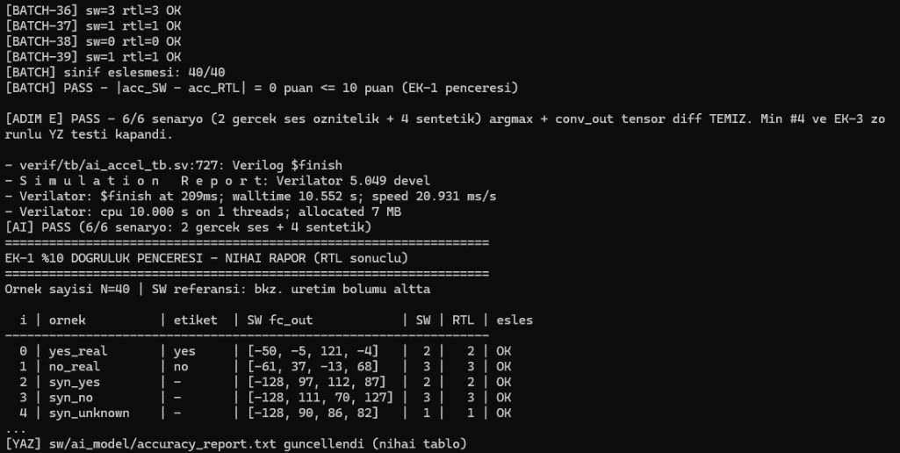
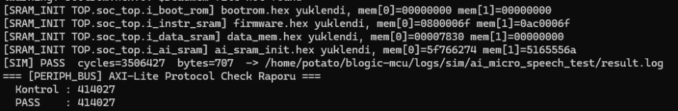
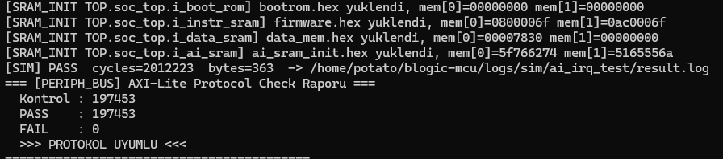
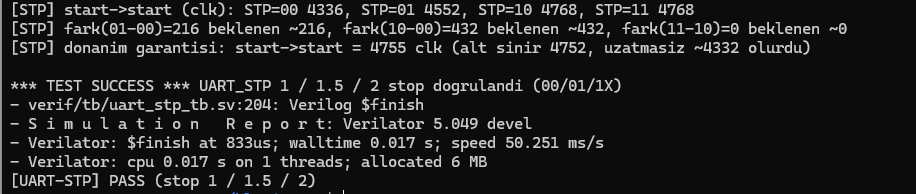

| Flow | Command | Verdict |
|---|---|---|
| Standalone TB (6 scenarios: 2 real + 4 synthetic) | `make ai` | `[ADIM E] PASS — 6/6 senaryo` (tool output: "step E — 6/6 scenarios pass") |
| SoC polling flow | `make soc-ai` | `[SOC-AI] PASS` (argmax = 2 → `yes`) |
| SoC interrupt / ISR | `make soc-ai-irq` | `[SOC-AI-IRQ] PASS` (ISR fires exactly once, argmax 2, DONE cleared) |
| HW vs SW speedup | `make soc-perf` | `[SOC-PERF] PASS` — **21.0 ×** (459,016 vs 9,684,726 cycles, xPack GCC 13.2.0 `-O2`) |
| EK-1 accuracy window | `make ai-batch1000` | **1000 / 1000 sample match**, `|acc_SW − acc_RTL| = 0` (full 10-point window) |
| Requantize saturation rails | `make sim FW_SRC=sw/tests/ai_sat_test.c` | **PASS** — ±2³⁰ bias forces every conv output to the 0x7F / 0x80 rails, 2 × 1000 words verified word-by-word |
| Live board sweep | `sw/ai_model/kart_sweep.py` (COM port) | **60 / 60 diversified UART vectors** match the SW argmax on Genesys 2 |
| Scale rehearsal at the announced jury volume | `kart_sweep.py --n 1000` | **1000 / 1000** (jury criterion is >= 900/1000 argmax match) — 40 named families + 960 seeded-random vectors, zero timeouts, 260 s end-to-end (2026-09-03, `sw/ai_model/kart_sweep_raporu_n1000_2026-09-03.txt`) |
| The same rehearsal from the jury panel, delivered bitstream (7 Sep 2026) | `juri_panel.py` → RANDOM SWEEP, N = 1000, seed 31082026 | **MATCHED 1000 / 1000**, 0 timeouts, 0 mismatches, 459,065 cycles every vector, 275.7 s — report `sw/ai_model/juri_panel_sweep_raporu_n1000_20260907.txt` |

<p align="center">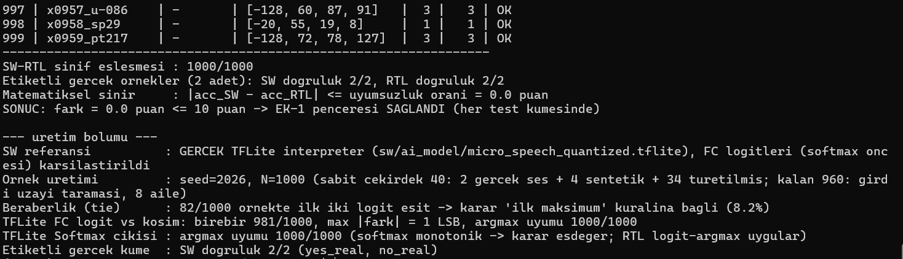</p>
<p align="center"><sub><code>make ai-batch1000</code>, run of 9 September 2026 — <b>SW/RTL class match 1000/1000</b> and <code>|acc_SW − acc_RTL| = 0.0</code> of the 10-point EK-1 window. The production block below the verdict names the reference (<i>the real TFLite interpreter</i> on <code>micro_speech_quantized.tflite</code>, FC logits compared pre-softmax) and reports the residual quantisation spread honestly: FC logits are <b>bit-exact on 981/1000</b> samples with a maximum difference of <b>1 LSB</b> and <b>argmax agreement 1000/1000</b>; 82/1000 samples have a tie between the top two logits, resolved by the "first maximum" rule in both paths. Verbatim from <code>sw/ai_model/accuracy_report_n1000.txt</code>.</sub></p>

<p align="center">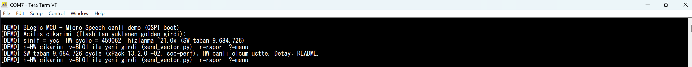</p>
<p align="center"><sub>Live board, 2026-09-02 re-validation: QSPI boot banner and the power-on inference — <code>sinif = yes, HW cycle = 459062, ~21.0x</code> — byte-identical to the August delivery run.</sub></p>

<p align="center">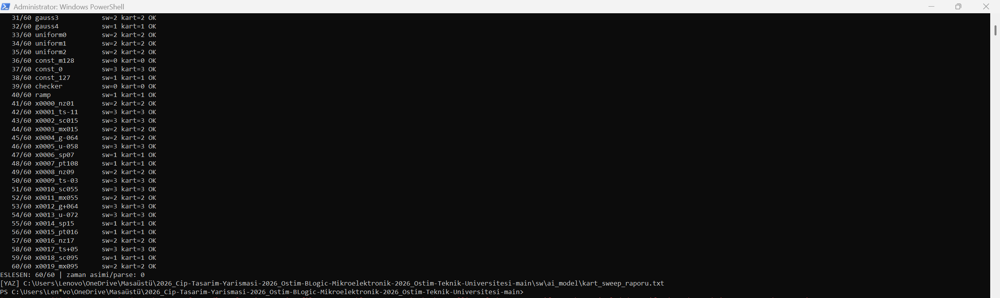</p>
<p align="center"><sub>The same session's full jury rehearsal: <code>kart_sweep.py --n 60</code> → <b>ESLESEN: 60/60, zero timeouts</b> (report committed as <code>sw/ai_model/kart_sweep_raporu_n60_2026-09-02.txt</code>).</sub></p>

<p align="center">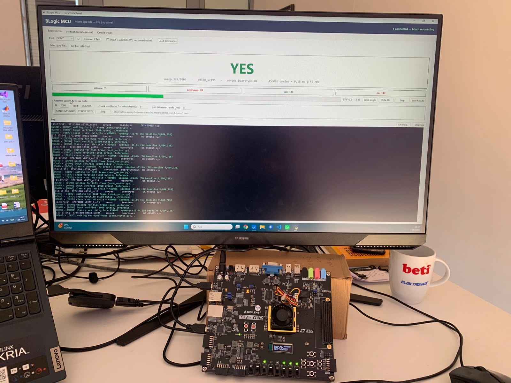</p>
<p align="center"><sub>7 September 2026, delivered bitstream (<code>fpga_top.bit</code> with the JTAG debug subsystem and the OLED): the Genesys 2 and the jury panel in one frame during the seeded 1000-vector sweep — vector 379/1000 classified <b>yes</b> by both the software reference and the board, 459,065 cycles = 9.18 ms at 50 MHz, the OLED on the board showing the same class.</sub></p>

<p align="center">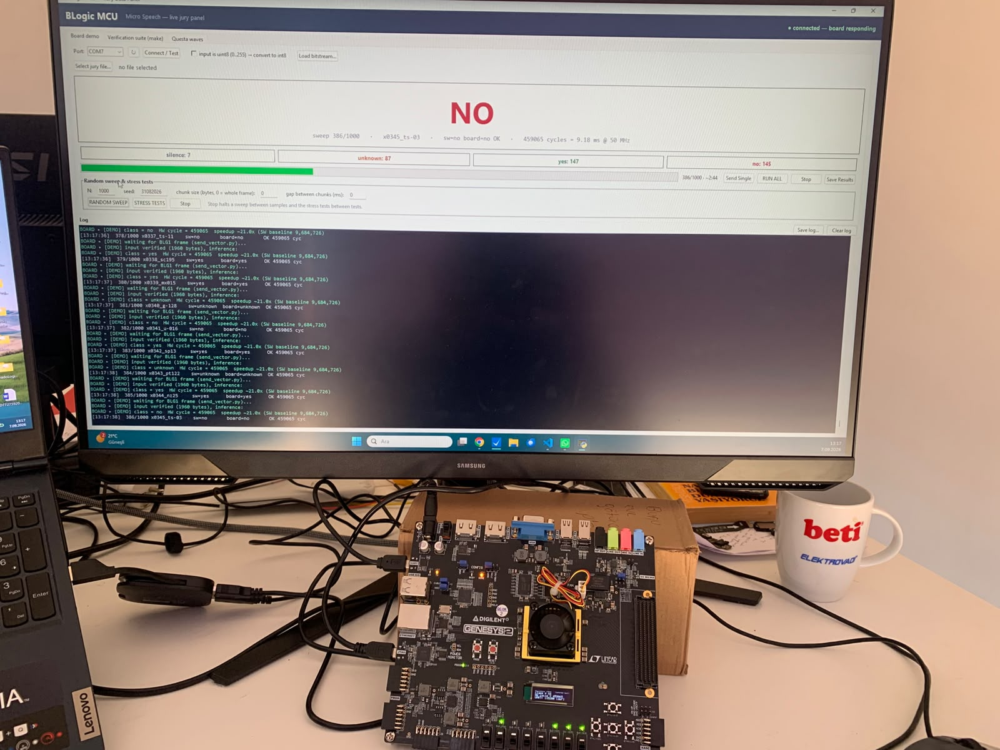&nbsp;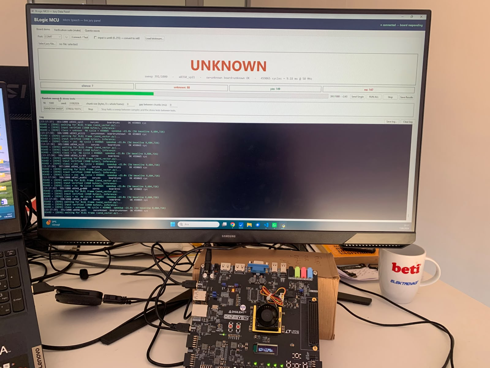</p>
<p align="center"><sub>Later vectors of the same run: <b>no</b> (386/1000) and <b>unknown</b> (391/1000) — the big label, the four class counters and the log follow the board live.</sub></p>

<p align="center">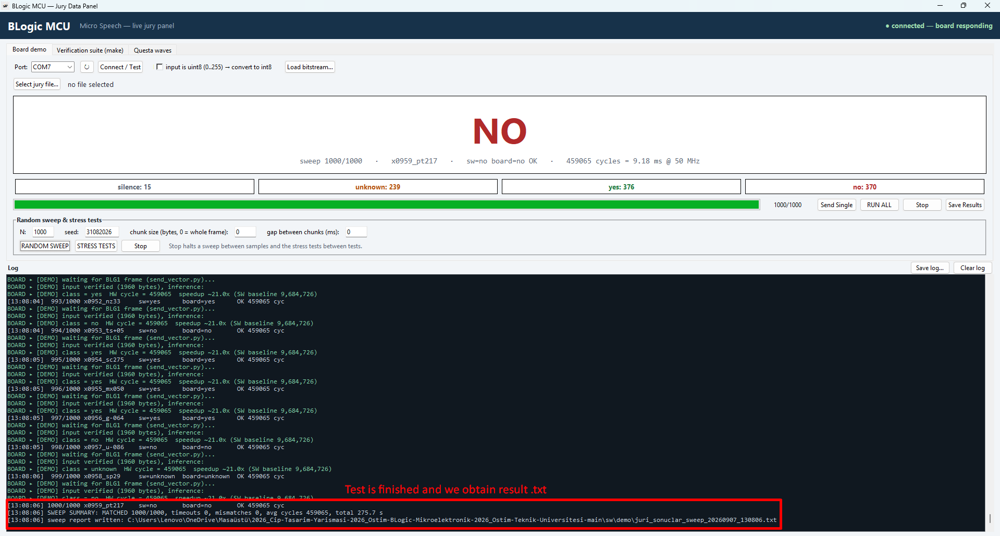</p>
<p align="center"><sub>End of the run: <code>SWEEP SUMMARY: MATCHED 1000/1000, timeouts 0, mismatches 0, avg cycles 459065, total 275.7 s</code>; the per-vector table (sample name, SW <code>fc_out</code>, SW and board class, cycles) is committed as <code>sw/ai_model/juri_panel_sweep_raporu_n1000_20260907.txt</code>.</sub></p>

### 11.5 Performance — Hardware vs Software

```bash
make soc-perf     # regenerates verif/perf_summary.txt
```

The same input is first run on the accelerator, then on the same CV32E40P core with a
pure-software reference implementation. Cycles are counted with the `mcycle` CSR inside
the SoC, so both numbers come from the same clock and the same memory system.

| Measurement | Value |
|---|---|
| Hardware (AI accelerator) | **459,016 cycles** |
| Software (CV32E40P) | **9,684,726 cycles** (`-O2`, `.text` = 3,058 B — re-measured 2026-09-01, identical cycle counts) |
| **Speed-up** | **21.0 ×** |
| Numerical agreement | `conv_out` **1000 / 1000 words bit-exact** |
| Classification | both `argmax = 2` (*yes*) |

Throughput derived from the cycle counts:

| Implementation | Clock basis | HW inference/s | HW throughput | HW latency | SW inference/s | SW throughput |
|---|---|---|---|---|---|---|
| **FPGA — Genesys 2, delivered bitstream** | **50 MHz, verified** (WNS +2.433 / WHS +0.059 ns, §12.4; board-measured 459,065 cycles) | **108** | **211.7 kB/s** | **9.18 ms** | 5 | 9.8 kB/s |
| **ASIC — sky130, verified** | **27.0 MHz, verified** (37.0 ns signoff; setup **and** hold closed in all three corners, §13.7) | **58** | **113.7 kB/s** | **16.98 ms** (459,016 × 37.000 ns) | 2 | 3.9 kB/s |
| ASIC — sky130, target | 50 MHz **target** (setup closes in TT +1.218 ns / FF +3.685 ns, not in SS −9.879 ns; hold closed, §13.7) | 108 | 211.7 kB/s | 9.18 ms | 5 | 9.8 kB/s |
| Scale reference (no implementation) | 100 MHz | 217 | 425.3 kB/s | 4.59 ms | 10 | 19.6 kB/s |

The cycle count is the same in both implementations (same RTL); each row uses the clock
that is actually signed off for that implementation, as the DDK ruling of 8 September 2026
requires (performance per implementation at its verified frequency). **The verified ASIC
row is the 27.0 MHz one**: it is the operating frequency at which the delivered run
`RUN_hold035_2026-09-09` closes both setup and hold in all three mandatory corners (§13.7);
the 50 MHz row is the design target, at which SS setup does not close. Both ASIC rows are
derived from the signoff STA of that run, not from `make soc-perf`. The 21.0 × hardware/software speed-up is
frequency-independent and holds on every row.

Input is `yes_real` — a real speech feature vector from the TFLite Micro Speech dataset,
not a synthetic pattern. Source: `sw/tests/ai_sw_reference.c`.

**Why this number differs from the DTR (22.1 ×).** A single hardware change explains
the entire gap: the `tflite_requant` pipeline cut plus the `data_sram` output register
(timing closure) cost +5.2 % cycles (436,344 → **459,016**) and bought the ASIC frequency
ceiling (38.2 → 45.0 MHz at the time of the change; the final LibreLane 3.0.6 signoff
closes setup at **50 MHz in the TT corner with +1.218 ns of slack** and hold in all three corners; the SS corner does not close at 50 MHz, so the verified ASIC frequency is **27.0 MHz** at the 37 ns signoff period — see §13.7) without changing
any result — `conv_out` remains 1000 / 1000 words bit-exact. The software baseline is
essentially unchanged (9,683,882 → 9,684,726, +0.009 %): 22.1 × (436,344 ÷) → 21.0 ×
(459,016 ÷), same truncating arithmetic as the on-chip report (`(sw × 10) / hw`,
`ai_sw_reference.c`).

The ratio is sensitive to the software baseline, so the compiler and flags are declared
and the full matrix is published rather than one favourable cell (same RTL, measured
7 Aug 2026; source: `scripts/gen_perf_report.py`):

| Toolchain | Flags | SW cycles | Ratio |
|---|---|---|---|
| xPack GCC 13.2.0 (installed default) | `-O2` | 9,684,726 | **21.0 ×** (reported) |
| xPack GCC 13.2.0 | `-O3` | 6,880,488 | 14.9 × |
| crosstool-NG GCC 10.2.0 | `-O2` | 9,029,918 | 19.6 × |

The hardware path is flag-independent (459,016 vs 459,014 — two cycles). `-O2` is the
reported baseline because it is the toolchain's installed default and reproducible on a
clean jury machine with plain `make soc-perf`; the `-O3` figure is published alongside it,
and the EK-1 criterion (> 1.0 ×) is met by every cell.

> **EK-1 acceptance criteria:** speed-up > 1.0 × **and** results bit-identical to the
> golden reference. Both are met. **Single source of truth for the cycle counts and the
> FPGA / scale-reference rows of this section: `verif/perf_summary.txt`**, regenerated by
> `make soc-perf`. If this README and that file ever disagree on those, the file wins. The
> ASIC clock bases (verified 27.0 MHz, target 50 MHz) come from the signoff STA of §13.7,
> which `make soc-perf` does not know about; the ASIC rows are the same cycle counts at
> those clocks.

### 11.6 End-to-End AI Regeneration

```bash
# 1. Extract weights and quantization params from the TFLite model
python3 sw/ai_model/extract_weights.py

# 2. Generate per-class golden vectors (input / conv_out / output)
python3 sw/ai_model/generate_golden.py

# 3. Fetch real WAV-derived features for yes / no (EK-3)
python3 sw/ai_model/fetch_real_features.py

# 4. Build the single ai_sram_init.hex consumed by SoC simulation
python3 sw/ai_model/generate_ai_sram_init.py

# 5. Generate the 40-sample accuracy batch + run RTL TB + auto-report
make ai-acc
```

---

## 12. FPGA Prototyping

### 12.1 Target Platform

**Digilent Genesys 2** — Xilinx Kintex-7 `XC7K325T-2FFG900C`, speed grade -2.

The delivered bitstream `rtl/fpga/fpga_top.bit` is built by `rtl/fpga/build_genesys2.tcl`
from `soc_files.f` with the same three design defines as the ASIC flow (`JTAG_DEBUG`,
`FC1_FIX`, `I2C_SDA_SYNC`); the JTAG debug subsystem is reached through the board's own
USB-JTAG (Xilinx `BSCANE2` USER3/USER4 in place of the ASIC TAP pins), so no extra header
is needed (§12.7 D). `rtl/fpga/fpga_top_m2_demo.bit` is the JTAG-less SRAM-boot backup
for demo day (`build_genesys2_m2demo.tcl`).

<p align="center">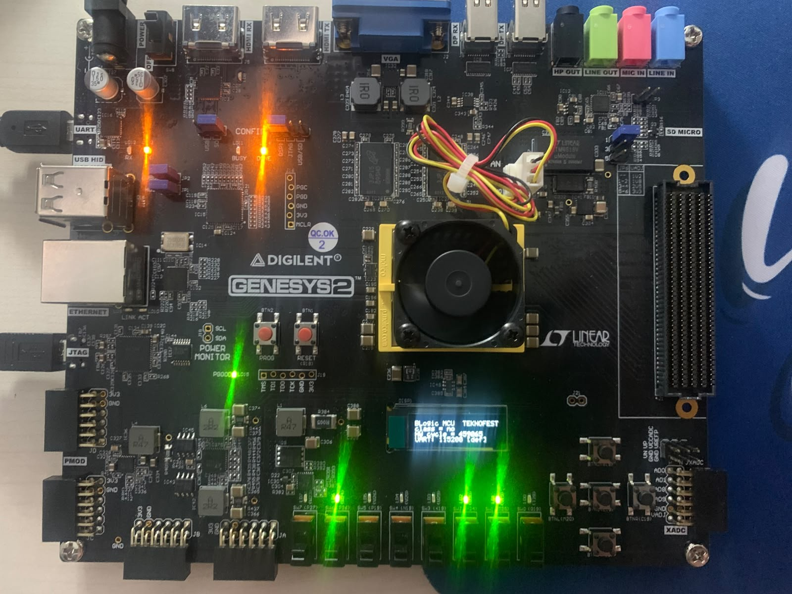</p>
<p align="center"><sub>Digilent Genesys 2 running the delivered bitstream (7 September 2026): USB-UART, USB-JTAG and Ethernet at the left edge, DONE lit next to the CONFIG jumpers, the on-board OLED (bottom centre) showing class / HW cycle / baud, and the class code on the LED row above the switches.</sub></p>

### 12.2 Clock Architecture

```
200 MHz LVDS (AD12 / AD11)
        │
        ▼
     IBUFDS
        │
        ▼
   MMCME2_BASE  (CLKFB ×5 / VCO 1 GHz)
        │  CLKOUT0 ÷20
        ▼
     50 MHz  ─► BUFG ─► soc_top.clk_i
        │
   mmcm_locked
        │
   cpu_resetn (R19)  ─AND─►  2-FF sync release  ─►  soc_top.rst_ni
```

The SoC stays in reset until both the user reset button is released **and** the MMCM has reported `LOCKED`, eliminating metastability on bring-up.

### 12.3 Pin Plan (extract — full file: `rtl/fpga/genesys2.xdc`)

| Signal | FPGA Pin | I/O Standard | Function |
|---|---|---|---|
| `sysclk_p / sysclk_n` | `AD12 / AD11` | LVDS | 200 MHz system clock |
| `cpu_resetn` | `R19` | LVCMOS33 | Active-low reset button (BTNR) |
| `uart_tx_in` | `Y20` | LVCMOS33 | FT232 host TX → SoC UART_0 RXD |
| `uart_rx_out` | `Y23` | LVCMOS33 | SoC UART_0 TXD → FT232 host RX |
| `led[7:0]` | `T28 / V19 / U30 / U29 / V20 / V26 / W24 / W23` | LVCMOS33 | LED0-2 heartbeat / MMCM lock / reset, LED3-7 = GPIO `ODR[4:0]` (LED3-6 inference class, LED7 switch warning) |
| `sw[7:0]` | `G19 / G25 / H24 / K19 / N19 / P19 / P26 / P27` | LVCMOS12 / 33 | GPIO `IDR[7:0]`; `sw0` up = UART_0 9600 baud, `sw1` up = 115200 (demo firmware v1) |
| `oled_*` (dc / res / sclk / sdin / vbat / vdd) | `AC17 / AB17 / AF17 / Y15 / AB22 / AG17` | LVCMOS18 (vbat LVCMOS33) | On-board 128×32 SSD1306 OLED, 4-wire SPI bit-banged from GPIO `ODR[15:10]` (VDD/VBAT switches are active-low on the board and inverted in `fpga_top`) |
| `ja[0..7]` | Pmod JA | LVCMOS33 | UART_1, I²C SCL / SDA |
| `QSPI` | U19 (CS) + R21 / R20 / R25 / P24 (D[3:0]) | LVCMOS33 | Onboard S25FL256S flash + STARTUPE2 CCLK |

### 12.4 Post-Implementation Resource Utilization

> All values below come from the committed signoff reports under `rtl/fpga/reports/`,
> regenerated end-to-end by `vivado -mode batch -source rtl/fpga/build_genesys2.tcl`.
> The reports in the repository were produced by the current bitstream
> (`rtl/fpga/fpga_top.bit`, built 6 September 2026 17:43 from the delivered
> configuration — JTAG debug subsystem on the BSCANE2 TAP, `FC1_FIX`,
> `I2C_SDA_SYNC`, plus the on-board OLED outputs of §12.6; hash and summary in
> `rtl/fpga/reports/build_summary_2026-09-06.txt`), which is the image to run
> on the board.

| Resource | Used (Impl) | Used (Synth) | Available | Utilization |
|---|---|---|---|---|
| **LUT** (13,770 as logic + 2 as memory) | 13,772 | 14,034 | 203,800 | **6.76 %** |
| **FF** | 9,756 | 9,738 | 407,600 | **2.39 %** |
| **BRAM (36k tiles)** | 14 (13× RAMB36 + 2× RAMB18) | 14 | 445 | **3.15 %** |
| **DSP48E1** | 10 | 10 | 840 | **1.19 %** |
| **IO (bonded IOB)** | 49 (43 + 6 OLED) | 49 | 500 | **9.8 %** |
| **BUFG** | 3 (50 MHz system clock, gated CV32E40P core clock, BSCANE2 TCK) | 3 | 32 | **9.4 %** |
| **MMCM** | 1 | 1 | 10 | **10 %** |
| **BSCANE2** | 2 (USER3 = DTMCS, USER4 = DMI) | 2 | 4 | **50 %** |
| **Total estimated power** | — | — | — | **0.330 W** (dynamic 0.167 + static 0.163) — vector-less Vivado estimate, `Confidence Level: Low`; see the note below |
| **WNS / TNS / WHS / THS** | **+2.433 ns / 0 / +0.059 ns / 0** (timing met, positive slack) | | | |
| **Failed routes** | **0** (19,973 / 19,973 routable nets fully routed) | | | |
| **Implementation DRC** | **0 errors**, 80 warnings (see 12.4.1) | | | |

**Note on the power figure — what it is and what it is not.** The 0.330 W is
Vivado's **vector-less** `report_power` result, and the report rates its own
overall confidence as **Low** (`rtl/fpga/reports/power.rpt`, section 1.3).
The rating is broken down there and we repeat it rather than quoting only
the headline number:

| Input | Confidence | Reason given by the tool |
|---|---|---|
| Design implementation state | High | design is routed |
| Clock nodes activity | High | more than 95 % of clocks user-specified |
| Device models | High | production models |
| Internal nodes activity | **Medium** | less than 25 % of internal nodes specified |
| I/O nodes activity | **Low** | more than 75 % of inputs missing user specification |
| **Overall** | **Low** | |

The cause is that no switching activity was supplied: there is no SAIF or VCD
from post-implementation simulation, so the tool applies default toggle rates
to the unspecified nets. The number is therefore an order-of-magnitude
estimate of on-chip power, **not a measurement**, and it is labelled as such
everywhere it appears in this document.

**No measured power figure is reported for either implementation.** For the
ASIC there is no silicon, and the competition's own deliverables document
(section 5.7) requires power results to be marked *estimated* — they are, in
`asic/README.md` section 9.10. For the FPGA a measurement is physically
possible but was not performed for this delivery: the Genesys 2 exposes no
on-board current sense (its XADC provides voltage and temperature only, and
no current-monitor pin appears in `rtl/fpga/genesys2.xdc`), so a real figure
requires external instrumentation in series with the 12 V supply. The two
ways to improve on the estimate are named here rather than left implicit:
(a) feed a post-implementation SAIF back into `report_power`, which raises
the confidence rating without any hardware; (b) measure the 12 V input
current as a delta between the configured and unconfigured board, which
isolates the design's own consumption from the board's. Both are recorded as
future work.

<p align="center">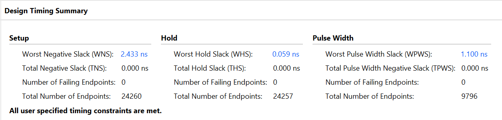</p>
<p align="center"><sub>Vivado <code>report_timing_summary</code> of the delivered <code>fpga_top.bit</code> (6 September 2026, <code>rtl/fpga/reports/impl_timing_summary.rpt</code>): WNS +2.433 ns, WHS +0.059 ns, WPWS +1.100 ns, 0 failing among 24,260 setup / 24,257 hold / 9,796 pulse-width endpoints &mdash; "All user specified timing constraints are met".</sub></p>

Two clock domains are constrained: the synchronous `clk_50_mmcm` SoC domain
(WNS +2.433 ns / WHS +0.059 ns, zero failing among 24,260 setup / 24,257 hold
endpoints in total) and the BSCANE2 `jtag_tck` domain of the debug TAP (100 ns
period, 320 endpoints, WNS +94.976 ns / WHS +0.087 ns); the two are an
asynchronous clock group and cross only through the riscv-dbg two-phase
handshake. With a 20 ns period and +2.433 ns of setup slack the SoC domain
closes with **~57 MHz of achievable headroom** while running at 50 MHz. The
debug subsystem costs 1,254 LUT / 1,081 FF (`i_dm_top` 488 / 665, `i_dmi_jtag`
582 / 362, `axi_dm_slave` 184 / 54, `impl_utilization_hier.rpt`); the JTAG-less
build of the same RTL closed at WNS +3.089 ns / WHS +0.068 ns with 12,340 LUT /
8,639 FF, and the JTAG build without the OLED outputs (6 September 04:39, the
image used for the board evidence of §10.10) at WNS +2.538 ns / WHS +0.085 ns
with 13,775 LUT / 9,752 FF.

Note on the drop versus earlier revisions: the accelerator's `conv_out`
storage originally presented three combinational read ports, which Yosys could
not infer as memory and implemented as ~32,000 flip-flops. Rewriting it as a
single synchronous port with a byte mask (see `rtl/ai_accelerator/ai_accelerator.sv`)
let the tools map every array to Block RAM — `LUT as Memory` is **2** and
all SoC storage sits in the 14 BRAM tiles above.

#### 12.4.1 Implementation DRC

`report_drc` reports **no errors and no critical warnings**; the 80 warnings
break down as follows and are all benign for this design:

| Rule | Count | Meaning |
|---|---|---|
| `REQP-1839` / `REQP-1840` | 20 + 20 | Asynchronous control on RAMB36 / RAMB18. Our memories use synchronous reads and are reset only through the synchronous SoC reset; the check fires on the shared asynchronous reset net. |
| `DPIP-1`, `DPOP-1`, `DPOP-2` | 19 + 8 + 8 | DSP48 input / output pipelining advisories. Adding those pipeline stages would raise DSP `Fmax`; at 50 MHz the design already has +2.433 ns of setup slack, so the extra latency is not worth taking. |
| `RPBF-3` | 3 | Incomplete IO buffering. Expected: the QSPI clock does not use a regular IO buffer — it reaches the flash through `STARTUPE2`/`USRCCLKO` (see 12.3). |
| `CHECK-3` | 2 | Vivado stopped listing after 20 violations of the two `REQP` rules above. |

### 12.5 Placed & Routed Design

<p align="center">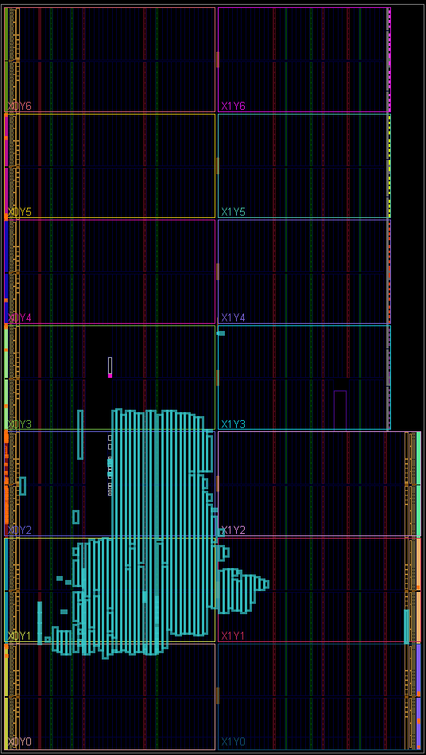&nbsp;&nbsp;&nbsp;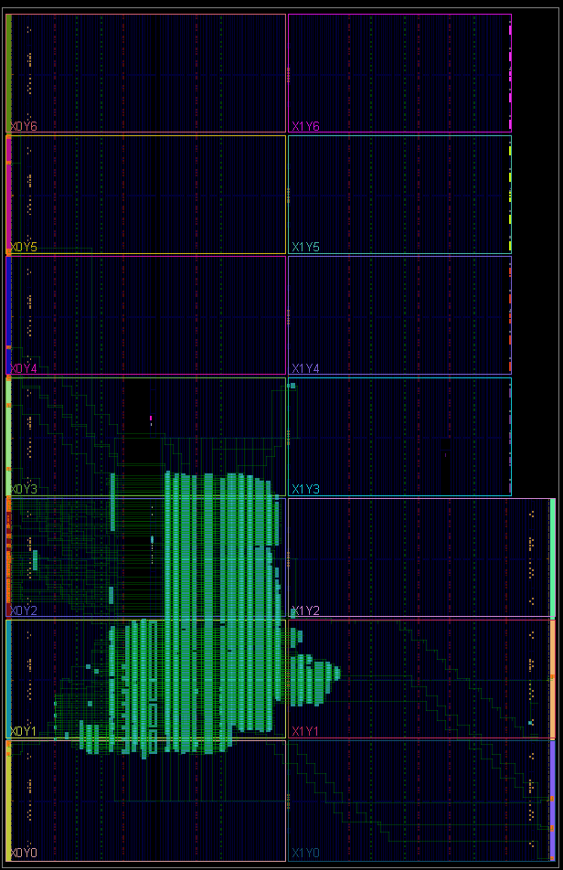</p>
<p align="center"><sub>Left: placement, every leaf cell of the design highlighted. Right: the same checkpoint with routing resources displayed &mdash; the green nets (19,973 / 19,973 fully routed) fan out from the logic block to the I/O columns at both die edges.</sub></p>

> Both device views show the delivered bitstream (`fpga_top.bit`, 6 September 2026,
> checkpoint `build/fpga_genesys2/post_route.dcp`); on the left every placed cell
> is highlighted: the SoC together with the JTAG debug module occupies clock
> regions X0Y1-X0Y3 of the XC7K325T (13,772 LUT = 6.76 %, 9,756 FF = 2.39 %).
> The June 2026 revision pictured here earlier used 23 % LUT / 15 % FF, which
> is why its floorplan looked much fuller. Numeric signoff data: the table in
> 12.4 and the reports under `rtl/fpga/reports/`.

#### 12.5.1 Synthesized netlist — Vivado schematic views

<p align="center">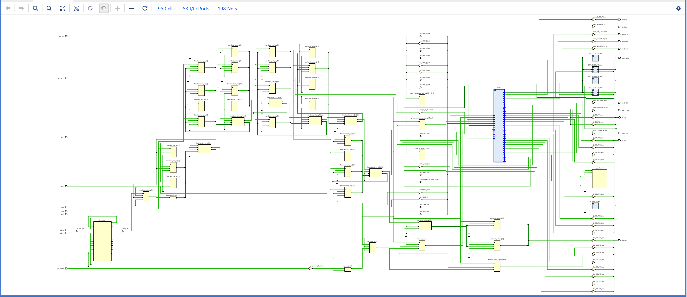</p>
<p align="center"><sub><code>fpga_top</code> after synthesis (95 cells, 53 I/O ports, 198 nets): the MMCM and reset synchroniser at the bottom left, the heartbeat counter chain, the single <code>i_soc</code> instance in the centre and the I/O buffers on the right &mdash; LEDs, Pmod JB, QSPI, UART and the six OLED lines.</sub></p>
<p align="center">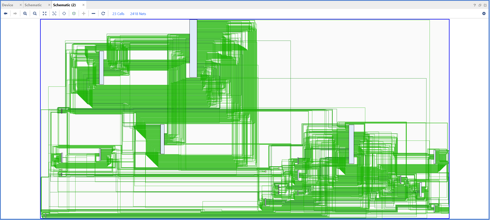</p>
<p align="center"><sub>One level down, <code>i_soc</code> (23 cells, 2,418 nets): the module instances of the hierarchical utilization report in 12.4 &mdash; CV32E40P core, OBI&rarr;AXI bridges, crossbar, SRAMs and boot ROM, AI accelerator, the peripherals (2&times; UART, QSPI, I2C, timer, GPIO) and the JTAG debug subsystem (<code>dmi_jtag</code>, <code>dm_top</code>, <code>axi_dm_slave</code>) &mdash; joined by the 2,418 nets of the AXI/OBI fabric.</sub></p>

### 12.6 FPGA Demos — Live Board

| | |
|---|---|
| 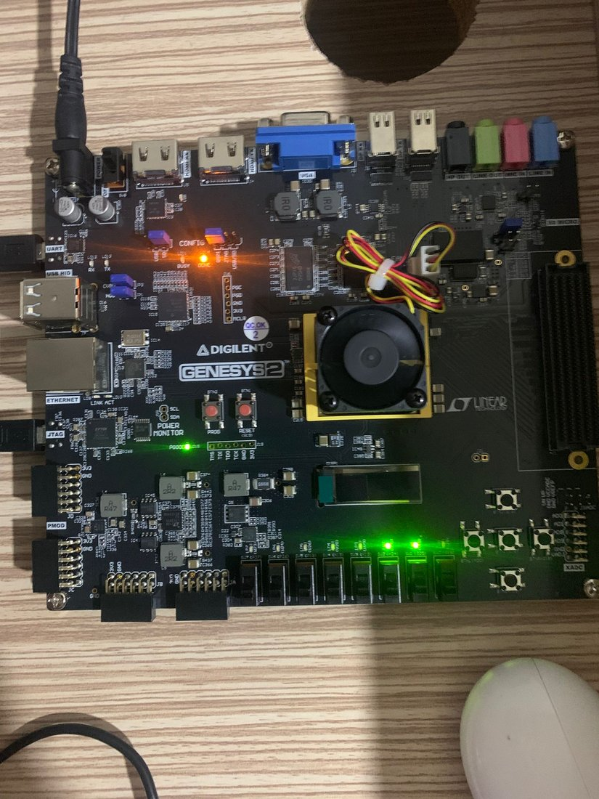 | 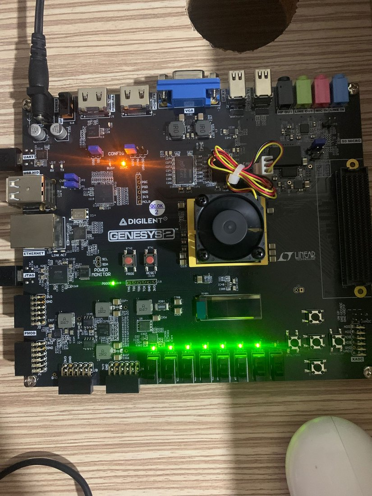 |
| GPIO walking-1 lighting the user LED row | UART test running, USB-UART + JTAG connected |

#### UART Hello World (host terminal)

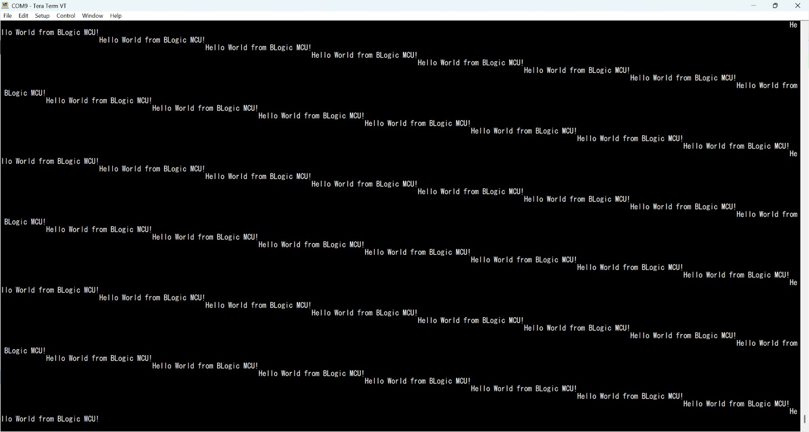

The SoC continuously emits `Hello World from BLogic MCU!` on UART_0 at 115200-8-N-1.

#### Calculator over UART (interactive)

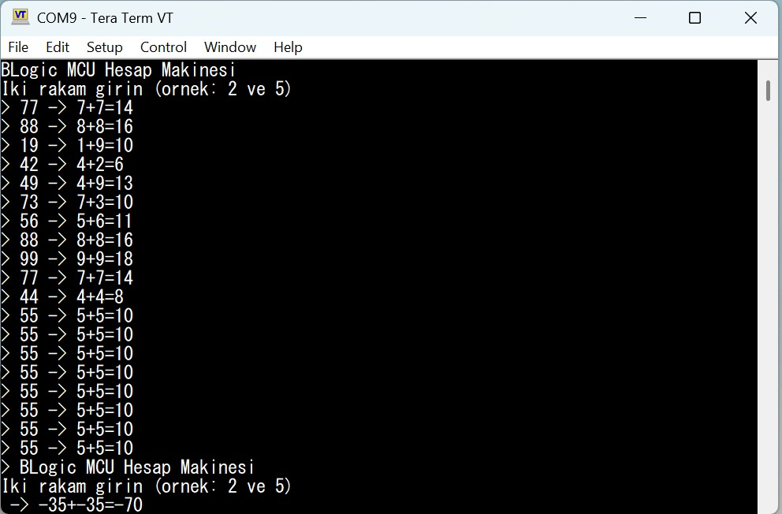

The firmware `sw/tests/uart_add_test.c` reads two digits from the host, computes the sum on the CV32E40P core, and prints the result over UART_0 — fully exercising the OBI → AXI4 → AXI-Lite path on real silicon (FPGA).

#### On-board OLED and switch-selected UART baud (demo firmware v1, 6 September 2026)

The demo firmware (`sw/demo/demo_main.c`) drives the board's 128×32 OLED
(SSD1306, 4-wire SPI bit-banged from GPIO `ODR[15:10]`, `rtl/fpga_top.sv`)
with four lines: the title, `class = yes|no|silence|unknown` after every
inference, the live `HW cycle` count and the active UART baud. The baud is
chosen with the switches, read at boot and re-read in the idle loop:
`sw0` up alone → **9600**, `sw1` up alone → **115200**, both down → 115200
(default), both up → invalid: the last valid rate is kept, LED7 lights and
the OLED reports `SW0+SW1 ERROR`. A change prints a banner at the new rate, so
the host terminal (or the panel's *Baud* box) must follow. The class is still
shown on LED3-6 and printed on UART_0 as a single line, so every script that
parses `class = … HW cycle = …` keeps working. The font is
`sw/demo/oled_font.h` (5×7, generated from ASCII-art glyph definitions).

<p align="center">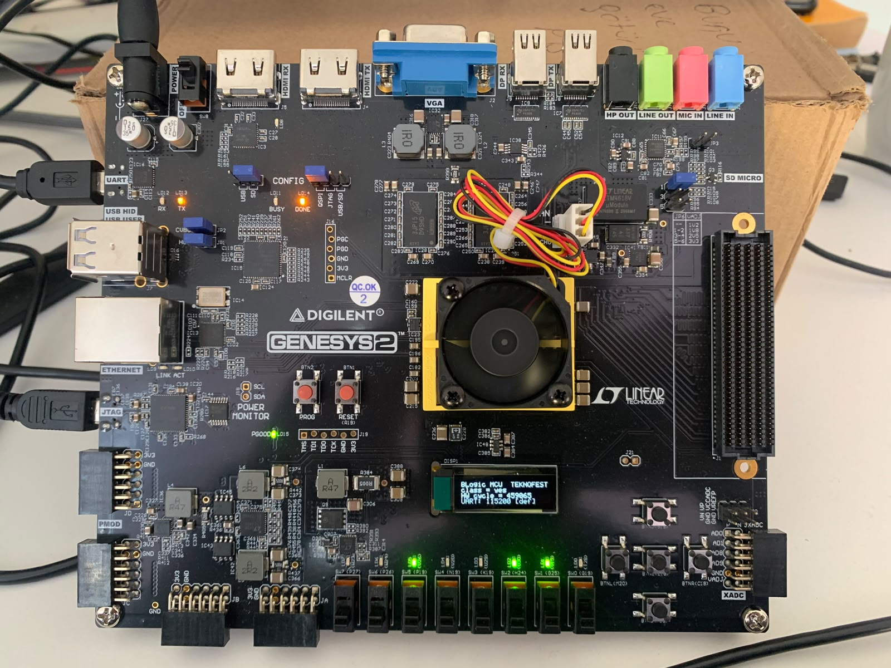</p>
<p align="center"><sub>Genesys 2 running the delivered bitstream (7 September 2026): USB-UART and JTAG cables at the left edge, DONE lit, the OLED with <code>BLogic MCU TEKNOFEST / class = yes / HW cycle = 459065 / UART: 115200 [def]</code> and the class code on the LED row.</sub></p>
<p align="center">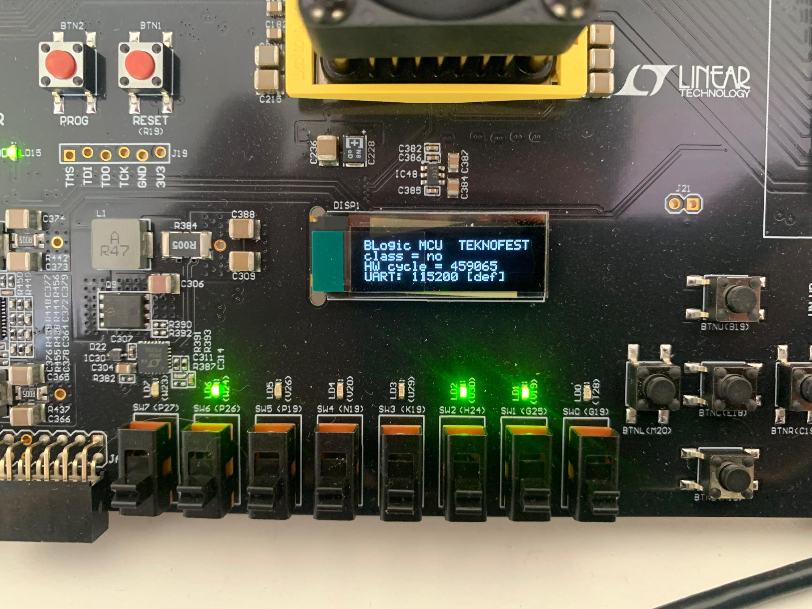</p>
<p align="center"><sub>Close-up after a <b>no</b> vector: the four OLED lines and LD1/LD2/LD6 — the class code on LED3-6 next to the switches (all down = 115200 default).</sub></p>

#### TEKNOFEST demo test harness — two-UART flow (demo firmware v2, 7 September 2026)

On demo day the jury connects the board to its own Python tool
(`demo_harness.py` 1.0.2): a **stream UART** carries the 1960-byte int8
vectors, a separate **core UART** returns one result line per vector, and the
tool scores golden agreement, latency and ten robustness scenarios from a JSON
Interface Control Document (ICD) written by the team. The delivered firmware
`sw/demo/demo_main.c` serves that flow next to the panel protocol of §12.7-C:

| Item | Our implementation |
|---|---|
| core UART | UART_0 on the on-board FT232 USB-UART (COM7 on the demo laptop), 115200 8N1 — result line `RESULT: <class>` immediately followed by the `[DEMO] class = … HW cycle = …` log line the panel and `kart_sweep.py` parse |
| stream UART | UART_1 on **Pmod JA**: JA1 = board RXD (host TX), JA2 = board TXD (host RX), JA5 = GND, 3.3 V USB-TTL adapter; 115200 8N1 by default, **230400 with `sw2` up** (the ICD baud must match; the OLED's fourth line shows both rates). 1 Mbps is deliberately not offered: the UART divisor rounds to multiples of 8 clocks (50 → 48, +4.2 %) and, with a single-byte receive register, a 1 Mbps stream lost 3.8 % of the bytes to CPU latency in simulation |
| frame | `"BLG1"` + length (2 bytes LE, 1960) + 1960 int8 + CRC16-CCITT (poly 0x1021, init 0xFFFF, LE, over the payload) — `sw/demo/team_icd.json`; `sw/demo/harness_frames.py` builds the same bytes as the harness's `FrameBuilder` (verified byte-identical) |
| receiver | byte-driven state machine with a 256-byte software ring: preamble mismatch, wrong length or bad CRC → shift to the next `BLG1` candidate inside the buffer and re-parse (truncated and oversized frames), 100 ms of silence inside a frame → drop it, every wait loop (UART_0 printing, OLED SPI, inference wait) keeps draining UART_1 so back-to-back frames survive the single-byte RDR |
| hooks | boot banner `BLogic MCU` on `?`, `peripheral_interleave` via `r` (`REPORT: SW baseline …`), `ignore_regex` `^\[DEMO\]` |
| self-test | `l` on the core UART: the firmware transmits one harness frame on UART_1 TX; with a jumper between JA1 and JA2 it comes back on UART_1 RX, runs through the same parser and prints `RESULT:` — an adapter-free check of the Pmod pins, the receiver and the parser (also the second step of `make demo-harness-sim`, where the simulator's UART_1 loopback plays the jumper) |
| ICD status | `python demo_harness.py validate -c sw/demo/team_icd.json` → **Valid** (one advisory warning about 115200 on the stream port; `sw2` up + ICD baud 230400 halves the vector time); `run --dry-run` against the tool's simulated device: 10/11 robustness scenarios pass, the eleventh (`peripheral_interleave`) needs the real board |
| **board evidence** | 8 September 2026 00:53, Genesys 2 with the delivered `fpga_top.bit` and firmware v2 in flash, CP2102 USB-TTL on Pmod JA (COM8) + on-board FT232 (COM7), the jury tool unmodified: `run --manifest public_dataset/manifest.csv` → **golden agreement 100.00 % (156/156)**, 0 mismatches, 0 timeouts, latency median / p95 / max 43.28 / 43.81 / 44.06 ms, **robustness 11 / 11** (silence, dither, saturation, alternating, back-to-back ×5, truncated, oversized, peripheral interleave via `r`, determinism 10× jitter 0.90 ms, 3 s idle); run twice with identical results. Report set committed under `sw/demo/harness_results/2026-09-08_public_dataset/` (`report.md`, `summary.json`, `samples.csv`, `robustness.csv`, `transcript.log`, `config_used.json`) |
| simulation evidence | `make demo-harness-sim` — the firmware runs on the Verilator model with 13 stream scenarios injected back-to-back on UART_1 at 230400 baud, the board's fastest stream rate (valid / zero / saturated / alternating vectors, a truncated frame followed by a valid one, 37 junk bytes after a frame, a bad-CRC frame, a `BLG` decoy, three back-to-back frames); the 14 `RESULT:` lines must match the bit-exact software reference in order → `[HARNESS-SIM] PASS` |
| own regression set in the tool's format | `make demo-harness-dataset` (`sw/demo/make_harness_dataset.py`, pure Python, no numpy/tflite) writes a dataset in the jury tool's own layout — `manifest.csv` (`file,name,truth,golden,…`) + `vectors/*.bin` (1960 int8) + `dataset_summary.json` — from the generator of `kart_sweep.py` / the panel's RANDOM SWEEP (40 named families + the seeded 8-family extension; the generator whose 1000 vectors are RTL-verified by `ai-batch1000` and board-verified in §11.4), the `golden` column coming from the bit-exact software reference. 8 September 2026: 1000 vectors in 52 s and 2000 in 89 s (seed 31082026; the 2000-vector set is a superset of the 1000-vector one — the generator's sequence is seeded, so extending `--n` only appends), accepted by the unmodified tool. `make demo-harness-sim-dataset` (`DS_K` vectors of the set through the UART_1 stream path on the Verilator model, one harness-style pause after each frame) → `[HARNESS-SIM] PASS` **10/10** (8 September 2026: seeded 10-vector subset, all 19,680 bytes received, `ok=10 bad=0`). **On the board**, same setup as the public-set run: 03:05 with 200 vectors → **200/200**, and 23:56 with the full **2000-vector** set → **golden agreement 100.00 % (2000/2000)**, 0 timeouts, 0 mismatches, latency median / p95 / max **43.34 / 43.92 / 46.38 ms**, **robustness 11 / 11**; the confusion matrix is perfectly diagonal (silence 27, unknown 481, yes 741, no 751). Report sets with their manifests committed under `sw/demo/harness_results/2026-09-08_random_dataset_n200/` and `…_n2000/` |
| the tool's GUI | `demo_gui.py` (gui 1.2.1) opened with the same ICD on 8 September: all 72 fields load, **Validate** shows only the 115200 advisory, Run tab with the public manifest → "Run complete" dialog and report folder written (dry-run: 30/30 golden, 10/11 robustness — `peripheral_interleave` needs the board, as in the CLI dry-run). Demo-day note: the GUI's *Synthetic (test only)* source attaches a cyclic pseudo-golden label, so agreement reads ≈25 % by construction; use *Manifest CSV* (public set or `random_dataset`) |

Demo-day sequence with the jury tool: load `fpga_top.bit`, press R19 (the
banner and the boot inference appear on the core UART), plug the USB-TTL
adapter into JA, set the two port names in `team_icd.json`, then
`python demo_harness.py run -c team_icd.json --manifest public_dataset/manifest.csv`
followed by `--only-robustness`; keep the `results/<team>_<timestamp>/` folder
(`report.md`, `summary.json`, `samples.csv`, `robustness.csv`, `transcript.log`,
`config_used.json`). The hardware reports the class only (the accelerator writes
the argmax, not the four scores), so the tool's optional score-error metric
stays empty. Team checklist for the day (cabling, commands, expected outputs, fallbacks):
`docs/demo_gunu_kontrol_listesi.md`.

#### QSPI Boot-Flow Live Trace

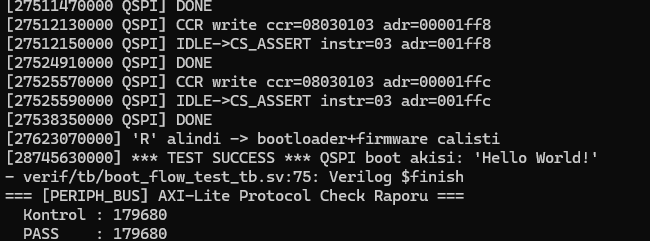

Internal Boot ROM trace shows the QSPI flash being read into Instruction SRAM (`adr=001ff8 / 001ffc`), the firmware-loaded character `'R'` arriving, and the user `*** TEST SUCCESS ***` golden string emitted on UART_0.

### 12.7 FPGA Build Instructions

#### A. Generate the bitstream

```bash
# Open a shell with Vivado on PATH
source /tools/Xilinx/Vivado/2021.2/settings64.sh

# Batch mode (recommended) — works from any directory
vivado -mode batch -source rtl/fpga/build_genesys2.tcl

# Or from inside the Vivado Tcl Console:
#   source rtl/fpga/build_genesys2.tcl
```

Output: `rtl/fpga/fpga_top.bit` (bitstream) + `rtl/fpga/reports/*.rpt` (synthesis / timing / utilization / power / DRC signoff reports). Intermediate files and routed checkpoints go to `build/fpga_genesys2/`.

The script parses `soc_files.f`: every `+define+` line becomes a synthesis define
(`JTAG_DEBUG`, `FC1_FIX`, `I2C_SDA_SYNC` — the delivered configuration) and
`dmi_jtag_tap.sv` is replaced by the BSCANE2-based `dmi_bscane_tap.sv`; `genesys2.xdc`
carries the matching `jtag_tck` clock (100 ns on the BSCANE2 TCK pin), the asynchronous
group towards `clk_50` and the TDI/TDO max-delay constraints.

> The build uses `BOOT_ADDR_HEX = 00000000` (M3 flash-boot mode). For SRAM-direct boot (M2), edit `build_genesys2.tcl` to `BOOT_ADDR_HEX = 00010000` and rebuild.

#### B. Program the QSPI Flash + load the bitstream

```bash
# First produce the FULL flash image as a raw binary
# (fw@0x0 + data@0x8000 + AI weights@0x10000 — see scripts/gen_flash_image.py):
make flash-bin FW_SRC=sw/tests/hello_blink.c

# Then, with the bitstream already built and the board connected:
vivado -mode batch -source rtl/fpga/flash_firmware.tcl
```

> Do **not** use the old `objcopy -O binary` recipe: it emits only `.text`,
> so the data region never reaches the flash and any firmware with string
> literals prints NULs (this was one of the two root causes of the silent
> board, fixed 11 Aug).

This one-shot script:

1. Opens Hardware Manager and connects to the JTAG target.
2. Auto-detects the Genesys 2 onboard flash device (S25FL256S).
3. Converts `rtl/fpga/firmware_flash.bin` → `firmware_flash.mcs`.
4. Erases → programs → verifies the flash.
5. Re-programs `fpga_top.bit` so the design picks up the new flash contents.

> Once programmed, press the **R19 reset button** to release CPU reset and start firmware execution.

#### C. Demo-day cockpit (`sw/demo/juri_panel.py`)

One window replaces Vivado GUI + terminal + scripts on demo day:

```
python sw/demo/juri_panel.py
```

The window has three tabs above one shared log: **Board demo** (items 1-4),
**Verification suite (make)** (the 40 `make` targets of the Makefile in a
table, run inside WSL with a PASS/FAIL line and a `juri_make_<date>.txt`
report; the panel puts `~/.local/bin`, `/opt/riscv/bin`, `/usr/local/bin` and
a TFLite venv in front of the WSL `PATH`, so a user-local RISC-V toolchain and
Verilator are found by the non-interactive shell) and **Questa waves** (item 5).

<p align="center">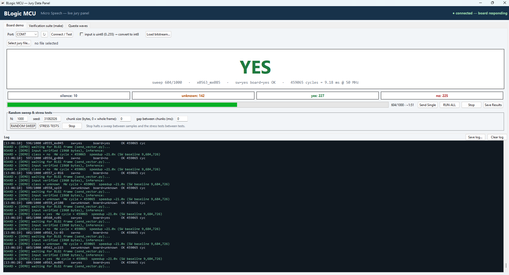</p>
<p align="center"><sub>The panel on 7 September 2026 during the seeded sweep (vector 604/1000): tabs, port and bitstream controls, the big class label with the live cycle count, class counters, progress and the shared log with the board's own UART lines (<code>BOARD ▸</code>).</sub></p>

1. **Load bitstream…** — pick `rtl/fpga/fpga_top.bit` (normal, flash boot) or
   `rtl/fpga/fpga_top_m2_demo.bit` (backup: demo firmware embedded, boots
   from SRAM, needs no flash at all; no JTAG debug subsystem). Note that the backup
   image still embeds the earlier demo firmware build whose UART/OLED strings are
   Turkish (`sinif = …` rather than `class = …`); rebuild it with
   `build_genesys2_m2demo.tcl` to embed the current English-string firmware. The panel programs the FPGA over JTAG via
   Vivado batch; the bitstream is volatile, so re-load after every power cycle.
2. **Connect / Test** — opens the UART port at the rate in the *Baud* box
   (115200 or 9600; it must match the board's `sw0`/`sw1` selection, §12.6);
   from then on every line the board prints (boot banner after R19, menu,
   results) appears live in the panel log.
3. **Select jury file…** — (panel protocol on UART_0; the jury tool's own
   two-UART flow is described in §12.6) auto-detects `.bin` / `.npy` / `.csv` / `.txt` /
   `.hex` or a folder, validates every vector (1960 bytes, int8) *before*
   touching the board, then **RUN ALL** streams them with the BLG1
   frame + checksum. A timeout retries once; each result is written to disk
   as it arrives; the final file carries a one-line summary (class
   distribution, mean cycles/ms).
4. **Random sweep & stress tests** — the `kart_sweep.py` jury rehearsal inside
   the panel. **RANDOM SWEEP** generates *N* (default 1000) seeded samples with
   exactly the same generator as `sw/ai_model/kart_sweep.py`
   (`run_accuracy_window.make_samples`: 40 core cases — real/synthetic keywords,
   noise, time/frequency shifts, mixes, scaling, Gaussian/uniform noise,
   constants, patterns — plus the extension families) and compares the board's
   class with the same bit-exact SW reference (`run_accuracy_window.run_model`,
   RTL-verified in the N=1000 simulation sweep), so `seed 31082026` reproduces
   the very vectors of `kart_sweep.py --n 1000 --seed 31082026`. The reference
   is imported lazily when the sweep starts (pure Python, no numpy/tflite);
   *chunk size* / *gap* split every frame into chunks with a pause between them
   (slow or fragmented senders). The log shows
   `i/N sample sw=… board=… OK|MISMATCH cycles`, the big label and counters
   follow the board, and the summary
   (`MATCHED n/N, timeouts, mismatches, avg cycles, total s`) plus the per-sample
   table go to `juri_sonuclar_sweep_<date>.txt`. **STRESS TESTS** runs seven
   protocol-robustness checks on the live board, each logged PASS/FAIL:
   (a) 64-byte chunks with 5 ms gaps, (b) 1-byte chunks with 1 ms gaps
   (~2000 writes), (c) 64 junk bytes with partial `B`/`BL`/`BLG` decoys before
   the magic — the firmware resynchronises on `BLG1`, (d) checksum+1 —
   `CHECKSUM ERROR` and no class line within 3 s, (e) length 1961 —
   `invalid length`, (f) a frame cut after 1000 bytes — `RX timeout` after
   ~12 s, then a normal vector proves recovery, (g) 20 back-to-back vectors
   with the mean ms/vector. *Stop* halts either run between samples/tests.
   `--selftest` exercises the same code paths without hardware against a
   built-in `FakeSerial` model of the firmware's UART state machine.
5. **Questa waves** — the `verif/questa` flow from the panel. The 21 tests of
   `verif/questa/tests.tcl` sit in a table; *Open in Questa (GUI + wave)*
   recompiles the delivered configuration, loads the selected testbench and
   opens the ready-made wave window of `verif/questa/wave/*.do` — the groups to
   load (UART0, CPU, interrupts, QSPI, I2C, GPIO, AI accelerator, JTAG TAP
   pins, DMI, debug module, AXI-DM bridge, crossbar, …) are ticked in the
   panel and extra signal paths can be typed in; they reach the flow as
   `QUESTA_WAVE_GROUPS` / `QUESTA_WAVE_EXTRA`, read by `questa_lib.tcl`.
   *Run headless* runs `vsim -c` for the selected tests (or all 21) with the
   verdict taken from `verif/questa/logs/<test>.transcript` exactly as
   `verif/questa/batch.ps1` does, coloured PASS/FAIL per test in the table and
   the log. Needs Questa on the machine (the *vsim* box is auto-detected);
   `--selftest` checks the catalogue against `tests.tcl` and, with
   `PANEL_QUESTA_LIVE=1`, really runs `uart_stp` headless. Questa 10.7c cannot
   open a repository path with non-ASCII characters (`work/_lib.qdb: unable to
   open database file`, seen with `Masaüstü`), so on Windows the panel runs
   Questa from an ASCII drive letter: it reuses an existing `subst` mapping of
   the repository or creates one on a free letter, and says so in the log.

> Windows note: Vivado (GUI and batch) and Questa 10.7c fail on paths containing
> non-ASCII characters (e.g. `Masaüstü`). Map the repository to a drive letter
> first (`subst X: "<repo path>"`) and work from `X:\`; the panel copies
> bitstreams to an ASCII temp directory on its own and runs Questa from a
> `subst` drive it finds or creates. Board-verified 2026-09-03: 1000/1000 with
> `kart_sweep.py --n 1000`, M2 backup boots and classifies without flash; and
> 2026-09-07 from the panel itself on the delivered bitstream: RANDOM SWEEP
> 1000/1000 (§11.4).

5. **Verification suite** — the `make` targets from a table inside the panel:
   the 18 `test-all` components, the gates (`lint`, `lint-fpga`, `jtag-gates`,
   `asic-sram-sim`, `asic-top-sim`, `coverage`) and the other checks
   (`boot-real`, `isa-compliance`, `ai-uart-load`, `test-full`, ...). Select
   rows or a group heading and press **Run selected** (or **Run test-all**);
   the targets run one after another inside WSL (the panel derives the
   distro and repository path from its own location, both are editable),
   their output streams into the panel log as `MAKE ▸` lines with the
   compiler noise filtered out (**verbose log** shows everything), each row
   turns green `PASS` or red `FAIL` with its duration, the `test-all` /
   `test-full` summary tables colour the individual rows, and a
   `juri_make_<date>.txt` report is written at the end. **Stop** kills the
   whole process group of the running target (Verilator simulations
   included); closing the panel does the same.

#### D. JTAG debug session on the board

```powershell
# 1. Windows: hand the FT2232H USB-JTAG (0403:6010) to WSL2 with usbipd. Vivado hw_server
#    and the serial terminal must be closed; the UART is a separate FT232R (COM7) and stays usable.
.\scripts\jtag_kart_wsl.ps1            # -Detach gives the device back to Windows
```

```bash
# 2. WSL: OpenOCD demo on the flash-booted firmware — halt, registers, single-step, CSR,
#    memory and MMIO access, hardware breakpoint, reset halt / reset run; verdict + log in logs/jtag/
make jtag-board                        # scripts/run_jtag_board.sh + rtl/debug/openocd/genesys2_bscan.cfg
# interactive session instead of the demo script (telnet :4444, gdb :3333):
openocd -f rtl/debug/openocd/genesys2_bscan.cfg -c "bindto 0.0.0.0"
```

```powershell
# 3. Windows, with the interactive OpenOCD of step 2 running: JTAG and the AI demo together —
#    halt/inspect/resume between live inferences, hardware breakpoint on run_hw before the accelerator starts
py -3 scripts/kart_jtag_entegrasyon.py --port COM7 --bp 0x104b8 `   # run_hw of demo firmware v1 (nm build/test.elf)
    --inputs sw/ai_model/golden_vectors/acc_batch_inputs.hex `
    --expected sw/ai_model/golden_vectors/acc_batch_expected.hex `
    --bin rtl/fpga/firmware_flash.bin
```

Evidence of both on hardware (6 September 2026): `rtl/debug/openocd/demo_run_board_2026-09-06.log`
and `demo_run_board_entegrasyon_2026-09-06.log` (§10.10). The backup image
`fpga_top_m2_demo.bit` has no debug subsystem — use `fpga_top.bit` for JTAG.

---

## 13. ASIC Flow (sky130)

The design targets a sky130 tape-out through **LibreLane 3.0.6**. Everything below is
reproducible from a clean clone; no step depends on a commercial EDA licence.

### 13.1 Environment

| Component | Version / hash |
|---|---|
| LibreLane | 3.0.6 (`ba7193b`, DDK reference version) |
| Yosys (in LibreLane) | bundled with LibreLane 3.0.6 (see `asic/environment/versions.txt`) |
| yosys-slang | bundled with LibreLane |
| sky130 PDK (ciel) | `8afc8346a57fe1ab7934ba5a6056ea8b43078e71` |
| Standard cells | `sky130_fd_sc_hd` |
| SRAM macros | `sky130_sram_macros` (ships with the PDK) |

### 13.2 Files

| Path | Purpose |
|---|---|
| `asic/filelist.f` | synthesis file list — 84 source files in compilation order (SoC RTL + the JTAG debug subsystem: riscv-dbg, common_cells v1.38.0 CDC cells, tech_cells_generic, `axi_dm_slave`) and the six defines `SYNTHESIS`, `ASIC_SRAM_MACRO`, `BOOTROM_CONTENT`, `JTAG_DEBUG`, `FC1_FIX`, `I2C_SDA_SYNC` (canonical source is `config.yaml`; regenerated from it with `check_filelist.py --generate` and cross-checked on every `make asic_run`; SVA/TB excluded, top = `asic_top`) |
| `asic/config.yaml` | LibreLane Classic master configuration (floorplan, PDN, obstructions, STA corners; the JTAG source block, the three design defines, the v1.38.0 include directory listed first, the four CTS settings of §10.10: `CTS_MACRO_CLUSTERING_MAX_DIAMETER`, `CTS_MACRO_CLUSTERING_SIZE`, `CTS_OBSTRUCTION_AWARE`, `CTS_CLK_MAX_WIRE_LENGTH`, and the hold-repair settings of the delivered run (`asic/README.md` §9.7): `PL_RESIZER_HOLD_SLACK_MARGIN: 0.35`, `GRT_RESIZER_HOLD_SLACK_MARGIN: 0.35`, `PL_RESIZER_ALLOW_SETUP_VIOS: true`, `GRT_RESIZER_ALLOW_SETUP_VIOS: true`, plus `SIGNOFF_SDC_FILE: dir::constraints/design_signoff.sdc` next to `PNR_SDC_FILE: dir::constraints/design.sdc`) |
| `asic/Makefile` | `make pdk` / `make asic_run` / `make asic_verify` — DDK §8 automation |
| `asic/README.md` | DDK §9.1–9.13 master delivery document (run tag, results, known issues) |
| `asic/constraints/design.sdc` | PnR timing constraints (`PNR_SDC_FILE`) — `clk` 20 ns (50 MHz target) and `jtag_tck` 100 ns (JTAG block at the end of the file: asynchronous `clk`/`jtag_tck` group, `jtag_trst_ni` false path, TMS/TDI input and TDO output budgets of 20 ns, 5 pF TDO load) |
| `asic/constraints/design_signoff.sdc` | signoff timing constraints (`SIGNOFF_SDC_FILE`, read by the final post-PnR STA) — identical to `design.sdc` except `create_clock -period 37.000` for `clk` = the verified 27.0 MHz (§13.7, `asic/README.md` §9.1 / §9.6) |
| `asic/BELLEK_ENVANTERI.md` | memory inventory, macro/banking plan, corner analysis |
| `rtl/asic/asic_top.sv` | ASIC top level — no MMCM/BUFG/IOBUF, clock and reset from pads |
| `rtl/asic/sram_macro_bank.sv` | 512-word banked SRAM macro wrapper |
| `rtl/asic/sram_macro_blackbox.sv` | macro port contracts (timing from `.lib`, layout from `.lef`/`.gds`) |
| `rtl/asic/boot_rom.sv` | synthesised boot ROM (content generated from `bootrom.hex`) |
| `rtl/asic/cv32e40p_clock_gate_asic.sv` | ASIC clock gate replacing the simulation-only vendor cell |
| `rtl/debug/axi_dm_slave.sv` | bridge from the two CPU-side AXI ports to the debug module's single memory port (registered request stage) |
| `rtl/debug/vendor/` + `rtl/debug/VENDOR.md` | vendored riscv-dbg (`21a5fbe`), common_cells v1.38.0 CDC subset, tech_cells_generic v0.2.3 — pins, file lists, licences |
| `rtl/debug/asic_jtag_sentez/` | sky130 exploration runs v1/v2/v3 that produced the CTS settings (§10.10) — evidence only, not flow inputs |
| `scripts/asic_elab.sh` | elaboration gate (`make asic-elab`) |

### 13.3 Frontend: yosys-slang, not sv2v

Yosys cannot read SystemVerilog interfaces (`AXI_BUS.Slave`) directly. Two paths were
evaluated:

| Path | Elaboration | Hierarchy |
|---|---|---|
| sv2v → Yosys | 19 min, 2 GB | flattened — `axi_sram_wrapper` inlined into `soc_top`, macros not separable in floorplan |
| **yosys-slang `--keep-hierarchy`** | **1.5 s, 100 MB** | **49 modules preserved** |

`--keep-hierarchy` is mandatory; without it slang also collapses the design into a
single module.

### 13.4 Memory strategy

The design holds **410,336 bits** of memory. Left as flip-flops that alone would be on
the order of 11 mm² in sky130 (there is no BRAM equivalent), which would dominate the
area score. `axi_sram_wrapper` therefore has two modes selected by `ASIC_SRAM_MACRO`:
behavioural arrays for simulation and FPGA, real macros for ASIC. Read latency is
identical in both (address at T, data at T+1); only the position of the register
differs, so `slv.r_data` is driven from a common `rdata_src`.

| Memory | Words | Macro plan |
|---|---|---|
| AI SRAM | 7,680 | 15 × `sky130_sram_2kbyte_1rw1r_32x512_8` |
| Instruction SRAM | 2,048 | 4 × `32x512` |
| Data SRAM | 2,048 | 4 × `32x512` |
| Boot ROM | 32 used / 256 addressed | synthesised `case` ROM |

7,680 is not a power of two but divides evenly by 512 (15 banks), so no tie-off decode
or rounding waste is needed. Result at the 3 Aug elaboration: **410,336 → 25,312 bits** of
logic memory, **23 macros**; the remainder was AI-accelerator local buffers (21,216) and
QSPI FIFOs (4,096). In the **final design** four of those local buffers were also converted
to macros (`u_input_mem` 1 × 2 KB, `u_conv_out` 2 × 2 KB, `u_conv_w_mem` 1 × 1 KB),
bringing the total to **27 macros** — see `asic/README.md` §9.5.

**The macro path is functionally simulated, not just synthesized:**
`make asic-sram-sim` rebuilds the SoC with `ASIC_SRAM_MACRO` and the
**delivered OpenRAM Verilog models** from `asic/macros/*/verilog/`, then runs
the complete QSPI boot flow. On this path no `$readmemh` preload exists —
firmware, data and AI weights are written into the macro-modelled SRAMs over
the bus and the CPU then fetches and executes entirely out of macro contents.
Result (2026-09-01): `TEST SUCCESS` — "Hello World!" printed, all 10 protocol
checkers clean, zero macro-model warnings. This closes the DDK §1.3
requirement that the mandatory SRAM macro be used in functional verification.

**`make asic-top-sim` goes one step further — a full-stack functional run of
the ASIC top module:** the DUT is `asic_top` itself (the module that becomes the
GDS, which no other simulation exercised), with `ASIC_SRAM_MACRO` and the
delivered OpenRAM models. **Scope limit, stated plainly:** this target compiles
**RTL** (`soc_files.f` + `rtl/asic/asic_top.sv`) against the vendor's
*behavioural* macro models — it is **not** a post-layout netlist or SDF
back-annotated simulation, and no such target exists in this repository. What it
proves is functional behaviour and the macro read/write contract at the ASIC top
level; post-layout timing is proven by STA instead (`asic/reports/timing/`).
It it boots from QSPI flash and then runs the accelerator's convolution
layer, comparing the 1000-word `conv_out` region in AI SRAM **bit-exactly**
(FNV-1a) against the committed golden vector. That region can only be produced
through the accelerator's *internal* macros, so all **27 macro instances** are
functionally exercised, including the three the boot flow never touches.
First result (2026-09-01, conv checksum only): **PASS** (42.9 s wall time). That
run's FC argmax check discovered erratum **FC-1**: the delivered OpenRAM model
drives `dout` to `X` every cycle after a read, and the FC stage consumed its
`conv_out` read ≥3 cycles late — a genuine macro-branch read-hold contract
violation, documented with isolation evidence and the expected-silicon analysis
in `asic/README.md` §9.5. The one-line fix (`co_re` re-issued with the same
address during `ST_FC_FETCH_W_WAIT`, define `FC1_FIX`) is **on in the delivered
configuration**, and `make asic-top-sim` now checks the conv checksum **and** the
FC argmax (== 2, "yes") plus the result word (`+define+CHECK_ARGMAX`, firmware
built with `-DCHECK_ARGMAX`). Negative control (6 September 2026): the same
testbench on RTL without `FC1_FIX` fails with `AI ARGMAX BA` — the gate is not
vacuous. The 14 August signed run was built without the fix and carried FC-1 as
a declared erratum; that history stays in §9.5.

### 13.5 Resolved blockers

| # | Issue | Resolution |
|---|---|---|
| 1 | `cv32e40p_register_file` declared twice | latch variant removed from the ASIC file list |
| 2 | `soc_protocol_bind` leaking into synthesis | wrapped in `` `ifndef SYNTHESIS `` in addition to `translate_off` |
| 3 | `$readmemh` / `INIT_FILE` unsynthesisable | guarded; ASIC path uses macros, simulation path unchanged |
| 4 | 410 kbit of memory as flip-flops | SRAM macro integration (13.4) |
| 5 | Yosys memory blow-up (14 min, 2.67 GB) | yosys-slang frontend (13.3) |
| 6 | Vendor clock gate is the only latch in the design | `rtl/asic/cv32e40p_clock_gate_asic.sv`. The vendor file states *"It must not be used for ASIC synthesis"*; it is a latch + AND and `cv32e40p_sleep_unit.sv` instantiates it unconditionally, so the whole CPU clock passes through it. By default gating is disabled (`clk_o = clk_i`) — `clock_en` is a power optimisation, not a functional requirement, so leaving the clock free-running is safe, removes the latch and keeps a single clock domain with no extra CTS/STA constraints. Defining `USE_SKY130_ICG` selects a real `sky130_fd_sc_hd__dlclkp_1` cell instead, at the cost of gated-clock constraints in the SDC. |

After these, the design contains **no latches** and elaborates cleanly.

### 13.6 Running the flow

```bash
make lint                    # ASIC lint of the delivered configuration (asic/filelist.f, defines included; MODDUP / PINMISSING deliberately NOT waived)
make lint-fpga               # fpga_top lint (BSCANE2 TAP + lint-only Xilinx shells)
make jtag-gates              # JTAG package: jtag-sim, jtag-bridge-sim, lint-fpga, jtag-equiv (+ OpenOCD/gdb demos if installed)
make asic-elab               # slang elaboration gate, behavioural memories
ASIC_SRAM=1 make asic-elab   # same, with SRAM macros bound
make asic-sram-sim           # boot flow simulated WITH the delivered SRAM macro models (DDK §1.3)
make asic-top-sim            # full-stack: asic_top (GDS top) + all 27 macros, boot + conv layer bit-exact + FC argmax (FC-1 fix proof)
make bootrom                 # regenerate boot ROM content from bootrom.hex

# Full physical flow — DDK "Final İstenen Çıktılar" §8 mandatory target:
cd asic && make pdk          # one-time: enable the reference PDK via ciel
cd asic && make asic_run     # LibreLane Classic; fills reports/ + results/ (asic/README.md §9.3)
```

`make asic-elab` fails if `$display` / `$readmemh` residue reaches the synthesis view,
and reports any latch it finds — both are regression gates, not one-off checks.

### 13.7 Final Signoff Results — `RUN_hold035_2026-09-09`

Every number below comes from a **single LibreLane run on a clean clone**,
`RUN_hold035_2026-09-09` (GCP VM1, 8 vCPU / 60 GB RAM, 3 h 44 min for
`make asic_run`, `make pdk` excluded), with
reports delivered unmodified under `asic/reports/` and outputs under
`asic/results/`. The authoritative document is `asic/README.md` §9.1–9.13.
The delivered configuration is the one of §13.2: 21-port `asic_top` with the
riscv-dbg JTAG debug subsystem (`JTAG_DEBUG`), `FC1_FIX` and `I2C_SDA_SYNC`,
two asynchronous clocks (`clk` — 20 ns for PnR, 37 ns for signoff — and `jtag_tck` 100 ns), the four CTS
settings of §10.10 and the hold-repair settings of `asic/README.md` §9.7. Two SDC
files are delivered: the design is **built** with the PnR SDC
(`asic/constraints/design.sdc`, `clk` 20 ns = the 50 MHz target) and **signed off**
with the signoff SDC (`asic/constraints/design_signoff.sdc`, `clk` 37 ns = the
verified 27.0 MHz) — LibreLane's `PNR_SDC_FILE` / `SIGNOFF_SDC_FILE` mechanism;
`asic/reports/timing/` is the 37 ns signoff, `asic/reports/timing_target_20ns/` the
same database re-timed at the 20 ns target. The delivered run is
`RUN_hold035_2026-09-09` (VM1, fresh clone of commit `248069b`, LibreLane 3.0.6
Classic, sky130A); it supersedes `RUN_final_2026-09-06` of 6 September, which had the
same configuration without the hold repair and the split SDC and could declare no
verified frequency (its figures are kept for comparison in `asic/README.md` §9.11.1).
The 14 August 2026
signed run of the JTAG-less RTL (commit `73d8dcd`) is the historical reference
that the exploration tables of §10.10 compare against.

| Item | Result |
|---|---|
| Die / core area | **4180 × 4490 µm = 18.77 mm²** / 17.74 mm² configured, 17.72 mm² after row snapping (`FP_SIZING: absolute`) |
| Utilization | 51.05 % total (std-cell 14.39 %) |
| Standard cells | 321,880 instances (2.56 M total incl. fill + tap; 10,509 of them hold delay cells, `asic/README.md` §9.9/2) |
| SRAM macros | **27** (26 × `sky130_sram_2kbyte_1rw1r_32x512_8` + 1 × `32x256`), hand-placed 4 × 7 grid |
| Routing | 6.67 m wire, 856,965 vias, **routing DRC = 0** |
| **Setup (tt_025C_1v80)** | **+9.718 ns @ 37 ns signoff (27.0 MHz), 0 violating endpoints**; at the 20 ns target (`asic/reports/timing_target_20ns/`, same database and parasitics re-timed with `design.sdc`) **+1.218 ns — setup closes at 50 MHz in this corner** |
| Setup (ff_n40C_1v95) | +12.185 ns @ 37 ns (0 violating endpoints); +3.685 ns at the 20 ns target (setup closes at 50 MHz) |
| Setup (ss_100C_1v60) | **+0.197 ns @ 37 ns — setup closes**, 0 violating endpoints; at the 20 ns target −9.879 ns with 3,304 violating endpoints (TNS −11,648 ns) — 50 MHz does not close in this corner. The setup-only closing point of this netlist is **36.6 ns = 27.3 MHz**, obtained by re-running signoff STA on the unmodified routed database at a series of clock periods (20 / 32 / 34 / 36 / 37 ns → −9.879 / −2.303 / −1.303 / −0.303 / +0.197 ns), not by extrapolation; 37.000 ns was chosen to leave +0.197 ns of margin. Setup slack recovers only 0.5 ns per ns of period because the supplied SRAM macro's read-data arc is `falling_edge`, making the read path half-cycle — at 37 ns the worst path in every corner is that half-cycle SRAM read path (`i_instr_sram` bank 3 macro → `if_stage`), at the 20 ns target it is still the pure std-cell CPU path (`id_stage` → ALU/divider → `id_stage`, §9.9/1). The superseded September 6 netlist closed at 35.0 ns = 28.6 MHz, and its earlier extrapolated ≈32.7 MHz was withdrawn (`asic/README.md` §9.1) |
| Hold (all three corners) | **Closed: +0.165 / +0.637 / +0.040 ns (TT / SS / FF), 0 violating endpoints** (`asic/reports/timing/<corner>/min.rpt`; hold is period-independent, so the hold reports of the 20 ns target are byte-identical). Obtained with the resizer hold margin raised to 0.35 and `ALLOW_SETUP_VIOS` on (`asic/README.md` §9.7): the resizer inserted **10,509 hold delay cells** (10,467 `dlygate4sd3_1` + 42 buffers) at a cost of about 1.3 MHz of setup ceiling (28.6 → 27.3 MHz, §9.9/12). The clock-tree skew to the macro clock pins that caused the September 6 violations is essentially unchanged (1.79 ns at TT; 1.88 ns then) — the repair adds delay on the data side of the skew-dominated paths. Worst post-extraction hold path: `i_obi_axi_instr._263_` → `if_stage_i.prefetch_buffer_i.instruction_obi_i._305_`. The superseded September 6 run carried TT 87 / SS 5 / FF 142 reg-to-reg violations (−0.309 / −0.122 / −0.290 ns) with 115 hold cells; its mechanism and endpoint families are kept in `asic/README.md` §9.9/2 |
| **Verified operating frequency** (DDK ruling of 8 September 2026: setup **and** hold closed in all mandatory corners) | **27.0 MHz (37.000 ns signoff)** — every corner closes setup and hold with 0 violating endpoints at this period; the `jtag_tck` group, recovery and removal checks are clean at the same period (`asic/README.md` §9.1). **50 MHz remains the target**: at 20 ns setup closes in TT (+1.218 ns) and FF (+3.685 ns), not in SS (−9.879 ns); hold is closed at any period. The FPGA implementation of the same RTL is verified at 50 MHz (§12.4). Why they differ: target technology and PVT signoff, not design — §13.8 |
| **KLayout DRC** | **0** (257 rules) |
| **LVS (Netgen, GDS extraction)** | **"Circuits match uniquely"** — 0 errors (top level 103,699 devices / 92,242 nets after parallel-device merge) |
| XOR (Magic vs KLayout GDS; streamout consistency check, not a DRC) | **0** |
| Antenna | **2** nets / 2 pins after 173 diode insertions — **declared exception** (`asic/README.md` §9.9/13): two met1 side-area ratio violations at 1.6–1.7× the limit (`net7416`, a resizer-inserted buffer net, 685.56 vs 400.00; `i_soc.i_periph_decoder.qspi_wdata[22]`, 645.11 vs 400.00) on nets created or lengthened by the hold-repair pass; the standard remedy is one antenna diode per affected gate as a routing ECO, not applied because a full re-run costs 3 h 44 min inside the freeze window and a partial ECO would invalidate the extraction / STA / DRC / LVS chain. The superseded September 6 run had 0 nets / 0 pins with 101 diodes |
| PDN | 0 grid errors; IR-drop **0.05 % VPWR / 0.06 % VGND** (0.96 mV drop / 1.04 mV rise) |
| Magic DRC (DEF + abstract-view input, `MAGIC_DRC_USE_GDS: false`; the GDS-based signoff DRC is the KLayout row) | 9,201 markers, **all one rule (`nwell.4`)** — measured root-cause analysis (every marker ≤ 6.13 µm from a tap, 0 markers inside SRAM footprints) documents it as a Magic connectivity-resolution artefact; KLayout/LVS/XOR are clean on the same GDS (`asic/README.md` §9.9/4) |
| Power (estimated, no VCD) | TT **64.0 mW at the verified 27.0 MHz** (SRAM 63 %, clock 18 %, seq. 17 %; SS 59.6 / FF 67.9 mW); at the 50 MHz target TT 117.5 mW (SS 108.8 / FF 124.6 mW, `asic/reports/timing_target_20ns/<corner>/power.rpt`) |
| Lint | Verilator **0 errors** / 979 warnings, no waivers |
| Transistors (MOS gates counted on the delivered GDS) | **12,750,459** (`asic/scripts/count_transistors.py`; 12,715,215 in the September 6 run) |

<p align="center">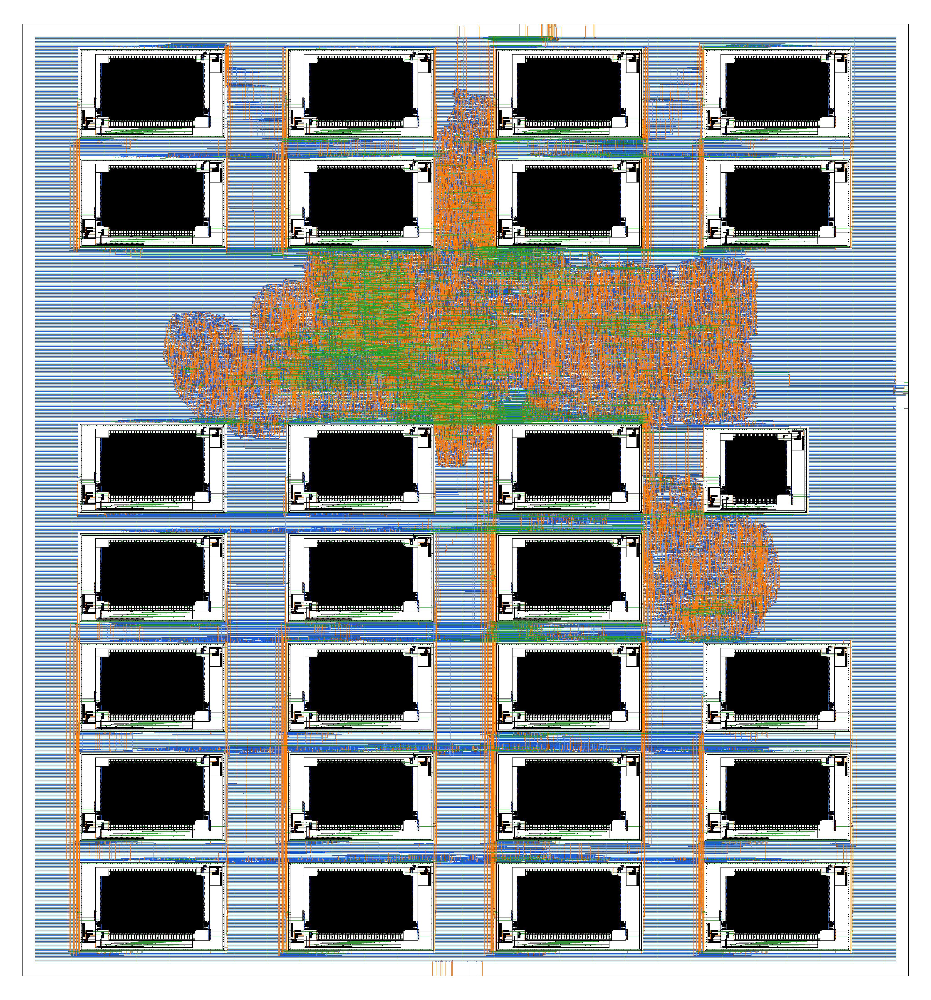</p>
<p align="center"><sub>Full-chip render of the delivered GDS (<code>asic/results/gds/asic_top_klayout.gds.gz</code>, 4180 &times; 4490 &micro;m) with the met4/met5 power grid and the fill / decap / tap cells hidden (<code>asic/scripts/render_die.py</code>, KLayout batch): the 27 hand-placed SRAM macros (4 &times; 7 grid, bitcell arrays dark), the standard-cell logic drawn by its met2 (orange) / met3 (green) routing &mdash; the wide band across the middle is the CV32E40P core (left, 30.6 k cells), the crossbar and peripherals (centre) and the QSPI controller (right, 12.9 k cells); the separate cluster at the lower right is the AI accelerator (12.0 k cells); the narrow vertical strip at the top centre is the JTAG debug module (<code>dm_top</code> + <code>dmi_jtag</code>) reaching the JTAG pins on the top edge (placement centroids from <code>asic/results/def/asic_top.def.gz</code>) &mdash; and the met1 (blue) routing channels between the macros. Colour key: diff green, poly red, li1 grey, met1 blue, met2 orange, met3 green. The flow's own render with the power grid drawn (<code>asic/results/images/asic_top.png</code>) is in <code>asic/README.md</code> &sect;9.7.</sub></p>

<p align="center">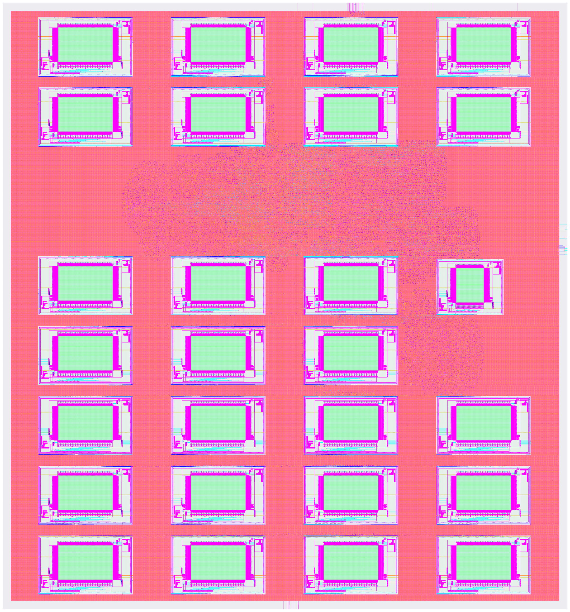</p>
<p align="center"><sub>The same GDS with every layer drawn (KLayout, 7 September 2026): the met4 / met5 power grid and the fill cells cover the whole core, which is what the chip physically looks like &mdash; the render above hides exactly those to expose the logic underneath.</sub></p>

<p align="center">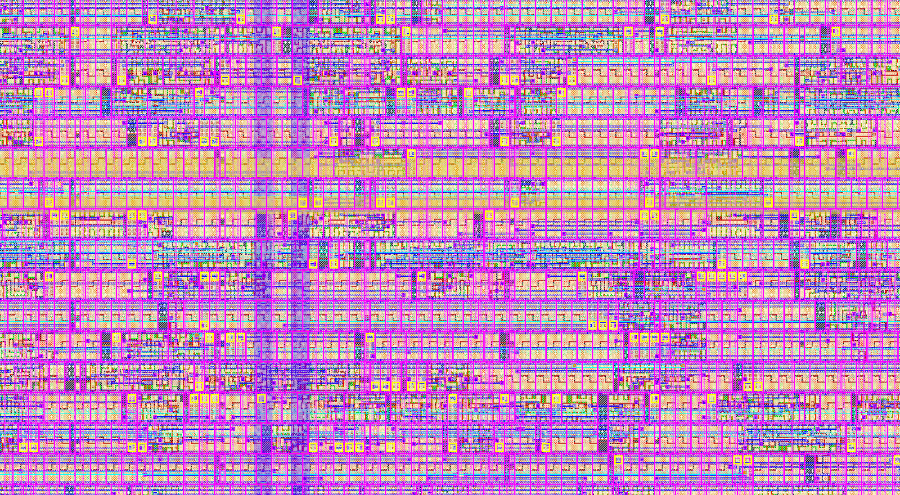&nbsp;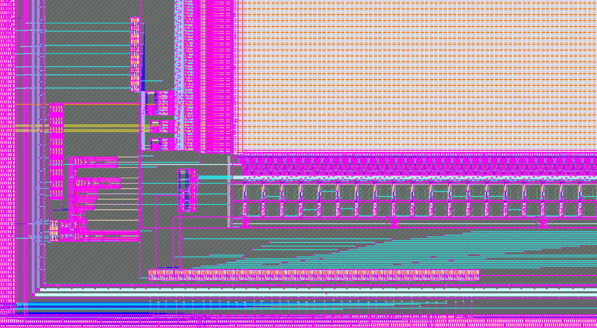</p>
<p align="center"><sub>Zoomed die crops from the delivered GDS — left: 80 µm window of standard-cell rows (PDN hidden); right: SRAM macro edge (bitcell array, word-line drivers). More crops (25 &micro;m transistor-level window): <code>asic/README.md</code> §9.7.</sub></p>

---

### 13.8 FPGA vs ASIC — Implementation Differences and Per-Implementation Performance

Both implementations are built from the **same RTL and the same `soc_files.f`
design defines** (`JTAG_DEBUG`, `FC1_FIX`, `I2C_SDA_SYNC`, `BOOTROM_CONTENT`); the
only functional switch that differs is `ASIC_SRAM_MACRO`. Everything else below is
wrapper or technology, not behaviour — the isolation proof is `make jtag-equiv`
(§10.10), and `make asic-top-sim` runs `asic_top` itself with all 27 macros against
the same golden vector the FPGA build matches on the board (§13.4). This section is
the summary the DDK ruling of 8 September 2026 asks for (differences between the two
implementations, the reason for any frequency difference, performance reported per
implementation — `asic/DDK_KARARLARI.md` items 8 and 10).

| Aspect | FPGA (Genesys 2, Kintex-7 XC7K325T-2) | ASIC (sky130A, LibreLane 3.0.6) | Where it is switched |
|---|---|---|---|
| Top module | `rtl/fpga_top.sv` (IBUFDS, MMCME2, BUFG, IOBUF, OLED pins) | `rtl/asic/asic_top.sv` — 21 ports, clock and reset from pads | separate file lists (`soc_files.f` / `asic/filelist.f`) |
| Synthesis defines | `JTAG_DEBUG`, `FC1_FIX`, `I2C_SDA_SYNC`, `BOOTROM_CONTENT` | the same four **plus** `SYNTHESIS`, `ASIC_SRAM_MACRO` | `asic/filelist.f` vs `rtl/fpga/build_genesys2.tcl` |
| SRAM implementation | behavioural arrays inferred as Block RAM — 14 BRAM 36k tiles (13 × RAMB36 + 2 × RAMB18) | **27 SKY130 SRAM macros** (26 × `sky130_sram_2kbyte_1rw1r_32x512_8` + 1 × `sky130_sram_1kbyte_1rw1r_32x256_8`), hand-placed 4 × 7 grid | `ASIC_SRAM_MACRO` in the SRAM wrappers and `ai_accelerator.sv` |
| **SRAM read latency** | address at T, data at T+1 | address at T, data at T+1 — **identical** | only the position of the output register differs; `slv.r_data` from a common `rdata_src` (§13.4) |
| SRAM contents at power-up | `$readmemh` / BRAM INIT baked into the bitstream | no preload — boot ROM + QSPI bootloader load firmware, data and AI weights over the bus | `ifndef ASIC_SRAM_MACRO` block of the SRAM wrapper |
| QSPI TX/RX FIFO depth | 64 words each | 64 words each — identical, no `ifdef` | `rtl/peripherals/qspi_master_axil.sv` (`FIFO_DEPTH = 64`) |
| Boot ROM | synthesised `case` ROM, `BOOTROM_CONTENT` on | the same synthesised `case` ROM, `BOOTROM_CONTENT` on | no difference |
| Clock source | 200 MHz LVDS → IBUFDS → MMCME2 → BUFG → 50 MHz | `clk_i` pad at 50 MHz; no PLL/MMCM on chip | §12.2 vs `asic/constraints/design.sdc` |
| Reset release | 2-FF release synchronizer in `fpga_top` (`rst_sync_n`) | `rst_ni` pad straight into `soc_top`; release synchronization is an integration requirement outside the macro | `asic/README.md` §9.6, §9.9/10 |
| CPU clock gate | vendor `cv32e40p_sim_clock_gate.sv` (BUFGCE on the board) | `rtl/asic/cv32e40p_clock_gate_asic.sv` | §13.5 |
| JTAG TAP access | Xilinx `BSCANE2` USER3/USER4 through the board USB-JTAG — no extra pins | 5 dedicated pads (`jtag_tck_i`, `jtag_tms_i`, `jtag_tdi_i`, `jtag_trst_ni`, `jtag_tdo_o`) | §12.1, §10.10 |
| JTAG clock domain | BSCANE2 `jtag_tck`, 100 ns, 320 endpoints, WNS +94.976 ns | `jtag_tck` 100 ns, asynchronous clock group, `jtag_trst_ni` false path | §12.4 vs `asic/README.md` §9.6 |
| Resource / area | 13,772 LUT (6.76 %), 9,756 FF (2.39 %), 10 DSP48E1, 49 IOB, 1 MMCM, 3 BUFG, 2 BSCANE2 | 321,880 std-cell instances (2.56 M incl. fill/tap; 10,509 of them hold delay cells), die 4180 × 4490 µm = 18.77 mm², utilization 51.05 % | §12.4 vs §13.7 |
| Power (estimated) | 0.330 W (dynamic 0.167 + static 0.163), Vivado vector-less, `Confidence Level: Low` (§12.4) | 64.0 mW at the verified 27.0 MHz, 117.5 mW at the 50 MHz target; no VCD (SRAM 63 %, clock 18 %, seq. 17 %) | §12.4 vs §13.7 / `asic/README.md` §9.10 |
| **Timing status at the 50 MHz target** | **Verified**: WNS +2.433 ns / WHS +0.059 ns, 0 failing among 24,260 setup / 24,257 hold endpoints | **Target only at 50 MHz**: setup closes in TT (+1.218 ns) and FF (+3.685 ns), not in SS (−9.879 ns); hold closed in all three corners (+0.165 / +0.637 / +0.040 ns) → **verified ASIC frequency 27.0 MHz** at the 37 ns signoff period (setup and hold closed in every corner; setup-only closing point 36.6 ns = 27.3 MHz by period sweep) | `rtl/fpga/reports/impl_timing_summary.rpt` vs `asic/reports/timing/` (37 ns signoff) and `asic/reports/timing_target_20ns/` (20 ns target), `asic/README.md` §9.1 |
| Why the frequencies differ | one operating point, hold-safe fabric routing, BRAM primitives | three PVT signoff corners on sky130A; the SS corner's CPU ALU cone at the 50 MHz target (§9.9/1), the half-cycle SRAM read path that sets the 27.3 MHz closing point (§9.1) and the clock-tree skew to 27 macro clock pins (1.79 ns at TT — repaired for hold with 10,509 delay cells at about 1.3 MHz of setup ceiling, §9.9/2) are corner-physics and floorplan effects of the target technology, not RTL differences | `asic/README.md` §9.9 |
| Signoff evidence | 0 failed routes (19,973 / 19,973), impl DRC 0 errors, live board 1000/1000 sweep and jury-tool 156/156 + 2000/2000 | routing DRC 0, KLayout DRC 0 (257 rules, GDS-based), LVS "Circuits match uniquely", XOR 0, antenna 2 nets (declared, `asic/README.md` §9.9/13); Magic DRC reported on the abstract-view input (§13.7) | §12.4 / §12.6 vs §13.7 |

**Per-implementation performance.** Cycles per inference are identical (459,016 in
simulation, 459,065 measured on the board; 21.0 × over the software baseline, both
frequency-independent). Data per second is therefore quoted per implementation at its
own clock basis in §11.5: the FPGA at its verified 50 MHz (108 inference/s, 211.7 kB/s,
9.18 ms), the ASIC at its verified 27.0 MHz (58 inference/s, 113.7 kB/s, 16.98 ms); the
ASIC's 50 MHz row (the same 108 inference/s) is a target figure, not a verified one.

## 14. Software Test Suite

All firmware tests live in `sw/tests/` and link against `sw/drivers/blogic_mcu.h` + `sw/common/{crt0.S, link.ld}`. Each test prints a golden string (`Hello World from BLogic MCU!`) on UART_0 when it passes; the Verilator harness (`verif/tb/sim_main.cpp`) matches this string and writes `result=PASS` to `logs/sim/<test>/result.log`.

| File | Purpose |
|---|---|
| `uart_hello.c` | UART_0 `puts`, parameterizable CPB; default 115200 |
| `uart_loopback.c` | UART RX → TX echo |
| `uart_baud_sweep.c` | EK-2 multi-baud sweep (115200 / 1 Mbps / 9600) |
| `uart_add_test.c` | UART RX-driven integer adder (FPGA calculator demo) |
| `uart_stp_reg_test.c` | Stop-bit register semantics (+1 / +0.5 extension, read-back) |
| `uart1_strm_test.c` | UART_1 stream DMA → AI SRAM + irq18 pulse |
| `gpio_led_test.c` | Walking-1 over `ODR` + `IDR` readback |
| `hello_blink.c` / `led_only.c` | Minimal GPIO toggles |
| `timer_irq_test.c` | Counting / auto-reload / prescaler / up-down / irq16 |
| `minimal_test.c` | Smallest non-trivial firmware, used by Spike lockstep |
| `lockstep_deep.c` | ~3 k-instruction RV32IM program for the deep Spike trace compare |
| `isa_compliance_test.c` | 31 directed RV32IMC instruction checks |
| `boot_flash_hello.c` | M3 flash-boot proof (R/A handshake over UART) |
| `qspi_test.c` | Basic QSPI read (first byte 0xAA check) |
| `qspi_modes_test.c` | x1 / x2 / x4 + 3B / 4B addressing |
| `qspi_fifo_err_test.c` | FIFO overflow / flush / status-clear error paths (25 checks) |
| `qspi_rdpath_test.c` | Read-direction coverage: multi-byte packing, dummy cycles, address-less commands (RDSR/RES), 4-byte address, x2/x4 reads, SE |
| `qspi_debug.c` / `qspi_hw_debug.c` | QSPI bring-up debug aids |
| `i2c_system_test.c` | I²C master against echo slave (block TB) |
| `i2c_soc_test.c` | I²C engine driven through the full SoC path (register semantics, 4-byte TX/RX, negative accesses) |
| `csr_negatif_test.c` | Unmapped / read-only offset accesses across all peripherals (decode-default coverage) |
| `ai_micro_speech_test.c` | SoC-level polling AI inference |
| `ai_irq_test.c` | SoC-level **interrupt-driven** AI inference with ISR |
| `ai_multi_class_test.c` | All four classes in a single firmware |
| `ai_uart_load_test.c` | BLG1-framed feature-vector load over UART_0 (jury input path) |
| `ai_sat_test.c` | Requantize saturation rails (±2³⁰ bias → all conv outputs at 0x7F / 0x80) |
| `ai_boot_macro_test.c` | `asic-top-sim` firmware: flash boot + conv layer bit-exact (FNV-1a vs golden) + FC argmax == 2 and result word (`CHECK_ARGMAX`, FC-1 fix proof) on `asic_top` with the delivered SRAM macro models |
| `ai_sw_reference.c` | Pure-software TFLite-equivalent reference for speedup measurement |

Switch firmware on any target with `FW_SRC=`, e.g.:

```bash
make sim FW_SRC=sw/tests/gpio_led_test.c
make sim FW_SRC=sw/tests/ai_irq_test.c TRACE=1
```

---

## 15. Design Tools

| Tool | Version (verified) | Purpose |
|---|---|---|
| **SystemVerilog** | IEEE 1800-2017 subset | RTL design |
| **Verilator** | 5.049 devel | RTL simulation, line + branch coverage |
| **UVM** | Vendored under `verif/uvm-lib` (no external dep.) | Constrained-random verification |
| **Spike ISS** | RV32IMC build | Processor lockstep co-simulation |
| **`riscv-arch-test`** | upstream | Official ISA compliance |
| **RISC-V GNU Toolchain** | GCC 13.2 / Newlib | Firmware compilation (rv32imc / ilp32) |
| **Xilinx Vivado** | 2021.2 (also tested on 2023.2) | FPGA synthesis & implementation |
| **Python** | 3.10 / 3.11 / 3.12 | Golden vectors, accuracy harness, ELF→hex |
| **TensorFlow / tflite-runtime** | 2.15+ | Reference inference for AI golden vectors |
| **NumPy** | 1.26+ | Array math in AI scripts |
| **GTKWave** | 3.3+ | Waveform inspection (`TRACE=1` VCDs) |
| **OpenOCD** | 0.12.0 (Ubuntu 24.04 package, RISC-V target) | JTAG debug host for the delivered debug subsystem (§10.10): `remote_bitbang` to the Verilator model, `ftdi` driver to the Genesys 2 on-board USB-JTAG (BSCANE2), gdb server on `:3333` |
| **gdb-multiarch** | GNU gdb 15.1 (`riscv:rv32`) | Source-level debug over OpenOCD (`make jtag-gdb`) |
| **PULP `riscv-dbg`** | commit `21a5fbe` (vendored, `rtl/debug/vendor/`) | RISC-V Debug Spec 0.13 TAP / DTM / Debug Module — the JTAG debug subsystem of the delivered chip |
| **PULP `common_cells`** (CDC subset) | v1.38.0 (vendored) | `cdc_2phase_clearable` chain used by `dmi_cdc` |
| **PULP `tech_cells_generic`** | v0.2.3 (vendored) | `tc_clk_inverter` / `tc_clk_mux2` for the TAP TDO clock |
| **KLayout** (Python module) | — | GDS renders, transistor count and layout images in `asic/scripts/` |
| **GitHub** | — | Version control |

---

## 16. References

1. RISC-V International — *RISC-V Instruction Set Manual, Volume I: Unprivileged ISA*, [https://riscv.org/specifications/](https://riscv.org/specifications/)
2. OpenHW Group — *CV32E40P User Manual*, [https://docs.openhwgroup.org/projects/cv32e40p-user-manual/](https://docs.openhwgroup.org/projects/cv32e40p-user-manual/)
3. RISC-V International — *riscv-arch-test*, [https://github.com/riscv-non-isa/riscv-arch-test](https://github.com/riscv-non-isa/riscv-arch-test)
4. CHIPS Alliance — *riscv-dv* (random instruction generator), [https://github.com/chipsalliance/riscv-dv](https://github.com/chipsalliance/riscv-dv)
5. Arm Limited — *AMBA AXI Protocol Specification (IHI 0022)*, [https://developer.arm.com/documentation/ihi0022/latest](https://developer.arm.com/documentation/ihi0022/latest)
6. PULP Platform — *axi* library, [https://github.com/pulp-platform/axi](https://github.com/pulp-platform/axi)
7. PULP Platform — *common\_cells* library, [https://github.com/pulp-platform/common\_cells](https://github.com/pulp-platform/common_cells)
8. R. David et al. — *TensorFlow Lite Micro: Embedded ML on TinyML Systems*, **MLSys 2021**
9. P. Warden & D. Situnayake — *TinyML*, O'Reilly Media, 2019
10. Google — *Micro Speech example*, [https://github.com/tensorflow/tflite-micro/tree/main/tensorflow/lite/micro/examples/micro\_speech](https://github.com/tensorflow/tflite-micro/tree/main/tensorflow/lite/micro/examples/micro_speech)
11. Accellera — *Universal Verification Methodology (UVM 1.2) Reference Manual*
12. D. Harris & S. Harris — *Digital Design and Computer Architecture: RISC-V Edition*, Morgan Kaufmann, 2021
13. Wilson Snyder — *Verilator User's Guide*, [https://verilator.org/guide/latest/](https://verilator.org/guide/latest/)
14. Digilent — *Genesys 2 Reference Manual*, [https://digilent.com/reference/programmable-logic/genesys-2/reference-manual](https://digilent.com/reference/programmable-logic/genesys-2/reference-manual)
15. Xilinx (AMD) — *UG470: 7 Series FPGAs Configuration User Guide* (STARTUPE2 / CCLK)

---

## 17. License & Acknowledgments

This project was developed by **BLogic Mikroelektronik** for the **TEKNOFEST 2026 Chip Design Competition**, hosted at **Ostim Technical University**.

### Vendored Open-Source Components

| Component | Author | License | Path |
|---|---|---|---|
| CV32E40P core | OpenHW Group | Solderpad Hardware Licence v0.51 | `rtl/core/cv32e40p/` |
| PULP `axi` library | PULP Platform | Solderpad Hardware Licence v0.51 | `rtl/bus/axi/` |
| PULP `common_cells` | PULP Platform | Solderpad Hardware Licence v0.51 | `rtl/core/cv32e40p/rtl/vendor/pulp_platform_common_cells/` |
| `verilog-uart` | Alex Forencich | MIT | `rtl/peripherals/verilog-uart/` |
| Accellera UVM | Accellera | Apache 2.0 | `verif/uvm-lib/` |
| TFLite Micro Speech model & features | Google / TensorFlow Authors | Apache 2.0 | `sw/ai_model/` |
| PULP `riscv-dbg` (JTAG debug subsystem of the delivered chip, commit `21a5fbe`) | PULP Platform | Solderpad Hardware Licence v0.51 (copy: `asic/licenses/riscv-dbg_SHL-0.51.txt`) | `rtl/debug/vendor/riscv-dbg/` |
| PULP `common_cells` v1.38.0 CDC cells, `tech_cells_generic` v0.2.3 | PULP Platform | Solderpad Hardware Licence v0.51 (copies: `asic/licenses/common_cells_v1.38.0_SHL-0.51.txt`, `tech_cells_generic_SHL-0.51.txt`) | `rtl/debug/vendor/common_cells_v1.38.0/`, `rtl/debug/vendor/tech_cells_generic/` |
| `remote_bitbang` server / `SimJTAG` (simulation only) | UC Regents / SiFive | BSD-3-Clause / Apache 2.0 | `rtl/debug/vendor/riscv-dbg/tb/` |

The original work (custom RTL, AI accelerator, peripherals, verification environment, FPGA wrapper, software, scripts) is © 2026 **BLogic Mikroelektronik — Berk Muammer Kuzu & Berkin Demircan**.

---

<div align="center">

**BLogic Mikroelektronik** · Ostim Technical University · TEKNOFEST 2026

*"Hello World from BLogic MCU!"*

</div>

