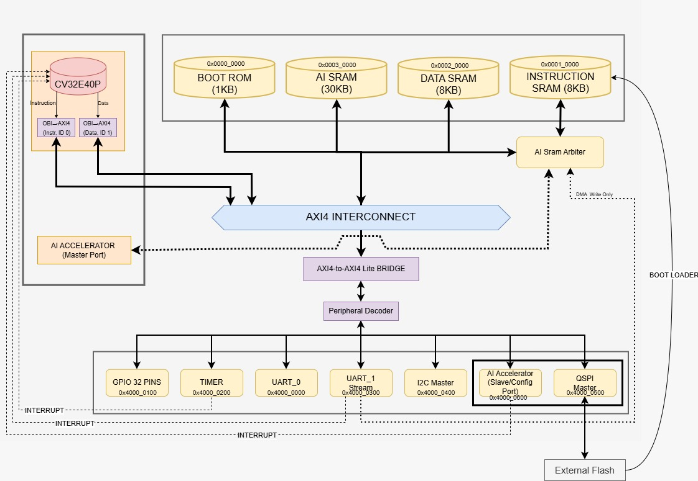
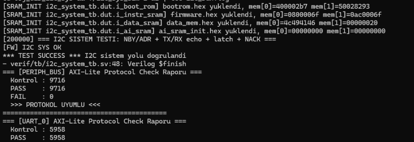
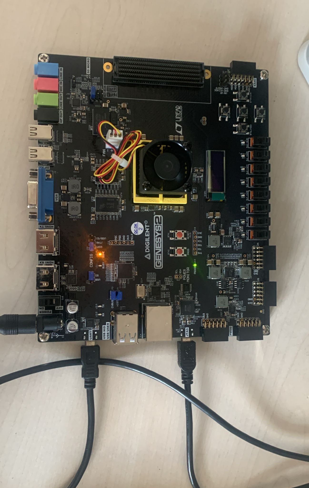
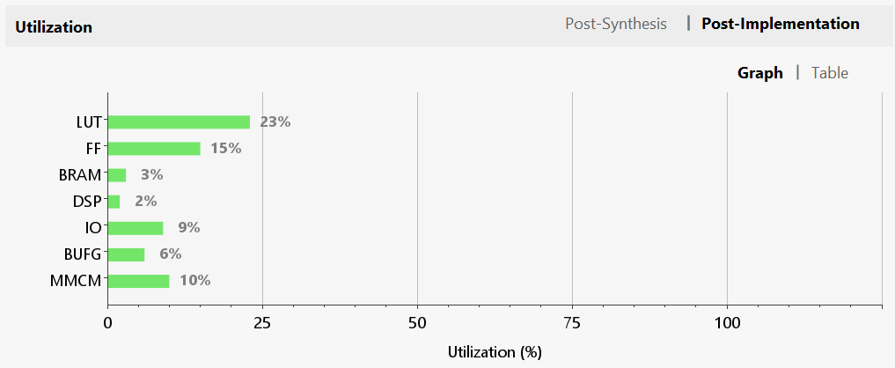
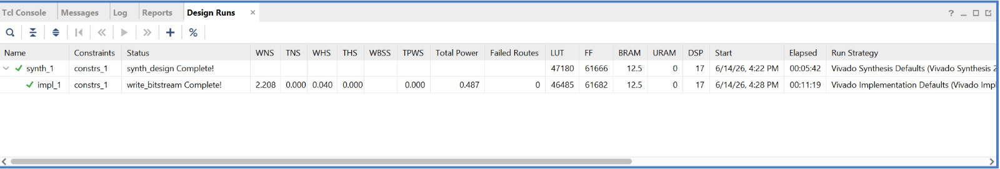

<div align="center">


# BLogic MCU — TEKNOFEST 2026 Chip Design Competition

### Microcontroller Design Category — Final Submission

</div>

> **Team:** BLogic Mikroelektronik — Ostim Technical University
> **Members:** Berk Muammer Kuzu, Berkin Demircan
> **Application ID:** 772759
> **Repository:** `2026_Cip-Tasarim-Yarismasi-2026_Ostim-BLogic-Mikroelektronik-2026_Ostim-Teknik-Universitesi`

---

## Table of Contents

1. [Overview](#1-overview)
2. [Key Features](#2-key-features)
3. [System Architecture](#3-system-architecture)
4. [Memory Map](#4-memory-map)
5. [Peripheral Register Map](#5-peripheral-register-map)
6. [Interrupt Map](#6-interrupt-map)
7. [Repository Structure](#7-repository-structure)
8. [Prerequisites & Toolchain Installation](#8-prerequisites--toolchain-installation)
9. [Build & Simulation](#9-build--simulation)
10. [Verification](#10-verification)
11. [AI Accelerator](#11-ai-accelerator)
12. [FPGA Prototyping](#12-fpga-prototyping)
13. [ASIC Flow (sky130)](#13-asic-flow-sky130)
14. [Software Test Suite](#14-software-test-suite)
15. [Design Tools](#15-design-tools)
16. [References](#16-references)
17. [License & Acknowledgments](#17-license--acknowledgments)

---

## 1. Overview

**BLogic MCU** is a 32-bit RISC-V based System-on-Chip (SoC) developed by **BLogic Mikroelektronik (Ostim Technical University)** for the **TEKNOFEST 2026 Chip Design Competition, Microcontroller Design Category**. The system is built around the open-source **CV32E40P** processor core (RV32IMC, 4-stage in-order pipeline) and integrates an AXI4 / AXI4-Lite bus fabric, on-chip SRAMs, a Boot ROM with QSPI boot loader, a full set of peripherals (UART × 2, GPIO, Timer, I²C Master, QSPI Master), and a custom **TFLite Micro Speech** hardware AI accelerator.

The design has been verified through Verilator-based directed and randomized simulation, SystemVerilog Assertions (SVA) protocol checking on every AXI / AXI-Lite interface, UVM-based testbenches, Spike ISS lockstep co-simulation, the official `riscv-arch-test` suite, and end-to-end AI accuracy regression (40/40 samples; **|acc<sub>SW</sub> − acc<sub>RTL</sub>| = 0**). The design has been physically validated on a **Digilent Genesys 2** FPGA board (Xilinx Kintex-7 `XC7K325T-2FFG900C`) at **50 MHz** with `WNS = +1.744 ns` / `WHS = +0.054 ns` (timing met; the synchronous `clk_50_mmcm` group closes at +2.722 ns) and `0.484 W` total estimated on-chip power. All figures are taken verbatim from `impl_timing_summary.rpt` / `impl_power.rpt`.

---

## 2. Key Features

| Category | Specification |
|---|---|
| **Processor** | OpenHW Group **CV32E40P** — RV32IMC, 4-stage pipeline, M-mode only, OBI instruction & data ports |
| **Bus Fabric** | PULP `axi_xbar` AXI4 Interconnect + custom AXI4-to-AXI4-Lite bridge + peripheral address decoder |
| **CPU↔Bus** | Custom **OBI-to-AXI4** bridges for both instruction (ID 0) and data (ID 1) ports |
| **Memory** | 1 KB Boot ROM, 8 KB Instruction SRAM, 8 KB Data SRAM, 30 KB AI SRAM (shared via arbiter) |
| **Peripherals** | UART_0 (general I/O), UART_1 (DMA stream → AI SRAM), 32-pin GPIO, Timer w/ IRQ, I²C Master, QSPI Master (x1/x2/x4 + 3B/4B addressing) |
| **AI Accelerator** | TFLite Micro Speech **Tiny Conv** (Conv2D + ReLU + FC + Argmax), INT8 × INT8 → INT32 MAC, AXI4 master + AXI-Lite slave CSR, hardware interrupt on completion |
| **Boot Flow** | Boot ROM → QSPI Flash loader → Instruction SRAM (M3 flash-boot mode active) |
| **Interrupts** | CV32E40P CLINT-style vector: Timer (bit 16), AI Accelerator (bit 17), UART-stream DMA (bit 18) |
| **Target Frequency** | **50 MHz** (post-implementation, met) |
| **FPGA Platform** | Digilent Genesys 2 — Xilinx Kintex-7 `XC7K325T-2FFG900C` |
| **Source Lang.** | SystemVerilog (RTL) + C / RISC-V Assembly (firmware) + Python (golden vectors & AI model) |

---

## 3. System Architecture



### Block Description

- **CV32E40P** is the application processor. Its Instruction OBI port (ID 0) and Data OBI port (ID 1) are bridged to AXI4 by two `obi_to_axi.sv` adapters.
- The **AXI4 Interconnect** (`soc_axi_interconnect.sv`, based on `pulp-platform/axi`) routes master traffic to four AXI4 slaves: Boot ROM, Instruction SRAM, Data SRAM and the **AI SRAM Arbiter**, plus the **AXI4 → AXI4-Lite bridge** that feeds the peripheral subsystem.
- The **AI SRAM Arbiter** multiplexes the 30 KB AI SRAM between the CPU (read/write), the AI Accelerator's master port (read & write during inference) and the UART_1 streaming DMA (write-only path).
- The **Peripheral Decoder** (`periph_decoder.sv`) decodes the 32-bit address bus into seven AXI4-Lite slave channels (UART_0, GPIO, Timer, UART_1 Stream, I²C, QSPI, AI Accelerator CSR).
- Three independent **interrupt sources** feed the CV32E40P irq vector: `timer_irq[16]`, `ai_irq[17]`, `strm_irq[18]`.
- The **QSPI Master** also connects to an **External Flash** through the FPGA's dedicated CCLK/STARTUPE2 path (Boot Loader flow).

---

## 4. Memory Map

| Address Range | Module | Size | Access | Notes |
|---|---|---|---|---|
| `0x0000_0000` – `0x0000_03FF` | **Boot ROM** | 1 KB | RX | First-stage QSPI loader |
| `0x0001_0000` – `0x0001_1FFF` | **Instruction SRAM** | 8 KB | RWX | Firmware is loaded here from flash |
| `0x0002_0000` – `0x0002_1FFF` | **Data SRAM** | 8 KB | RW | `.data`, `.bss`, stack, heap |
| `0x0003_0000` – `0x0003_77FF` | **AI SRAM** | 30 KB | RW | Shared by CPU + AI Accel + UART_1 DMA |
| `0x4000_0000` | **UART_0** (general) | 32 B map | RW | TX/RX, baud-configurable |
| `0x4000_0100` | **GPIO** (32-pin) | 32 B map | RW | IDR (RO) + ODR (RW) |
| `0x4000_0200` | **Timer** | 32 B map | RW | Auto-reload + IRQ |
| `0x4000_0300` | **UART_1 / AI Stream** | 32 B map | RW | DMA → AI SRAM |
| `0x4000_0400` | **I²C Master** | 32 B map | RW | NBY / ADR / RDR / TDR / CFG |
| `0x4000_0500` | **QSPI Master** | 32 B map | RW | x1 / x2 / x4 + 3B/4B addressing |
| `0x4000_0600` | **AI Accelerator CSR** | 32 B map | RW | CTRL / STATUS / DATA_ADDR / OUT_ADDR |

> The SoC top module accepts `INSTR_SRAM_BYTES` and `DATA_SRAM_BYTES` parameters; defaults are **8 KB / 8 KB** (the official competition configuration). For the `riscv-arch-test` ISA-compliance flow only, these can be expanded to 1 MB / 64 KB via `-G` overrides.

---

## 5. Peripheral Register Map

### 5.1 UART_0 & UART_1 (`0x4000_0000` / `0x4000_0300`)

| Offset | Name | Access | Description |
|---|---|---|---|
| `0x00` | `CPB` | RW | Clock-per-bit (50 MHz / baud). `434 → 115200`, `50 → 1 Mbps`, `5208 → 9600` |
| `0x04` | `STP` | RW | Stop bit count: `0 = 1`, `1 = 1.5`, `2 = 2` |
| `0x08` | `RDR` | RO | Received data register |
| `0x0C` | `TDR` | RW | Transmit data register |
| `0x10` | `CFG` | RW | bit 0 = TX_START, bit 1 = RX_READY, bit 2 = TX_DONE |

### 5.2 GPIO (`0x4000_0100`)

| Offset | Name | Access | Description |
|---|---|---|---|
| `0x00` | `IDR` | RO | Input Data Register (32-bit) |
| `0x04` | `ODR` | RW | Output Data Register (32-bit) |

### 5.3 Timer (`0x4000_0200`)

| Offset | Name | Access | Description |
|---|---|---|---|
| `0x00` | `PRE` | RW | Prescaler |
| `0x04` | `ARE` | RW | Auto-reload value |
| `0x08` | `CLR` | RW | Clear |
| `0x0C` | `ENA` | RW | Enable |
| `0x10` | `MOD` | RW | Mode |
| `0x14` | `CNT` | RO | Counter value |
| `0x18` | `EVN` | RO | Event counter |
| `0x1C` | `EVC` | RW | Event clear |

### 5.4 I²C Master (`0x4000_0400`)

| Offset | Name | Access | Description |
|---|---|---|---|
| `0x00` | `NBY` | RW | Byte count (auto-rounded) |
| `0x04` | `ADR` | RW | 7-bit Slave address |
| `0x08` | `RDR` | RO | Received data (byte-packed into 32-bit word) |
| `0x0C` | `TDR` | RW | Transmit data |
| `0x10` | `CFG` | RW | TXEN / TXDN / RXEN / RXDN / NACK |

### 5.5 AI Accelerator CSR (`0x4000_0600`)

| Offset | Name | Description |
|---|---|---|
| `0x00` | `CTRL` | bit 0 = START, bit 1 = CLEAR_DONE |
| `0x04` | `STATUS` | bit 0 = BUSY, bit 1 = DONE, bits[7:4] = argmax class |
| `0x08` | `DATA_ADDR` | Input feature vector base in AI SRAM |
| `0x0C` | `OUT_ADDR` | Output (logits + argmax) base in AI SRAM |

---

## 6. Interrupt Map

| IRQ Vector | Source | Trigger | Acknowledged via |
|---|---|---|---|
| `irq_i[16]` | **Timer** | Auto-reload overflow | Timer `EVC` register |
| `irq_i[17]` | **AI Accelerator** | `STATUS.DONE` rising edge (level-sensitive) | `CTRL.CLEAR_DONE` |
| `irq_i[18]` | **UART_1 Stream DMA** | DMA word transfer complete | DMA CFG clear |

> The IRQ vector is built in `soc_top.sv` as `{13'd0, strm_irq, ai_irq, timer_irq, 16'd0}` and routed to `CV32E40P.irq_i`. `mtvec_addr_i` is tied to `0x0001_0000` in `soc_top.sv`; `crt0.S` does **not** write `mtvec` at run time — it places the vector table at the start of instruction memory (slot 0 = exceptions, slot 16 = timer, slot 17 = AI, slot 18 = stream) and also provides a `mcause`-decoding dispatcher so the design works in both direct and vectored trap modes.

---

## 7. Repository Structure

```
2026_Cip-Tasarim-Yarismasi-2026_Ostim-BLogic-Mikroelektronik-2026_Ostim-Teknik-Universitesi/
├── rtl/                                  # All synthesizable RTL
│   ├── soc_top.sv                        # SoC top level (parameterizable SRAM sizes)
│   ├── fpga_top.sv                       # FPGA wrapper (IBUFDS + MMCM + STARTUPE2)
│   ├── core/cv32e40p/                    # CV32E40P RISC-V core (vendored)
│   ├── bus/
│   │   ├── obi_to_axi.sv                 # OBI ↔ AXI4 bridges (CPU side)
│   │   ├── soc_axi_interconnect.sv       # AXI4 crossbar
│   │   ├── axi4_to_axilite_bridge.sv     # AXI4 → AXI4-Lite (peripheral feed)
│   │   ├── periph_decoder.sv             # Address decoder (8 slaves)
│   │   └── axi/                          # PULP-platform AXI library
│   ├── peripherals/
│   │   ├── uart_axil.sv                  # UART_0 (general)
│   │   ├── uart_stream_axil.sv           # UART_1 + DMA → AI SRAM
│   │   ├── uart_tx.v / uart_rx.v / uart.v
│   │   ├── gpio_axil.sv                  # 32-pin GPIO
│   │   ├── timer_axil.sv                 # Timer + IRQ
│   │   ├── i2c_master_axil.sv            # I²C Master
│   │   ├── qspi_master_axil.sv           # QSPI Master (x1/x2/x4 + 3B/4B)
│   │   └── verilog-uart/                 # Alex Forencich UART (reference)
│   └── ai_accelerator/
│       ├── ai_accelerator.sv             # Tiny Conv hardware
│       └── ai_sram_arbiter.sv            # CPU / Accel / DMA arbiter
├── sw/
│   ├── common/
│   │   ├── crt0.S                        # C runtime + IRQ vector table
│   │   └── link.ld                       # Linker script (8 KB / 8 KB)
│   ├── drivers/
│   │   ├── blogic_mcu.h                  # Peripheral register definitions
│   │   └── qspi.h                        # QSPI driver helpers
│   ├── bootloader/                       # 1 KB QSPI boot ROM + flash helper
│   │   ├── bootloader.S, bootloader.ld
│   │   ├── bootrom.hex                   # Pre-built boot ROM image
│   │   ├── flash_helloworld.hex          # Example payload image
│   │   └── build.py
│   ├── tests/                            # 19 standalone firmware tests
│   │   ├── uart_hello.c, uart_loopback.c, uart_baud_sweep.c, uart_add_test.c
│   │   ├── gpio_led_test.c, hello_blink.c, led_only.c, minimal_test.c
│   │   ├── isa_compliance_test.c
│   │   ├── qspi_test.c, qspi_modes_test.c, qspi_debug.c, qspi_hw_debug.c
│   │   ├── i2c_system_test.c
│   │   ├── ai_micro_speech_test.c, ai_irq_test.c, ai_sw_reference.c
│   └── ai_model/                         # AI golden vectors & accuracy harness
│       ├── micro_speech_quantized.tflite # Reference model
│       ├── extract_weights.py            # → weights/bias .hex
│       ├── generate_golden.py            # → input/conv_out/output .hex
│       ├── fetch_real_features.py        # EK-3 real WAV features (yes/no)
│       ├── generate_ai_sram_init.py      # Single combined ai_sram_init.hex
│       ├── run_accuracy_window.py        # EK-1 "10% window" 40-sample pipeline
│       ├── tiny_conv_reference.py        # RTL-accurate Python model
│       ├── accuracy_report_n1000.txt     # N=1000 accuracy evidence (committed)
│       └── golden_vectors/               # Generated hex files
├── verif/
│   ├── tb/                               # Verilator testbenches
│   │   ├── sim_main.cpp                  # C++ harness (UART monitor, golden match)
│   │   ├── ai_accel_tb.sv                # Standalone AI accelerator TB
│   │   ├── boot_flow_test_tb.sv          # Full Boot ROM → QSPI → SRAM flow
│   │   ├── qspi_modes_tb.sv              # QSPI x1/x2/x4 + 4-byte addressing
│   │   ├── i2c_master_tb.sv, i2c_system_tb.sv
│   │   ├── uart_stp_tb.sv                # Stop-bit 1 / 1.5 / 2
│   │   ├── uart_stream_tb.sv             # DMA → AI SRAM 5-scenario test
│   ├── sva/                              # SystemVerilog Assertions
│   │   ├── axi_lite_protocol_checker.sv
│   │   ├── axi4_protocol_checker.sv
│   │   ├── soc_protocol_bind.sv          # 10-interface protocol bind
│   │   └── ai_accel_checker_bind.sv
│   ├── uvm/                              # UVM (GPIO) directed + random
│   │   ├── axi_lite_if.sv
│   │   ├── axi_lite_uvm_pkg.sv
│   │   └── tb_top.sv
│   ├── uvm-lib/                          # Vendored UVM library (no clone needed)
│   ├── spike/                            # Spike ISS lockstep trace compare
│   │   └── compare_traces.py
│   ├── arch_tests/                       # riscv-arch-test glue (link.ld + htif.S)
│   ├── models/                           # Verification models
│   │   ├── spi_flash_model.sv            # QSPI flash device
│   │   ├── i2c_slave_model.sv            # I²C echo slave
│   │   └── xilinx_prims_stub.sv          # IBUFDS/MMCM stubs (Verilator)
│   ├── coverage_summary.txt              # Line + branch coverage report
│   └── coverage_waivers.vlt              # Vendor (CV32E40P) waivers
├── fpga/
│   ├── build_genesys2.tcl                # End-to-end Vivado build script
│   ├── flash_firmware.tcl                # Program QSPI flash + re-program bit
│   └── genesys2.xdc                      # Pin / timing constraints
├── teknotest/                            # TEKNOFEST jury reference DDK testbench
│   ├── tb/teknotest_tb.sv
│   ├── user_files/                       # Wrapper + RTL list for jury sim
│   └── scripts/create_vivado_proj.tcl
├── scripts/
│   ├── elf2hex.py                        # ELF → $readmemh hex
│   ├── run_regression.sh                 # 4-test smoke regression
│   ├── run_coverage.sh                   # Verilator line coverage harness
│   └── arch_test_size_check.sh           # 8 KB budget audit for arch-test
├── images/                               # README figures
├── Makefile                              # Top-level thin wrapper
├── Makefile.verilator                    # Verilator build + sim
├── Makefile.uvm                          # UVM build
├── soc_files.f                           # Single source of truth for RTL list
├── bootrom.hex                           # Pre-built top-level boot ROM image
├── run_teknotest_2021.tcl                # Jury sim entry point
└── README.md                             # (this file)
```

---

## 8. Prerequisites & Toolchain Installation

The project is developed and tested on **Ubuntu 24.04 LTS** (native or WSL2 on Windows 11). All commands below assume a recent Debian / Ubuntu system.

### 8.1 System Packages

```bash
sudo apt-get update
sudo apt-get install -y \
    build-essential gcc g++ make autoconf automake libtool \
    bison flex git ccache help2man perl python3 python3-pip python3-venv \
    libfl-dev libfl2 zlib1g zlib1g-dev libgoogle-perftools-dev \
    numactl perl-doc libssl-dev curl wget unzip xz-utils \
    device-tree-compiler libboost-regex-dev gtkwave
```

### 8.2 Verilator (≥ 5.0)

The repository is verified with **Verilator 5.049 devel (rev `v5.048-135-g99a35fee8`)**. UVM and `--timing` require a 5.x build, so packaged Ubuntu 24.04 versions (4.x) are **not sufficient**. Releases **older than v5.048 will not build the CV32E40P core**: `cv32e40p_cs_registers.sv` triggers `%Error-BLKANDNBLK` (blocking + non-blocking assignment to `mhpmcounter_q`). Check out the exact commit below so that coverage figures match the ones reported in this README.

```bash
git clone https://github.com/verilator/verilator.git
cd verilator
git checkout 99a35fee8           # v5.049 devel - exact revision used for all reported results
autoconf
./configure --prefix=/usr/local
make -j$(nproc)
sudo make install
verilator --version              # -> Verilator 5.049 devel rev v5.048-135-g99a35fee8
```

### 8.3 RISC-V GNU Toolchain (rv32imc / ilp32)

Two installation options. Pre-built (fastest) is recommended:

**Option A — Pre-built (xPack):**

```bash
cd /tmp
wget https://github.com/xpack-dev-tools/riscv-none-elf-gcc-xpack/releases/download/v13.2.0-2/xpack-riscv-none-elf-gcc-13.2.0-2-linux-x64.tar.gz
sudo mkdir -p /opt/riscv && sudo tar -xzf xpack-riscv-none-elf-gcc-*.tar.gz -C /opt/riscv --strip-components=1
echo 'export PATH=/opt/riscv/bin:$PATH' >> ~/.bashrc
source ~/.bashrc
# The Makefile expects the "riscv32-unknown-elf-*" prefix; create symlinks:
for tool in gcc g++ ld as objcopy objdump size readelf nm ar; do \
    sudo ln -sf /opt/riscv/bin/riscv-none-elf-$tool /usr/local/bin/riscv32-unknown-elf-$tool; \
done
riscv32-unknown-elf-gcc --version
```

**Option B — Build from source (full control, takes ~30 min):**

```bash
sudo mkdir -p /opt/riscv && sudo chown $USER:$USER /opt/riscv
git clone --depth 1 https://github.com/riscv-collab/riscv-gnu-toolchain.git
cd riscv-gnu-toolchain
./configure --prefix=/opt/riscv --with-arch=rv32imc --with-abi=ilp32
make -j$(nproc)
echo 'export PATH=/opt/riscv/bin:$PATH' >> ~/.bashrc
source ~/.bashrc
```

### 8.4 Spike RISC-V ISS (Lockstep Co-simulation)

Spike is required for the **Test 3: Spike ISS Lockstep** regression.

```bash
git clone https://github.com/riscv-software-src/riscv-isa-sim.git
cd riscv-isa-sim
mkdir build && cd build
../configure --prefix=/opt/riscv --with-isa=RV32IMC
make -j$(nproc)
sudo make install
spike --help
```

### 8.5 Python Dependencies (AI golden vectors)

The AI flow (`sw/ai_model/*.py`) depends on **NumPy** and **TensorFlow** (or the smaller `tflite-runtime`). A Python virtual-env is strongly recommended.

```bash
cd <repo-root>
python3 -m venv .venv
source .venv/bin/activate

# Core
pip install --upgrade pip
pip install numpy

# Choose ONE of the following two interpreters:

# (1) Full TensorFlow (~500 MB) — required by run_accuracy_window.py for
#     softmax-preceding logit extraction (experimental_preserve_all_tensors)
pip install tensorflow

# (2) tflite-runtime (much smaller, only TFLite Interpreter)
#     Sufficient for extract_weights.py + generate_golden.py
pip install tflite-runtime
```

The `fetch_real_features.py` and `generate_ai_sram_init.py` scripts only use the Python standard library — no extra dependencies.

| Python script | Required packages | Output |
|---|---|---|
| `extract_weights.py` | `numpy`, `tensorflow` *or* `tflite-runtime` | `weights_conv.hex`, `bias_conv.hex`, `weights_fc.hex`, `bias_fc.hex`, `quant_params.{h,hex}` |
| `generate_golden.py` | `numpy`, `tensorflow` *or* `tflite-runtime` | `input_{cls}.hex`, `conv_out_{cls}.hex`, `output_{cls}.hex` |
| `fetch_real_features.py` | stdlib only | `input_{yes,no}_real.hex`, `conv_out_*`, `output_*` |
| `generate_ai_sram_init.py` | stdlib only | `ai_sram_init.hex` (7680 lines for SoC preload) |
| `run_accuracy_window.py` | `numpy`, `tensorflow` (preferred) | `accuracy_report.txt` (generated, untracked), 40-sample golden batch; `--n=1000` writes `accuracy_report_n1000.txt` |
| `tiny_conv_reference.py` | `numpy` | RTL-faithful Python model (debugging) |
| `scripts/elf2hex.py` | stdlib only | `$readmemh`-compatible hex |

### 8.6 Xilinx Vivado (FPGA only)

For the Genesys 2 FPGA flow you also need **Vivado 2021.2** (verified) or any 2021.2+ release that supports the Kintex-7 `XC7K325T-2FFG900C` part. Vivado must be on `PATH`:

```bash
source /tools/Xilinx/Vivado/2021.2/settings64.sh
vivado -version
```

### 8.7 Optional — `riscv-arch-test`

Required only for `make arch-test`:

```bash
git clone --depth 1 https://github.com/riscv-non-isa/riscv-arch-test verif/arch_tests/riscv-arch-test
```

---

## 9. Build & Simulation

The top-level `Makefile` is a thin wrapper that dispatches to `Makefile.verilator` (most targets) and `Makefile.uvm` (UVM only). Every target writes structured logs under `logs/` and prints `result=PASS` / `result=FAIL` keys for CI parsing.

### 9.1 Quick Start

```bash
# 1. Compile firmware and run the default UART_0 Hello World simulation
make compile
make sim

# 2. Run the full regression (UART × 3 baud, Spike lockstep, QSPI flash)
make regression

# 3. Run absolutely everything (regression + boot + AI + ISA + UVM + …)
make test-all
```

### 9.2 Make Target Reference

| Target | What it does |
|---|---|
| `make compile` | Build firmware ELF, generate `instr_mem.hex` + `data_mem.hex` |
| `make verilate` | Run Verilator on `soc_files.f`, build `obj_dir/blogic_sim` |
| `make sim` | End-to-end simulation, default `FW_SRC=sw/tests/uart_hello.c` |
| `make sim TRACE=1` | Same, with VCD waveform dump |
| `make sim COVERAGE=1` | Same, with line + branch coverage instrumentation |
| `make sim FW_SRC=sw/tests/gpio_led_test.c` | Swap firmware source |
| `make regression` | 4-test regression: UART_TX_115200 + UART_TX_1M + UART_TX_9600 + Spike lockstep + QSPI_Flash |
| `make uart-baud` | EK-2 multi-baud proof: 115200 → 1 Mbps → 9600 sweep in a single run |
| `make uart-stp` | EK-2 stop-bit 1 / 1.5 / 2 verification (standalone `uart_axil` TB) |
| `make uart-stream` | UART_1 DMA → AI SRAM, 5 scenarios (A–E) |
| `make boot` | Full QSPI boot flow (Boot ROM → flash → SRAM → user code) |
| `make qspi-modes` | QSPI x1 / x2 / x4 data-phase + 3B/4B addressing |
| `make i2c-sys` | I²C system test (NBY rounding, ADR mask, TX/RX echo, NACK) |
| `make ai` | Standalone AI accelerator TB (6 scenarios: 2 real audio + 4 synthetic) |
| `make ai-acc` | EK-1 accuracy window: regenerate + simulate + auto-report |
| `make soc-ai` | SoC-level AI inference C test (polling) |
| `make soc-ai-irq` | SoC-level AI **interrupt** flow test (ISR) |
| `make soc-perf` | HW vs SW speedup measurement (same SoC, same `mcycle`) |
| `make arch-test` | Official `riscv-arch-test` ISA compliance (default `ARCH_EXT=I`) |
| `make uvm` | UVM GPIO directed + random tests |
| `make coverage` | Line + branch coverage report |
| `make spike` | Run firmware directly on Spike ISS |
| `make test-all` | Everything above + summary table |
| `make clean` | Remove `obj_dir/` and `build/` |
| `make logs-clean` | Remove `logs/` |
| `make help` | Print this list |

### 9.3 Manual Build (without Make)

```bash
# 1. Software compilation
riscv32-unknown-elf-gcc \
    -march=rv32imc -mabi=ilp32 -nostdlib -O2 \
    -T sw/common/link.ld sw/common/crt0.S sw/tests/uart_hello.c \
    -o build/test.elf

# 2. Hex generation (instruction + data sections)
riscv32-unknown-elf-objcopy -O binary -j .text.init -j .text build/test.elf build/instr.bin
python3 scripts/elf2hex.py build/instr.bin build/instr_mem.hex
riscv32-unknown-elf-objcopy -O binary -j .rodata -j .data build/test.elf build/data.bin
python3 scripts/elf2hex.py build/data.bin build/data_mem.hex

# 3. RTL elaboration & C++ build
verilator --cc --timing --top-module soc_top \
    -Wno-fatal -Wno-TIMESCALEMOD -Wno-WIDTHEXPAND -Wno-WIDTHTRUNC \
    -Wno-MODDUP -Wno-CASEINCOMPLETE -Wno-UNSIGNED \
    -DVERILATOR -public-flat-rw \
    --Mdir obj_dir -f soc_files.f --exe verif/tb/sim_main.cpp -o blogic_sim
make -C obj_dir -f Vsoc_top.mk blogic_sim -j$(nproc)

# 4. Stage hex files + run
cp build/instr_mem.hex obj_dir/firmware.hex
cp build/data_mem.hex  obj_dir/data_mem.hex
cd obj_dir && ./blogic_sim +CPB=434
```

---

## 10. Verification

### 10.1 Methodology

| Layer | Tool / Style | Purpose |
|---|---|---|
| **Unit RTL sim** | Verilator 5.049 devel, SystemVerilog | Per-module testbenches (`verif/tb/`) |
| **SoC integration sim** | Verilator + `sim_main.cpp` | Full SoC, UART golden-string monitor |
| **ISA compliance** | `riscv-arch-test` repo | RV32I / M extension self-tests |
| **Lockstep** | Spike ISS + Python diff (`verif/spike/compare_traces.py`) | Cycle-by-cycle PC + commit trace |
| **Bus protocol** | SystemVerilog Assertions (SVA) bound to 10 AXI / AXI-Lite interfaces | Protocol-level legality |
| **UVM** | Vendored UVM (`verif/uvm-lib`) + AXI-Lite agent | GPIO directed + random |
| **AI accuracy** | Python `run_accuracy_window.py` + RTL TB | 40-sample SW vs RTL match |
| **Coverage** | Verilator `--coverage-line` | Per-file line + branch report |

### 10.2 Regression Test Suite


```bash
make regression
```

| # | Test | Firmware | Outcome |
|---|---|---|---|
| 1 | UART TX @ 115200 baud | `sw/tests/uart_hello.c` (CPB=434) | **PASS** |
| 2 | UART TX @ 1 Mbps | `sw/tests/uart_hello.c` (CPB=50) | **PASS** |
| 3 | UART TX @ 9600 baud | `sw/tests/uart_hello.c` (CPB=5208) | **PASS** |
| 4 | Spike ISS Lockstep | `sw/tests/minimal_test.c` | **PASS** |
| 5 | QSPI Flash addressing | `sw/tests/qspi_test.c` | **PASS** |
| — | **AXI / AXI-Lite Protocol Compliance** | 10 interfaces, every cycle | **40 / 40 UYUMLU (COMPLIANT)** |

### 10.3 ISA Compliance (RV32IMC, 31/31 PASS)


The C-level smoke test (`sw/tests/isa_compliance_test.c`) covers the RV32IMC subset across 31 directed tests:

| Group | Coverage |
|---|---|
| RV32I — Arithmetic | `ADD`, `SUB`, `ADDI`, `SLT/SLTI/SLTU/SLTIU` |
| RV32I — Logical | `AND/OR/XOR` + immediates |
| RV32I — Shifts | `SLL/SRL/SRA` + immediates |
| RV32I — Comparison | `BEQ/BNE/BLT/BGE/BLTU/BGEU` |
| RV32I — Branches | Forward & backward, taken & not taken |
| RV32I — Load/Store | `LB/LH/LW/LBU/LHU` + `SB/SH/SW` (alignment) |
| RV32I — `LUI` / `AUIPC` | PC-relative + upper-immediate construction |
| RV32M — Mult/Div | `MUL/MULH/MULHU/MULHSU`, `DIV/DIVU/REM/REMU` |

> **Result:** `31 / 31 PASS`, golden string `Hello World from BLogic MCU!` emitted.

For the full official `riscv-arch-test` suite use `make arch-test ARCH_EXT=I` (then `M`).

### 10.4 AXI / AXI-Lite Protocol Checker (SVA)


`verif/sva/soc_protocol_bind.sv` instantiates two checker modules (`axi_lite_protocol_checker.sv` and `axi4_protocol_checker.sv`) on **all 10** bus interfaces. Every clock cycle, the checkers validate VALID/READY handshakes, address alignment, byte-strobe legality, response codes, and outstanding-transaction bounds.

| # | Interface | Type | Address |
|---|---|---|---|
| 1 | Periph master | AXI-Lite | (bridge output) |
| 2 | UART_0 slave | AXI-Lite | `0x4000_0000` |
| 3 | GPIO slave | AXI-Lite | `0x4000_0100` |
| 4 | Timer slave | AXI-Lite | `0x4000_0200` |
| 5 | UART_1 slave | AXI-Lite | `0x4000_0300` |
| 6 | I²C slave | AXI-Lite | `0x4000_0400` |
| 7 | QSPI slave | AXI-Lite | `0x4000_0500` |
| 8 | AI Accel CSR | AXI-Lite | `0x4000_0600` |
| 9 | AI Accel master | AXI4 | (AI SRAM) |
| 10 | UART_1 master | AXI4 | (AI SRAM, write-only DMA) |

In the AI integration test alone, `414027` AXI-Lite transactions were validated with **0 protocol violations**.

### 10.5 UART Stop-Bit, Baud Sweep & Stream Tests

| Image | Test |
|---|---|
|  | `make uart-baud` — three-phase sweep  | Final verdict |
|  | `make uart-stream` (DMA → AI SRAM) |

The `uart-baud` sweep proves the UART works across the spec range **9600 → 115200 → 1 Mbps** in a single firmware (CPB switched at runtime). The `uart-stp` test proves stop-bit `1`, `1.5`, and `2` selectability. The `uart-stream` test verifies all 5 DMA scenarios (A: basic 16-byte, B: partial-word strobe, C: busy SADR latch, D: mid restart, E: DMA-off normal RX/TX) — `5 / 5 PASS`.

### 10.6 QSPI Master — x1/x2/x4 + 4-Byte Addressing


`make qspi-modes` exercises the QSPI master in all three data-phase widths (x1, x2, x4) with both 3-byte and 4-byte address modes. After `70825` AXI-Lite transactions, `PROTOKOL UYUMLU` (compliant) is reported.

### 10.7 I²C System Test



`make i2c-sys` instantiates the I²C master against `verif/models/i2c_slave_model.sv` (echo slave) and exercises:

- `NBY` byte-count rounding (0/1/3/4)
- `ADR` 7-bit mask
- 1-byte and 4-byte TX + echo RX with `RDR` byte packing
- Mid-transfer SADR latch protection
- Synthetic NACK injection

Verdict: `*** TEST SUCCESS *** I2C SISTEM YOLU DOGRULANDI` with `9716` AXI-Lite transactions clean.

### 10.8 Coverage Report

Coverage is measured at **two levels**, because Verilator merges `.dat` files by
hierarchical path: in the SoC build a peripheral lives under `TOP.soc_top.i_qspi`,
while in its standalone bench it lives under `TOP.qspi_modes_tb`. Merging both into
one percentage double-counts the same lines and understates the result, so the two
levels are reported separately.

#### SoC level — `make coverage`

Eleven self-checking C tests on a single instrumented SoC build, fixed denominator.

**Scope:** design RTL only (14 files). Excluded via `verif/coverage_waivers.vlt`:
CV32E40P / PULP vendor code, testbenches, behavioural models, SVA checkers and
covergroup binds — these are verification infrastructure, not design under test.

| Metric | Result |
|---|---|
| **Line coverage** | **71.9 %** (271 / 377) |
| **Branch coverage** | **83.9 %** (713 / 850) |
| Lines fully covered (annotation) | 81.0 % (1440 / 1758) |

Per-file uncovered point counts:

| RTL file | Uncovered points | Note |
|---|---|---|
| `qspi_master_axil.sv` | 55 | 256 / 311 lines covered (**82.3 %**), up from 189 / 311 (60.8 %). FIFO overflow, status clear, TX/RX flush, register read-back and the write direction are closed by `make qspi-err`. What remains is one family: the x2/x4 lane mux and the dummy / multi-lane read states, which the boot path never selects and the standalone `qspi-modes` bench drives instead (module level below). Line 210 (RX FIFO underflow) is structurally unreachable — the read path already gates `cmd_rx_pop` with `!rx_empty` |
| `obi_to_axi.sv` | 23 | AW/W channel-skew states — structurally unreachable, every AXI-Lite slave asserts ready in the same cycle |
| `ai_accelerator.sv` | 11 | saturation branches and SAME-pad path not reached with the real quantised weights |
| `uart_stream_axil.sv` | 2 | read-decoder defaults |
| `gpio_axil.sv` | 2 | decoder defaults |
| `uart_axil.sv` / `timer_axil.sv` | 1 each | read-decoder default (unreachable on a word-aligned bus) |
| `ai_sram_arbiter.sv` / `periph_decoder.sv` / `soc_axi_interconnect.sv` | 0 | fully covered |

Annotated sources: `logs/coverage/annotate/` (`%`-prefixed lines are uncovered).
Committed summary: `verif/coverage_summary.txt`.

#### Module level — `make coverage-tb`

Each standalone testbench exercises its target module with the scenarios that
module was designed for, so this table reflects how thoroughly each block is
actually verified.

| Testbench | Target module | Covered / total | Ratio |
|---|---|---|---|
| `boot` | `axi_sram_wrapper.sv` | 16 / 16 | **100.0 %** |
| `i2c-sys` | `i2c_master_axil.sv` | 180 / 184 | **97.8 %** |
| `ai` | `ai_accelerator.sv` | 373 / 388 | **96.1 %** |
| `uart-stream` | `uart_stream_axil.sv` | 140 / 147 | **95.2 %** |
| `uart-stp` | `uart_axil.sv` | 98 / 105 | **93.3 %** |
| `qspi-modes` | `qspi_master_axil.sv` | 220 / 305 | **72.1 %** |

Committed summary: `verif/coverage_tb_summary.txt`.

#### Functional coverage

SVA-based covergroups are bound to the UART, QSPI, AI-accelerator CSR and IRQ
interfaces (`verif/sva/*_func_cov.sv`). The IRQ covergroup reaches **3 / 3 bins**
(timer irq16, AI irq17, stream irq18) over a full `make coverage` run.

### 10.9 UVM Testbench

```bash
make uvm                  # all tests
make -f Makefile.uvm directed   # GPIO directed only
make -f Makefile.uvm random     # GPIO random only
```

| Test | Style | Result |
|---|---|---|
| `gpio_directed_test` | Directed walking-1, IDR/ODR R/W, mask checks | **UVM_ERROR : 0** |
| `gpio_random_test` | Constrained-random sequences, scoreboard | **UVM_ERROR : 0** |

The UVM library is vendored under `verif/uvm-lib` — no external clone is needed (see `verif/uvm-lib/KAYNAK.md`).

---

## 11. AI Accelerator

The custom AI Accelerator implements Google's **TensorFlow Lite Micro Speech "Tiny Conv"** keyword-spotting model directly in hardware. It is **bit-exact** with a Python reference (`sw/ai_model/tiny_conv_reference.py`) and TFLite-faithful for the supplied real WAV features (yes / no).

### 11.1 Architecture

| Block | Description |
|---|---|
| **AXI4-Lite slave port** | CSR access from CPU (`CTRL`, `STATUS`, `TA_ADDR`, `OUT_ADDR`) — `0x4000_0600` |
| **AXI4 master port** | Read input + weights + bias, write Conv output + FC output to **AI SRAM** |
| **Local RAMs** | `input_mem` (1960 B), `conv_w` (640 B), `conv_bias` (32 B), `conv_out` (4000 B), `fc_bias` (16 B), `fc_out` (4 B) |
| **Datapath** | INT8 × INT8 → INT32 MAC, ReLU, `>>> CONV_SHIFT (11)`, saturation to INT8 |
| **Main FSM** | `IDLE → LOAD → CONV → WRITE_CONV → LOAD_FC → FC → ARGMAX → DONE` |
| **Interrupt** | `irq_o` raised level-high on `STATUS.DONE`, deasserted by `CTRL.CLEAR_DONE` |

### 11.2 Model Topology

| Stage | Tensor shape | Notes |
|---|---|---|
| Input | `49 × 40 × 1` INT8 (1960 B) | Pre-processed mel-frontend features (≈ 1 s @ 16 kHz) |
| Conv2D | `10 × 8 × 1 × 8` (kernel), stride `2`, **SAME** pad (top 4, left 3) | → `25 × 20 × 8` |
| Bias + ReLU + `>>> 11` + sat | INT8 | Per-channel quantization in Python; single-shift in RTL |
| Fully Connected | `4000 → 4` + bias + `>>> 11` + sat | INT8 logits |
| Argmax | t class | `0 = silence`, `1 = unknown`, `2 = yes`, `3 = no` |

### 11.3 AI SRAM Layout (`AI_SRAM_BASE = 0x0003_0000`, 30 KB)

| Region | Offset (byte) | Size | Generated by |
|---|---|---|---|
| `INPUT` | `0x0000` | 1960 | `generate_ai_sram_init.py` or DMA from UART_1 |
| `CONV_OUT` | `0x07A8` | 4000 | Written by accelerator |
| `CONV_W` | `0x17A8` | 640 | `extract_weights.py` |
| `CONV_BIAS` | `0x1BA8` | 32 | `extract_weights.py` |
| `FC_W` | `0x1BC8` | 16000 | `extract_weights.py` |
| `FC_BIAS` | `0x5A48` | 16 | `extract_weights.py` |
| `RESULT` | `0x5A58` | 4 | Written by accelerator |

### 11.4 Test Results


| Flow | Command | Verdict |
|---|---|---|
| Standalone TB (6 scenarios: 2 real + 4 synthetic) | `make ai` | `[ADIM E] PASS — 6/6 senaryo` |
| SoC polling flow | `make soc-ai` | `[SOC-AI] PASS` (argmax = 2 → `yes`) |
| SoC interrupt / ISR | `make soc-ai-irq` | `[SOC-AI-IRQ] PASS` (ISR fires exactly once, argmax 2, DONE cleared) |
| HW vs SW speedup | `make soc-perf` | `[SOC-PERF] PASS` — **21.0 ×** (459,016 vs 9,684,726 cycles, xPack GCC 13.2.0 `-O2`) |
| EK-1 accuracy window | `make ai-batch1000` | **1000 / 1000 sample match**, `|acc_SW − acc_RTL| = 0` (full 10-point window) |

### 11.5 Performance — Hardware vs Software

```bash
make soc-perf     # regenerates verif/perf_summary.txt
```

The same input is first run on the accelerator, then on the same CV32E40P core with a
pure-software reference implementation. Cycles are counted with the `mcycle` CSR inside
the SoC, so both numbers come from the same clock and the same memory system.

| Measurement | Value |
|---|---|
| Hardware (AI accelerator) | **459,016 cycles** |
| Software (CV32E40P) | **9,684,726 cycles** (`-O2`, `.text` = 3,052 B) |
| **Speed-up** | **21.0 ×** |
| Numerical agreement | `conv_out` **1000 / 1000 words bit-exact** |
| Classification | both `argmax = 2` (*yes*) |

Throughput derived from the cycle counts:

| System clock | HW inference/s | HW throughput | SW inference/s | SW throughput |
|---|---|---|---|---|
| 50 MHz (target) | 108 | 211.7 kB/s | 5 | 9.8 kB/s |
| 100 MHz (reference) | 217 | 425.3 kB/s | 10 | 19.6 kB/s |

Input is `yes_real` — a real speech feature vector from the TFLite Micro Speech dataset,
not a synthetic pattern. Source: `sw/tests/ai_sw_reference.c`.

**Why this number differs from the DTR (22.1 ×).** A single hardware change explains
the entire gap: the `tflite_requant` pipeline cut plus the `data_sram` output register
(timing closure) cost +5.2 % cycles (436,344 → **459,016**) and bought the ASIC frequency
ceiling (38.2 → 45.0 MHz, pending re-confirmation under LibreLane 3.0.6) without changing
any result — `conv_out` remains 1000 / 1000 words bit-exact. The software baseline is
essentially unchanged (9,683,882 → 9,684,726, +0.009 %): 22.1 × (436,344 ÷) → 21.0 ×
(459,016 ÷), same truncating arithmetic as the on-chip report (`(sw × 10) / hw`,
`ai_sw_reference.c`).

The ratio is sensitive to the software baseline, so the compiler and flags are declared
and the full matrix is published rather than one favourable cell (same RTL, measured
7 Aug 2026; source: `scripts/gen_perf_report.py`):

| Toolchain | Flags | SW cycles | Ratio |
|---|---|---|---|
| xPack GCC 13.2.0 (installed default) | `-O2` | 9,684,726 | **21.0 ×** (reported) |
| xPack GCC 13.2.0 | `-O3` | 6,880,488 | 14.9 × |
| crosstool-NG GCC 10.2.0 | `-O2` | 9,029,918 | 19.6 × |

The hardware path is flag-independent (459,016 vs 459,014 — two cycles). `-O2` is the
reported baseline because it is the toolchain's installed default and reproducible on a
clean jury machine with plain `make soc-perf`; the `-O3` figure is published alongside it,
and the EK-1 criterion (> 1.0 ×) is met by every cell.

> **EK-1 acceptance criteria:** speed-up > 1.0 × **and** results bit-identical to the
> golden reference. Both are met. **Single source of truth for every number in this
> section: `verif/perf_summary.txt`**, regenerated by `make soc-perf`. If this README and
> that file ever disagree, the file wins.

### 11.6 End-to-End AI Regeneration

```bash
# 1. Extract weights and quantization params from the TFLite model
python3 sw/ai_model/extract_weights.py

# 2. Generate per-css golden vectors (input / conv_out / output)
python3 sw/ai_model/generate_golden.py

# 3. Fetch real WAV-derived features for yes / no (EK-3)
python3 sw/ai_model/fetch_real_features.py

# 4. Build the single ai_sram_init.hex consumed by SoC simulation
python3 sw/ai_model/generate_ai_sram_init.py

# 5. Generate the 40-sample accuracy batch + run RTL TB + auto-report
make ai-acc
```

---

## 12. FPGA Prototyping

### 12.1 Target Platform

**Digilent Genesys 2** — Xilinx Kintex-7 `XC7K325T-2FFG900C-2` speedrade.



### 12.2 Clock Architecture

```
200 MHz LVDS (AD12 / AD11)
        │
        ▼
     IBUFDS
        │
        ▼
   MMCME2_BASE  (CLKFB ×5 / VCO 1 GHz)
        │  CLKOUT0 ÷20
        ▼
     50 MHz  ─► BUFG ─► soc_top.clk_i
        │
   mmcm_locked
        │
   cpu_resetn (R19)  ─AND─►  2-FF sync release  ─►  soc_top.rst_ni
```

The SoC stays in reset until both the user reset button is released **and** the MMCM has repo `LOCKED`, eliminating metastability on bring-up.

### 12.3 Pin Plan (extract — full file: `rtl/fpga/genesys2.xdc`)

| Signal | FPGA Pin | I/O Standard | Function |
|---|---|---|---|
| `sysclk_p / sysclk_n` | `AD12 / AD11` | LVDS | 200 MHz system clock |
| `cpu_resetn` | `R19` | LVCMOS33 | Active-low reset button (BTNR) |
| `uart_tx_in` | `Y20` | LVCMOS33 | FT232 host TX → SoC UART_0 RXD |
| `uart_rx_out` | `Y23` | LVCMOS33 | SoC UART_0 TXD → FT232 host RX |
| `led[7:0]` | `T28 / V19 / U30 / U29 / V20 / V26 / W24 / W23` | LVCMOS33 | GPIO `ODR[7:0]` |
| `ja[0..7]` | Pmod JA | LVCMOS33 | UART_1, I²C SCL / SDA |
| `QSPI` | U19 (CS) + R21 / R20 / R25 / P24 (D[3:0]) | LVCMOS33 | Onboard S25FL256S flash + STARTUPE2 CCLK |

### 12.4 Post-Implementation Resource Utilization




> All values below come from the committed signoff reports under `rtl/fpga/reports/`,
> regenerated end-to-end by `vivado -mode batch -source rtl/fpga/build_genesys2.tcl`.

| Resource | Used (Impl) | Used (Synth) | Available | Utilization |
|---|---|---|---|---|
| **LUT** | 46,087 | 46,784 | 203,800 | **22.6 %** |
| **FF** | 61,731 | 61,717 | 407,600 | **15.1 %** |
| **BRAM (36k tiles)** | 12.5 | 12.5 | 445 | **2.8 %** |
| **DSP48E1** | 17 | 17 | 840 | **2.0 %** |
| **IO (bonded IOB)** | 43 | 43 | 500 | **8.6 %** |
| **BUFG** | 2 | 2 | 32 | **6.3 %** |
| **MMCM** | 1 | 1 | 10 | **10 %** |
| **Total estimated power** | — | — | — | **0.484 W** |
| **WNS / TNS / WHS / THS** | **+1.744 ns / 0 / +0.054 ns / 0** (timing met, positive slack) | | | |
| **Failed routes** | **0** | | | |

### 12.5 Placed & Routed Design


### 12.6 FPGA Demos — Live Board

| | |
|---|---|
|  |  |
| GPIO walking-1 lighting the user LED row | UART test running, USB-UART + JTAG connected |

#### UART Hello World (host terminal)


The SoC continuously emits `Hello World from BLogic MCU!` on UART_0 at 115200-8-N-1.

#### Calculator over UART (interactive)


The firmware `sw/tests/uart_add_test.c` reads two digits from the host, computes the sum on the CV32E40P core, and prints the result over UART_0 — fully exercising the OBI → AXI4 → AXI-Lite path on real silicon (FPGA).

#### QSPI Boot-Flow Live Trace


Internal Boot ROM trace shows the QSPI flash being read into Instruction SRAM (`adr=001ff8 / 001ffc`), the firmware-loaded character `'R'` arriving, and the user `*** TEST SUCCESS ***` golden string emitted on UART_0.

### 12.7 FPGA Build Instructions

#### A. Generate the bitstream

```bash
# Open a shell with Vivado on PATH
source /tools/Xilinx/Vivado/2021.2/settings64.sh

# Batch mode (recommended) — works from any directory
vivado -mode batch -source rtl/fpga/build_genesys2.tcl

# Or from inside the Vivado Tcl Console:
#   source rtl/fpga/build_genesys2.tcl
```

Output: `rtl/fpga/fpga_top.bit` (bitstream) + `rtl/fpga/reports/*.rpt` (synthesis / timing / utilization / power / DRC signoff reports). Intermediate files and routed checkpoints go to `build/fpga_genesys2/`.

> The build uses `BOOT_ADDR_HEX = 00000000` (M3 flash-boot mode). For SRAM-direct boot (M2), edit `build_genesys2.tcl` to `BOOT_ADDR_HEX = 00010000` and rebuild.

#### B. Program the QSPI Flash + load the bitstream

```bash
# First produce the raw firmware binary for the flash (offset 0x0):
riscv32-unknown-elf-objcopy -O binary <firmware.elf> rtl/fpga/firmware_flash.bin

# Then, with the bitstream already built and the board connected:
vivado -mode batch -source rtl/fpga/flash_firmware.tcl
```

This one-shot script:

1. Opens Hardware Manager and connects to the JTAG target.
2. Auto-detects the Genesys 2 onboard flash device (S25FL256S).
3. Converts `rtl/fpga/firmware_flash.bin` → `firmware_flash.mcs`.
4. Erases → programs → verifies the flash.
5. Re-programs `fpga_top.bit` so the design picks up the new flash contents.

> Once programmed, press the **R19 reset button** to release CPU reset and start firmware execution.

---

## 13. ASIC Flow (sky130)

The design targets a sky130 tape-out through **LibreLane 3.0.5**. Everything below is
reproducible from a clean clone; no step depends on a commercial EDA licence.

### 13.1 Environment

| Component | Version / hash |
|---|---|
| LibreLane | 3.0.5 |
| Yosys (in LibreLane) | 0.62 (`7326bb7d`) |
| yosys-slang | bundled with LibreLane |
| sky130 PDK (ciel) | `8afc8346a57fe1ab7934ba5a6056ea8b43078e71` |
| Standard cells | `sky130_fd_sc_hd` |
| SRAM macros | `sky130_sram_macros` (ships with the PDK) |

### 13.2 Files

| Path | Purpose |
|---|---|
| `asic/filelist.f` | synthesis file list (kanonik: config.yaml'dan uretilir; SVA/TB excluded, top = `asic_top`) |
| `asic/soc_top.sdc` | timing constraints (50 MHz) |
| `asic/BELLEK_ENVANTERI.md` | memory inventory, macro/banking plan, corner analysis |
| `rtl/asic/asic_top.sv` | ASIC top level — no MMCM/BUFG/IOBUF, clock and reset from pads |
| `rtl/asic/sram_macro_bank.sv` | 512-word banked SRAM macro wrapper |
| `rtl/asic/sram_macro_blackbox.sv` | macro port contracts (timing from `.lib`, layout from `.lef`/`.gds`) |
| `rtl/asic/boot_rom.sv` | synthesised boot ROM (content generated from `bootrom.hex`) |
| `rtl/asic/cv32e40p_clock_gate_asic.sv` | ASIC clock gate replacing the simulation-only vendor cell |
| `scripts/asic_elab.sh` | elaboration gate (`make asic-elab`) |

### 13.3 Frontend: yosys-slang, not sv2v

Yosys cannot read SystemVerilog interfaces (`AXI_BUS.Slave`) directly. Two paths were
evaluated:

| Path | Elaboration | Hierarchy |
|---|---|---|
| sv2v → Yosys | 19 min, 2 GB | flattened — `axi_sram_wrapper` inlined into `soc_top`, macros not separable in floorplan |
| **yosys-slang `--keep-hierarchy`** | **1.5 s, 100 MB** | **49 modules preserved** |

`--keep-hierarchy` is mandatory; without it slang also collapses the design into a
single module.

### 13.4 Memory strategy

The design holds **410,336 bits** of memory. Left as flip-flops that alone would be on
the order of 11 mm² in sky130 (there is no BRAM equivalent), which would dominate the
area score. `axi_sram_wrapper` therefore has two modes selected by `ASIC_SRAM_MACRO`:
behavioural arrays for simulation and FPGA, real macros for ASIC. Read latency is
identical in both (address at T, data at T+1); only the position of the register
differs, so `slv.r_data` is driven from a common `rdata_src`.

| Memory | Words | Macro plan |
|---|---|---|
| AI SRAM | 7,680 | 15 × `sky130_sram_2kbyte_1rw1r_32x512_8` |
| Instruction SRAM | 2,048 | 4 × `32x512` |
| Data SRAM | 2,048 | 4 × `32x512` |
| Boot ROM | 32 used / 256 addressed | synthesised `case` ROM |

7,680 is not a power of two but divides evenly by 512 (15 banks), so no tie-off decode
or rounding waste is needed. Result: **410,336 → 25,312 bits** of logic memory,
**23 macros**; the remainder is AI-accelerator local buffers (21,216) and QSPI FIFOs (4,096).

### 13.5 Resolved blockers

| # | Issue | Resolution |
|---|---|---|
| 1 | `cv32e40p_register_file` declared twice | latch variant removed from the ASIC file list |
| 2 | `soc_protocol_bind` leaking into synthesis | wrapped in `` `ifndef SYNTHESIS `` in addition to `translate_off` |
| 3 | `$readmemh` / `INIT_FILE` unsynthesisable | guarded; ASIC path uses macros, simulation path unchanged |
| 4 | 410 kbit of memory as flip-flops | SRAM macro integration (13.4) |
| 5 | Yosys memory blow-up (14 min, 2.67 GB) | yosys-slang frontend (13.3) |
| 6 | Vendor clock gate is the only latch in the design | `rtl/asic/cv32e40p_clock_gate_asic.sv`. The vendor file states *"It must not be used for ASIC synthesis"*; it is a latch + AND and `cv32e40p_sleep_unit.sv` instantiates it unconditionally, so the whole CPU clock passes through it. By default gating is disabled (`clk_o = clk_i`) — `clock_en` is a power optimisation, not a functional requirement, so leaving the clock free-running is safe, removes the latch and keeps a single clock domain with no extra CTS/STA constraints. Defining `USE_SKY130_ICG` selects a real `sky130_fd_sc_hd__dlclkp_1` cell instead, at the cost of gated-clock constraints in the SDC. |

After these, the design contains **no latches** and elaborates cleanly.

### 13.6 Running the flow

```bash
make lint                    # ASIC lint (MODDUP / PINMISSING deliberately NOT waived)
make asic-elab               # slang elaboration gate, behavioural memories
ASIC_SRAM=1 make asic-elab   # same, with SRAM macros bound
make bootrom                 # regenerate boot ROM content from bootrom.hex
```

`make asic-elab` fails if `$display` / `$readmemh` residue reaches the synthesis view,
and reports any latch it finds — both are regression gates, not one-off checks.

---

## 14. Software Test Suite

All firmware tests live in `sw/tests/` and link against `sw/drivers/blogic_mcu.h` + `sw/common/{crt0.S, link.ld}`. Each test prints a golden string (`Hello World from BLogic MCU!`) on UART_0 when it passes; the Verilator harness (`verif/tb/sim_main.cpp`) matches this string and writes `result=PASS` to `logs/sim/<test>/result.log`.

| File | Purpose |
|---|---|
| `uart_hello.c` | UART_0 `puts`, parameterizable CPB; default 115200 |
| `uart_loopback.c` | UART RX → TX echo |
| `uart_baud_sweep.c` | EK-2 multi-baud sweep (115200 / 1 Mbps / 9600) |
| `uart_add_test.c` | UART RX-driven integer adder (FPGA calculator demo) |
| `gpio_led_test.c` | Walking-1 over `ODR[31:0]` + `IDR` readback |
| `hello_blink.c` / `led_only.c` | Minimal GPIO toggles |
| `minimal_test.c` | Smallest non-trivial firmware, useby Spike lockstep |
| `isa_compliance_test.c` | 31 directed RV32IMC instruction checks |
| `qspi_test.c` | Basic QSPI read |
| `qspi_modes_test.c` | x1 / x2 / x4 + 3B / 4B addressing |
| `qspi_debug.c` / `qspi_hw_debug.c` | QSPI bring-up debug aids |
| `i2c_system_test.c` | I²C master against echo slave |
| `ai_micro_speech_test.c` | SoC-level polling AI inference |
| `ai_irq_test.c` | SoC-level **interrupt-driven** AI inference with ISR |
| `ai_sw_reference.c` | Pure-software TFLite-equivalent reference fr speedup measurement |

Switch firmware on any target with `FW_SRC=`, e.g.:

```bash
make sim FW_SRC=sw/tests/gpio_led_test.c
make sim FW_SRC=sw/tests/ai_irq_test.c TRACE=1
```

---

## 15. Design Tools

| Tool | Version (verified) | Purpose |
|---|---|---|
| **SystemVerilog** | IEEE 1800-2017 subset | RTL design |
| **Verilator** | 5.049 devel | RTL simulation, line + branch coverage |
| **UVM** | Vendored under `verif/uvm-lib` (no external dep.) | Constrained-random verification |
| **Spike ISS** | RV32IMC build | Processor lockstep co-simulation |
| **`riscv-arch-test`** | upstream | Official ISA compliance |
| **RISC-V GNU Toolchain** | GCC 13.2 / Newlib | Firmware compilation (rv32imc / ilp32) |
| **Xilinx Vivado** | 2021.2 (also tested on 2023.2) | FPGA synthesis & implementation |
| **Python** | 3.10 / 3.11 / 3.12 | Golden vectors, accuracy harness, ELF→hex |
| **TensorFlow / tflite-runtime** | 2.15+ | Reference inference for AI golden vectors |
| **NumPy** | 1.26+ | Array math in AI scripts |
| **GWave** | 3.3+ | Waveform inspection (`TRACE=1` VCDs) |
| **GitHub** | — | Version control |

---

## 16. References

1. RISC-V International — *RISC-V Instruction Set Manual, Volume I: Unprivileged ISA*, [https://riscv.org/specifications/](https://riscv.org/specifications/)
2. OpenHW Group — *CV32E40P User Manual*, [https://docs.openhwgroup.org/projects/cv32e40p-user-manual/](https://docs.openhwgroup.org/projects/cv32e40p-user-manual/)
3. RISC-V International — *riscv-arch-test*, [https://github.comon-isa/riscv-arch-test](https://github.com/riscv-non-isa/riscv-arch-test)
4. CHIPS Alliance — *riscv-dv* (random instruction generator), [https://github.com/chipsalliance/riscv-dv](https://github.com/chipsalliance/riscv-dv)
5. Arm Limited — *AMBA AXI Protocol Specification (IHI 0022)*, [https://developer.arm.com/documentation/ihi0022/latest](https://developer.arm.com/documentation/ihi0022/latest)
6. PULP Platform — *axi* library, [https://github.com/pulp-platform/axi](https://github.com/pulp-platform/. PULP Platform — *common\_cells* library, [https://github.com/pulp-platform/common\_cells](https://github.com/pulp-platform/common_cells)
8. R. David et al. — *TensorFlow Lite Micro: Embedded ML on TinyML Systems*, **MLSys 2021**
9. P. Warden & D. Situnayake — *TinyML*, O'Reilly Media, 2019
10. Google — *Micro Speech example*, [https://github.com/tensorflow/tflite-micro/tree/main/tensorflow/lite/micro/examples/micro\_speech](https://github.com/tensorflow/tflite-micro/tree/main/tensorflow/lite/micros/micro_speech)
11. Accellera — *Universal Verification Methodology (UVM 1.2) Reference Manual*
12. D. Harris & S. Harris — *Digital Design and Computer Architecture: RISC-V Edition*, Morgan Kaufmann, 2021
13. Wilson Snyder — *Verilator User's Guide*, [https://verilator.org/guide/latest/](https://verilator.org/guide/latest/)
14. Digilent — *Genesys 2 Reference Manual*, [https://digilent.com/reference/programmable-logic/genesys-2/reference-manual](https://digilent.com/reference/programmable-logic/geneference-manual)
15. Xilinx (AMD) — *UG470: 7 Series FPGAs Configuration User Guide* (STARTUPE2 / CCLK)

---

## 17. License & Acknowledgments

This project was developed by **BLogic Mikroelektronik** for the **TEKNOFEST 2026 Chip Design Competition**, hosted at **Ostim Technical University**.

### Vendored Open-Source Components

| Component | Author | License | Path |
|---|---|---|---|
| CV32E40P core | OpenHW Group | Solderpad Hardware Licence v2.1 | `rtl/core/cv32e40p/` |
| PULP `axi` library | PULP Ptform | Solderpad Hardware Licence v0.51 | `rtl/bus/axi/` |
| PULP `common_cells` | PULP Platform | Solderpad Hardware Licence v0.51 | `rtl/core/cv32e40p/rtl/vendor/pulp_platform_common_cells/` |
| `verilog-uart` | Alex Forencich | MIT | `rtl/peripherals/verilog-uart/` |
| Accellera UVM | Accellera | Apache 2.0 | `verif/uvm-lib/` |
| TFLite Micro Speech model & features | Google / TensorFlow Authors | Apache 2.0 | `sw/ai_model/` |

The original work (custom RTL, AI accelerator, peripherals, verification environment, FPGA wrapper, software, scripts) is © 2026 **BLogic Mikroelektronik — Berk Muammer Kuzu & Berkin Demircan**.

---

<div align="center">

**BLogic Mikroelektronik** · Ostim Technical University · TEKNOFEST 2026

*"Hello World from BLogic MCU!"*

</div>

