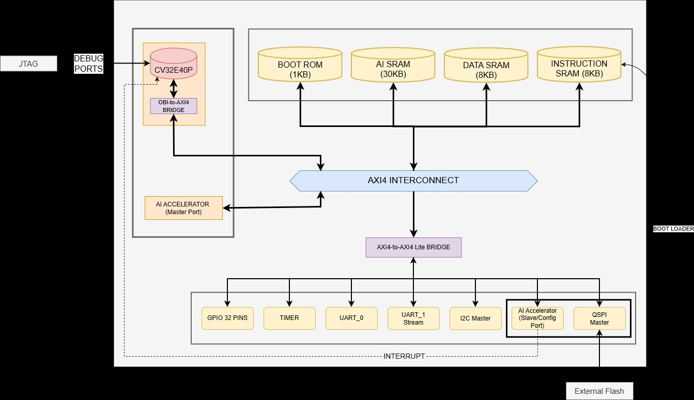

# BLogic MCU — TEKNOFEST 2026 Chip Design Competition

> **Team:** BLogic Mikroelektronik — Ostim Technical University  
> **Members:** Berk Muammer Kuzu, Berkin Demircan  
> **Application ID:** 772759

---

## Overview

BLogic MCU is a 32-bit RISC-V based System-on-Chip (SoC) designed for the TEKNOFEST 2026 Chip Design Competition, Microcontroller Design Category. The system features a CV32E40P processor core, AXI4/AXI4-Lite bus infrastructure, multiple peripherals, and a hardware AI accelerator targeting TFLite Micro Speech inference.

### Key Features

- **Processor:** CV32E40P RISC-V (RV32IMC, 4-stage pipeline)
- **Bus Architecture:** AXI4 Interconnect + AXI4-to-AXI4-Lite Bridge
- **Memory:** 8KB Instruction SRAM, 8KB Data SRAM, 30KB AI SRAM, 1KB Boot ROM
- **Peripherals:** UART, 32-pin GPIO, Timer (with IRQ), QSPI Master, I2C Master
- **AI Accelerator:** TFLite Micro Speech hardware accelerator (Tiny Conv architecture)
- **Target Frequency:** 50 MHz
- **FPGA Platform:** Digilent Genesys 2 (Xilinx Kintex-7 XC7K325T)

---

## System Architecture



### Memory Map

| Address Range | Module | Size |
|---|---|---|
| `0x0000_0000` | Boot ROM | 1 KB |
| `0x0001_0000` | Instruction SRAM | 8 KB |
| `0x0002_0000` | Data SRAM | 8 KB |
| `0x0003_0000` | AI SRAM | 30 KB |
| `0x4000_0000` | UART_0 | - |
| `0x4000_0100` | GPIO (32-pin) | - |
| `0x4000_0200` | Timer | - |
| `0x4000_0300` | UART_1 (Stream) | - |
| `0x4000_0400` | I2C Master | - |
| `0x4000_0500` | QSPI Master | - |
| `0x4000_0600` | AI Accelerator CSR | - |

---

## Repository Structure

```
blogic-mcu/
├── rtl/
│   ├── soc_top.sv                    # SoC top-level
│   ├── fpga_top.sv                   # FPGA wrapper (IBUFDS + MMCM)
│   ├── bus/
│   │   ├── obi_to_axi.sv            # OBI-to-AXI4 bridge
│   │   ├── soc_axi_interconnect.sv  # AXI4 crossbar
│   │   ├── axi4_to_axilite_bridge.sv
│   │   ├── periph_decoder.sv        # Peripheral address decoder
│   │   └── axi/                     # PULP AXI library
│   ├── core/
│   │   └── cv32e40p/                # CV32E40P RISC-V processor
│   ├── peripherals/
│   │   ├── uart_axil.sv             # UART with AXI-Lite interface
│   │   ├── gpio_axil.sv             # 32-pin GPIO
│   │   ├── timer_axil.sv            # Timer with IRQ
│   │   ├── qspi_master_axil.sv      # QSPI Master
│   │   └── verilog-uart/            # Alex Forencich UART core
│   └── ai_accelerator/
│       └── ai_accelerator.sv        # TFLite Micro Speech HW accelerator
├── sw/
│   ├── common/
│   │   ├── crt0.S                   # C runtime startup
│   │   └── link.ld                  # Linker script
│   ├── drivers/
│   │   └── blogic_mcu.h             # Peripheral register definitions
│   └── tests/
│       ├── uart_hello.c             # UART Hello World
│       ├── calc_test.c              # Calculator demo (UART RX/TX)
│       ├── gpio_led_test.c          # GPIO walking-1 test
│       ├── isa_compliance_test.c    # RV32IMC ISA compliance test
│       └── bare_led.S               # Minimal LED test (assembly)
├── verif/
│   ├── sim_main.cpp                 # Verilator testbench
│   └── spike/                       # Spike ISS lockstep comparison
├── fpga/
│   └── genesys2.xdc                 # Genesys 2 constraints
├── scripts/
│   ├── elf2hex.py                   # ELF to hex converter
│   └── run_regression.sh            # Automated regression suite
├── dtr_demo/                        # DTR demo testbench (DDK)
├── Makefile.verilator               # Verilator build system
└── README.md
```

---

## FPGA Prototyping

### Platform: Digilent Genesys 2 (XC7K325T)


### FPGA Resource Utilization

| Resource | Used | Available | Utilization |
|---|---|---|---|
| LUT | 5,149 | 203,800 | 2.53% |
| FF | 2,960 | 407,600 | 0.73% |
| BRAM36 | 4 | 445 | 0.90% |
| DSP48 | 5 | 840 | 0.60% |
| MMCM | 1 | 10 | 10% |

### Clock Architecture

The Genesys 2 provides a 200 MHz LVDS differential clock. The `fpga_top.sv` wrapper handles clock conversion:

```
200 MHz LVDS (AD12/AD11) → IBUFDS → MMCME2_BASE (÷4) → 50 MHz → BUFG → soc_top
```

MMCM locked signal gates the system reset — SoC stays in reset until the clock is stable.

### FPGA Demo: Calculator over UART


Interactive calculator running on the FPGA. User sends two digits via UART (115200 baud), the CPU computes the sum and sends the result back.

---

## Verification

### Regression Test Suite (4/4 PASS)


| # | Test | Status |
|---|---|---|
| 1 | UART TX 115200 Baud | PASS |
| 2 | UART TX 9600 Baud | PASS |
| 3 | Spike ISS Lockstep | PASS |
| 4 | QSPI Flash Addressing | PASS |

### ISA Compliance Test (31/31 PASS)


RV32IMC instruction set compliance verified with 31 directed tests covering arithmetic, logical, shift, comparison, branch, load/store, LUI/AUIPC, and multiply/divide operations.

### Verification Methodology

- **RTL Simulation:** Verilator (SystemVerilog)
- **Processor Verification:** Spike ISS lockstep trace comparison
- **Bus Protocol:** SystemVerilog Assertions (SVA) on AXI interfaces
- **Coverage:** Line, toggle, and branch coverage via Verilator
- **FPGA Validation:** Genesys 2 board tests (UART, GPIO, Timer)

---

```

### Features

- **Datapath:** INT8×INT8 MAC with INT32 accumulation, ReLU activation
- **Memory Interface:** Dedicated AXI4 Master port to 30KB AI SRAM
- **Configuration:** AXI4-Lite CSR registers (CTRL, STATUS, DATA_ADDR, OUT_ADDR)
- **Interrupt:** Hardware interrupt to CPU on inference completion
- **Classification:** silence / unknown / yes / no

---

## Build Instructions

### Prerequisites

- RISC-V GNU Toolchain (`riscv32-unknown-elf-gcc`)
- Verilator (for simulation)
- Spike ISS (for lockstep verification)
- Xilinx Vivado 2023.2 (for FPGA synthesis)

### Software Compilation

```bash
# Compile firmware
riscv32-unknown-elf-gcc -march=rv32imc -mabi=ilp32 -nostdlib -O2 \
    -T sw/common/link.ld sw/common/crt0.S sw/tests/uart_hello.c \
    -o build/test.elf

# Generate hex files
riscv32-unknown-elf-objcopy -O binary -j .text.init -j .text build/test.elf build/instr.bin
od -An -tx4 -v build/instr.bin | tr -s ' ' '\n' | grep -v '^$' > firmware.hex
```

### Verilator Simulation

```bash
make -f Makefile.verilator clean verilate
make -f Makefile.verilator sw FW_SRC=sw/tests/uart_hello.c
cp build/instr_mem.hex obj_dir/firmware.hex
cp build/data_mem.hex obj_dir/data_mem.hex
cd obj_dir && ./blogic_sim
```

### Regression Tests

```bash
./scripts/run_regression.sh
```

### FPGA Synthesis (Vivado)

```bash
# In Vivado Tcl Console:
source blogic_clean.tcl
launch_runs impl_1 -to_step write_bitstream -jobs 8
```

---

## Design Tools

| Tool | Purpose |
|---|---|
| SystemVerilog | RTL design |
| Verilator | RTL simulation |
| Spike ISS | Processor verification |
| RISC-V GNU Toolchain | Firmware compilation |
| Xilinx Vivado 2023.2 | FPGA synthesis & implementation |
| Python / TensorFlow Lite | AI model analysis & golden vectors |
| GitHub | Version control |

---

## References

1. RISC-V International, "riscv-arch-test" — https://github.com/riscv/riscv-arch-test
2. Google, "riscv-dv" — https://github.com/chipsalliance/riscv-dv
3. Arm Limited, "AMBA AXI Protocol Specification" — https://developer.arm.com/documentation/ihi0022/latest
4. R. David et al., "TensorFlow Lite Micro: Embedded ML on TinyML Systems," MLSys, 2021
5. P. Warden & D. Situnayake, "TinyML," O'Reilly Media, 2019
6. D. Harris & S. Harris, "Digital Design and Computer Architecture: RISC-V Edition," 2021

---

## License

This project is developed for the TEKNOFEST 2026 Chip Design Competition.  

---

*BLogic Mikroelektronik — Ostim Technical University — 2026*
