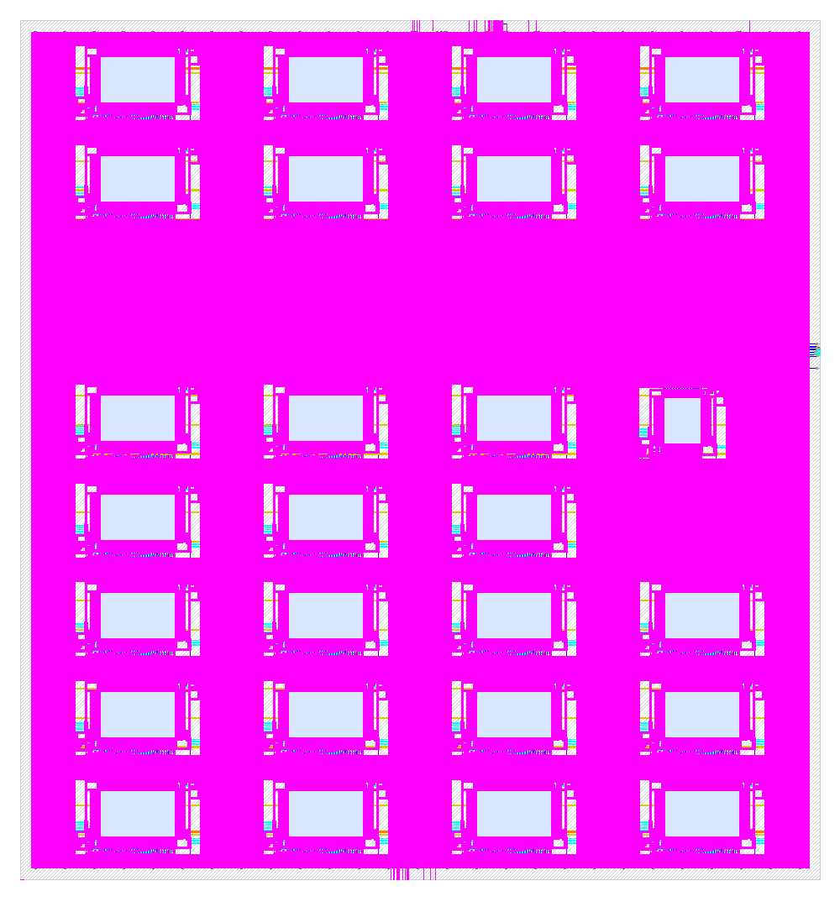
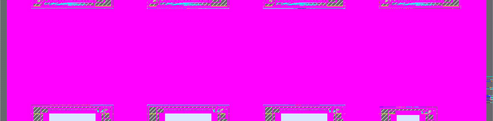
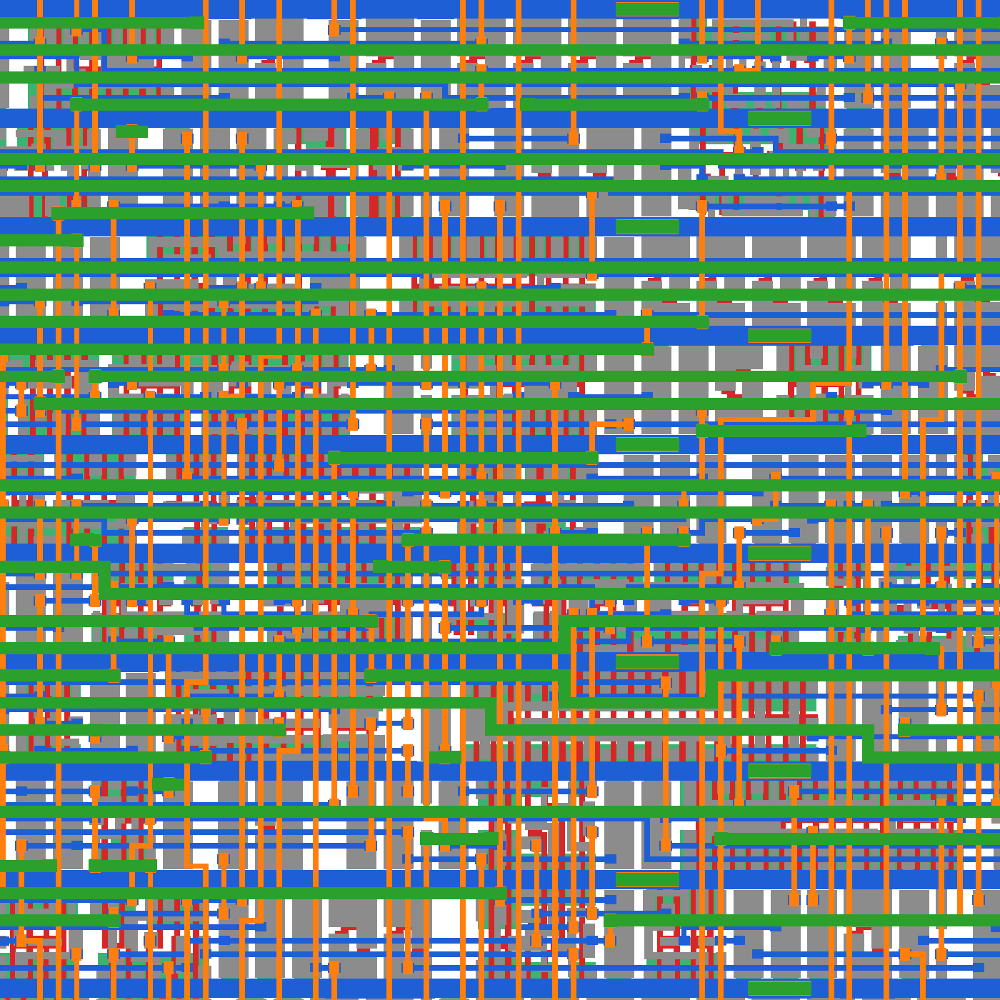
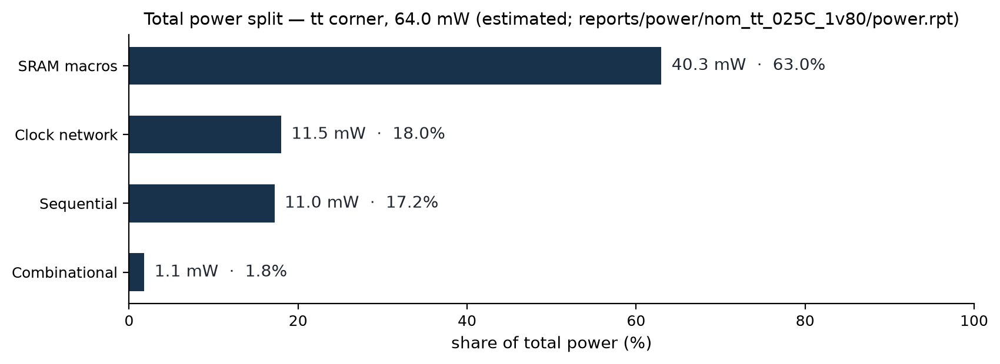
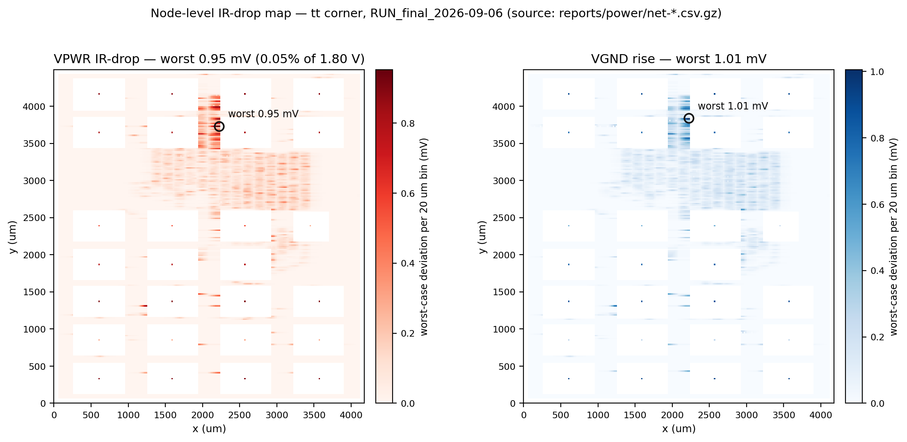
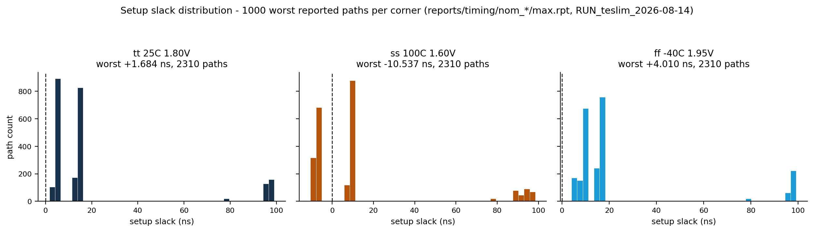

# BLogic MCU - ASIC Physical Design Flow

> **STATUS.** The headings match DDK "Final Istenen Ciktilar" (EN: Final
> Required Deliverables) sections 9.1-9.13 one-to-one. All sections are
> complete. **All signoff/timing/power/area results come from a SINGLE
> run: `RUN_teslim_2026-08-14`** (from scratch on a clean clone,
> `make pdk` + `make asic_run`, 3 h 28 min). Decision and experiment
> measurements taken DURING the design process (August 3-11;
> channel-widening, derate derivation, hold-repair trials) are marked
> separately with their own dates and document decision rationales, not
> final results. The full text of the DDK errata and written decisions
> dated August 17, 2026: `asic/DDK_KARARLARI.md`.

## 9.1 Design Summary

RISC-V (CV32E40P) based microcontroller SoC: AXI4/AXI4-Lite interconnect,
QSPI boot, UART/GPIO/Timer/I2C peripherals, and a TFLite Micro Speech
(2D convolution + fully connected layer) AI accelerator. Top-level module:
`asic_top`. Clock: `clk_i` (single clock domain), reset: `rst_ni`
(asynchronous assert, synchronous release). Inputs/outputs are macro pins
in the final LEF/DEF (Section 2).

**Top-level interface (16 ports, `rtl/asic/asic_top.sv`):**

| Port | Direction | Width | Function |
|---|---|---|---|
| `clk_i` / `rst_ni` | input | 1/1 | system clock / asynchronous reset (synchronous release) |
| `uart_rxd_i` / `uart_txd_o` | input/output | 1/1 | UART0 (console + BLG1 vector reception) |
| `uart1_rxd_i` / `uart1_txd_o` | input/output | 1/1 | UART1 (stream DMA input) |
| `gpio_in_i` / `gpio_out_o` | input/output | 32/32 | GPIO (inputs with 2FF synchronizers) |
| `qspi_sclk_o` `qspi_cs_no` `qspi_io_o` `qspi_io_i` `qspi_io_oe` | output x3, input | 1/1/4/4/4 | QSPI flash (boot + data) |
| `i2c_scl_o` `i2c_sda_oe_o` `i2c_sda_i` | output x2, input | 1/1/1 | I2C master (open-drain drive via `sda_oe`) |

**Target clock frequency and per-corner closure (final delivery run
`RUN_teslim_2026-08-14`):**

| Corner | Setup WS | Setup TNS | Closing frequency |
|---|---|---|---|
| tt_025C_1v80 | **+2.210 ns** | 0 | 50 MHz target CLOSES (fmax ~56.2 MHz) |
| ss_100C_1v60 | -9.083 ns | -10,639.4 ns | ~34.4 MHz (equivalent to 29.08 ns) |
| ff_n40C_1v95 | **+4.375 ns** | 0 | CLOSES (fmax ~64.0 MHz) |

Declared statement: target clock is **50 MHz**; it closes in the TT corner
with a +2.210 ns margin. In the SS (1.6 V / 100 C) corner 50 MHz does not
close — the closing frequency in this corner is **~34.4 MHz** and the
worst path is a pure standard-cell CPU path (it is NOT SRAM/derate
induced; it is a consequence of the corner physics). The STA reports for
all three corners are delivered in full (`reports/timing/`); details:
sections 9.9 and 9.11. `config.yaml` CLOCK_PERIOD = 20 ns, identical to
`design.sdc` create_clock.

## 9.2 Tool and Environment Information

See `asic/environment/versions.txt` (LibreLane 3.0.6 / `ba7193b`, Classic,
sky130A @ Open PDKs `8afc834`, sky130_fd_sc_hd, OpenRAM not used).
No tool/PDK/library differing from the reference release was USED.

## 9.3 Running the Flow

**Prerequisites:**

- Nix (with flakes support). Installation guide: LibreLane 3.0.6 official
  documentation, Nix-based installation page.
- Reference PDK (once, with network access): `cd asic && make pdk`
  (`ciel enable --pdk-family sky130 8afc8346a57fe1ab7934ba5a6056ea8b43078e71`).
- No environment variables required; all paths are repository-relative.

**Starting the Nix environment (optional, for manual work):**

    cd asic/environment
    nix develop --accept-flake-config     # librelane --version -> v3.0.6

**Mandatory re-run command (DDK Section 8):**

    cd asic && make asic_run

If `librelane` is not on PATH, the `make` targets automatically run the
commands inside the `environment/` flake environment
(`scripts/run_in_env.sh`); opening `nix develop` beforehand is not
required.

**Preparation of the `run/` directory:** `asic_run` first cleans the
`run/` subtree (only `.gitkeep` remains), then starts the LibreLane
Classic flow with `--force-run-dir run/RUN_<date-time>`; all temporary
step directories, intermediate databases and `final/` views are created
in this directory.

**Collecting reports and outputs:** when the flow finishes,
`scripts/collect_outputs.sh` copies the Section 5 reports into
`asic/reports/` and the Section 6 outputs into `asic/results/` following
the Table 8 layout, and produces `checksums/SHA256SUMS`. `asic_run`
invokes this script with `ALLOW_MISSING=1` (so that the reports at hand
are collected even if the flow finishes partially); **the hard gate of
the mandatory set is `make asic_verify`** — on any missing mandatory item
it exits with a non-zero code and prints the missing list.

**Additional targets:** `make asic_verify` (mandatory file presence +
metric summary), `make asic_clean` (cleans `run/`), `make check_filelist`
(config.yaml <-> filelist.f consistency).

**Approximate runtime and resources:** the verified environment is GCP
8 vCPU / 60 GB RAM; the final run took **3 hours 28 minutes** (clean
clone, excluding `make pdk`; VM: 8 vCPU / 60 GB RAM / NVMe).
On low-RAM machines the `magic-writelef` step may OOM; with 60 GB it runs
without issues. Disk: run directory (`run/`, deleted at delivery)
**~17 GB**; the collected report+output tree is ~4.2 GB before packaging
and ~0.8 GB after packaging.

## 9.4 RTL and Flow Inputs

- **File list:** `asic/filelist.f`. The canonical source is the
  `VERILOG_FILES` list inside `asic/config.yaml`; `filelist.f` is
  generated from it (`python3 scripts/check_filelist.py --generate`) and
  consistency is checked automatically at the start of every
  `make asic_run` (the automation requested by DDK page 20). 67 source
  files, in compilation order.
- **Path base:** all paths inside `filelist.f` are resolved **relative to
  the `asic/` directory** (`../rtl/...`) and the flow is started from
  this directory (`cd asic && make asic_run`). This is exactly in line
  with the DDK announcement *"Errata - filelist.f Path Resolution"* dated
  August 17, 2026; the announcement supersedes the Section 9.4 wording
  that said paths were to be defined relative to the repository root. The
  main RTL sources, verification/testbench and FPGA files are NOT COPIED
  under `asic/` (Section 3/4 rule).
- **Include directories:** `rtl/asic`, `rtl/core/cv32e40p/rtl/include`,
  `.../pulp_platform_common_cells/include`, `rtl/bus/axi/include`.
- **Compile defines (MANDATORY):** `SYNTHESIS`, `ASIC_SRAM_MACRO`
  (selects the SRAM macro branches), `BOOTROM_CONTENT` (embeds the boot
  ROM content). Both `config.yaml` and `filelist.f` carry the same
  defines.
- **Main configuration:** `asic/config.yaml` (LibreLane Classic).
- **Timing constraints:** `asic/constraints/design.sdc` (section 9.6).
- **Third-party RTL locations:** `rtl/core/cv32e40p/` (vendored:
  common_cells, including the fpnew package), `rtl/bus/axi/`, the UART
  core originating from `rtl/peripherals/verilog-uart`. Details and
  licenses: `asic/THIRD_PARTY.md`.
- **Top-level module:** `asic_top` — the RTL, `config.yaml` and this
  README all use the same name (Section 3.1 consistency requirement).

## 9.5 SRAM and Physical Macros

The design uses the two ready-made SKY130 SRAM macros approved in
Table 5. Source: reference PDK installation
(`libs.ref/sky130_sram_macros/`, Open PDKs `8afc834`); the views are
copied into the repository as required by Table 8. The physical and
logical views are NOT MODIFIED (Section 1.3).

| | `sky130_sram_2kbyte_1rw1r_32x512_8` | `sky130_sram_1kbyte_1rw1r_32x256_8` |
|---|---|---|
| Capacity / depth / width | 2 KiB / 512 / 32 bit | 1 KiB / 256 / 32 bit |
| Port structure / write | 1RW + 1R / 8-bit | 1RW + 1R / 8-bit |
| Instance paths | `i_soc.i_instr_sram.*.u_macro`, `i_soc.i_data_sram.*.u_macro`, `i_soc.i_ai_sram.*.u_macro` (bank arrays, `sram_macro_bank.sv`), `i_soc.i_ai_accel.u_input_mem`, `i_soc.i_ai_accel.u_conv_out.*.u_macro` (2 banks) | `i_soc.i_ai_accel.u_conv_w_mem` |
| GDSII | `macros/<name>/gds/<name>.gds` | same pattern |
| LEF | `macros/<name>/lef/<name>.lef` | same pattern |
| Liberty | `macros/<name>/lib/<name>_TT_1p8V_25C.lib` | same pattern |
| Verilog model | `macros/<name>/verilog/<name>.v` | same pattern |
| SPICE netlist | `macros/<name>/spice/` | same pattern |
| Power / ground pins | `vccd1` / `vssd1` | `vccd1` / `vssd1` |

The total macro count is verified from the synthesis statistics:
26 x 2KB + 1 x 1KB = **27 macros** (Aug 10 `config.yaml` synthesis run;
the final count is read from `reports/synthesis/stat.json`; in case of
conflict, stat is authoritative).

**PDN connection:** the macro `vccd1`/`vssd1` pins connect to the
design's `VPWR`/`VGND` nets (`config.yaml` `PDN_MACRO_CONNECTIONS`, a
separate rule for each of the three instance patterns; consistent with
section 9.7 and the macro LEF `PIN vccd1 ... USE POWER` definitions).
The fixed placement is given via `macro_placement.cfg`.

**Functional verification with the delivered Verilog models
(Section 1.3 requirement):** the mandatory SRAM macros are exercised in
functional verification with the **delivered OpenRAM Verilog models
themselves**, not only through the timing-equivalent behavioural model:
`make asic-sram-sim` (repository root) compiles the SoC with
`ASIC_SRAM_MACRO` plus the `macros/*/verilog` models and runs the full
QSPI boot flow — firmware, data and AI weights are written into the
macro-modelled ISRAM / DSRAM / AI SRAM over the bus (no `$readmemh`
preload exists on this path) and the firmware then executes entirely out
of the macro contents, printing "Hello World!" (`TEST SUCCESS`, all 10
AXI/AXI-Lite protocol checkers clean, zero model warnings). Verified
2026-09-01, **PASS**. The behavioural/macro equivalence argument (same
address-at-T / data-at-T+1 contract) remains documented in
`rtl/core/cv32e40p/rtl/axi_sram_wrapper.sv`.

**Full-stack GDS-equivalent simulation (`make asic-top-sim`):** goes one
step further than `asic-sram-sim` — the DUT is `asic_top` itself (the
actual top module of the GDS, which no other run simulated), compiled
with `ASIC_SRAM_MACRO` and the delivered OpenRAM models, booting from
QSPI flash and then running the AI accelerator's convolution layer.
The firmware (`sw/tests/ai_boot_macro_test.c`) checks the 1000-word
`conv_out` region in AI SRAM bit-exactly against the committed golden
vector (FNV-1a checksum of `conv_out_yes_real.hex`). A single-word
deviation fails the run, and the region can only be produced through the
accelerator's **internal** macros (input read from `u_input_mem`,
weights from `u_conv_w_mem`, results written to and drained back out of
`u_conv_out`), so this run exercises **all 27 macro instances**
functionally, including the three inside the accelerator that the boot
flow alone never touches. Verified 2026-09-01, **PASS**.

**Known issue FC-1 (found by `asic-top-sim`, declared — RTL and the
signed run were NOT modified):** in the `ASIC_SRAM_MACRO` branch, the
fully-connected stage issues a `conv_out` read in `ST_FC_FETCH_W` but
consumes `co_rdata` only after the AXI weight fetch completes, ≥3 cycles
later (`rtl/ai_accelerator/ai_accelerator.sv:799-812`). The delivered
OpenRAM functional model drives `dout1` to `X` on **every** rising edge
(`#(T_HOLD) dout1 = 32'bx;` — the model's own comment: *"Delay to hold
dout value after posedge. Value is arbitrary"*), so read data is valid
for exactly one consuming cycle; under the model, every FC MAC therefore
reads a clobbered `conv_out` value and the final argmax is wrong, while
the convolution layer itself (whose reads are re-issued every cycle, and
whose `WCONV` drain consumes at exactly T+1) is bit-exact. The behavioural
branch registers and *holds* read data, which is why 15/15 SoC tests,
4/4 golden-model scenarios and the 60/60 board demo (FPGA = behavioural
branch) all pass and masked this until the GDS-equivalent run. Isolation
evidence: the identical firmware and flash image **pass** on the
behavioural build and **fail identically** (same signature, same
timestamp) on `soc_top`+macros and on `asic_top`+macros — i.e. the issue
is the macro-branch read-hold contract, not `asic_top` wiring. Expected
silicon impact: the physical macro's `dout` is driven by the sense-amp
output stage and holds its last read value while `csb1` stays high (no
new sense operation occurs), so the fabricated chip is expected to
compute FC correctly; the delivered functional model simply forbids
relying on that hold, and under that model contract the FC output is
treated as unverified. Remediation for any future re-spin is a one-line
RTL change (keep re-issuing `co_re` with the same address during
`ST_FC_FETCH_W_WAIT`); per Section 1.3 and the signed-run consistency
rule, neither the RTL nor `RUN_teslim_2026-08-14` was touched — the
finding is declared here instead. Argmax correctness itself is proven on
the behavioural side (Section 9.11 / root README Section 11).

**Corner assumption (the most important item of this section):** both
macros are distributed in the PDK with only the `TT_1p8V_25C` Liberty;
there is NO model corresponding one-to-one to the SS/FF corners of
Table 4.

The DDK's written clarification dated August 17, 2026 made the expected
approach for this situation explicit: for ready-made SRAM macros, **the
provided `TT_1p8V_25C` Liberty model may be used as a documented
substitute in the SS and FF analyses as well**; the standard-cell
libraries continue to use their respective corner models, and **no
artificial scaling of the model is required**. Our delivery is within
this framework:

- Standard cells use their own corner Liberty in every analysis
  (`tt_025C_1v80` / `ss_100C_1v60` / `ff_n40C_1v95`).
- The SRAM macros are modeled with `TT_1p8V_25C` in all three analyses;
  **no modification whatsoever** has been made to the Liberty files.
- **In addition,** a measurement-based pessimistic `set_timing_derate` is
  applied to the SRAM paths: `sky130_fd_sc_hd__dfxtp_1` clk->Q median
  delay TT 0.4376 ns / SS 1.1642 ns, ratio **2.661x** (setup/late), and
  0.5x for hold/early. At signoff, the application is conditional on the
  corner name inside `constraints/design.sdc` (1.0 in TT). **In the PnR
  context** the corner name is undefined, so the derate is applied
  unconditionally (late 2.661 / early 0.5) — the 0-DRC physical result
  was produced under these pessimistic constraints. This is extra
  pessimism the DDK *does not require*; it does not modify the model, it
  only tightens the margin in analysis.
- It has also been measured that the derate does not determine the SS
  result: the worst setup path in the SS corner is a pure standard-cell
  CPU path that does not pass through SRAM (section 9.9/1), so even with
  the derate removed, 50 MHz does not close in SS.

Summary: the model gap is closed by the TT substitution accepted in the
DDK's August 17, 2026 decision; the 2.661x/0.5x derate is a
measurement-based safety margin added on top of it and is not mandatory.

## 9.6 Timing Constraints and Exceptions

Constraint file: `asic/constraints/design.sdc`. PnR and signoff use the
same file (`PNR_SDC_FILE` = `SIGNOFF_SDC_FILE`); per Section 6.2, a
single SDC delivery is sufficient.

- **Primary clock:** `clk` = `clk_i` port, period 20.000 ns (50 MHz).
- **Generated clock:** NONE. QSPI SCLK is generated from `clk` via a
  register output (at most clk/2 = 25 MHz), is not used as an internal
  clock, and all data paths are in the same clock domain; therefore no
  generated clock definition is required.
- **Clock domain relations / asynchronous clock groups:** the design has
  a SINGLE clock domain, there is no CDC path (the FPGA's MMCM is inside
  `fpga_top` and does not enter the ASIC). The related conditional
  definitions are not required.
- **Input/output delay:** for the synchronously constrained inputs
  (`i2c_sda_i`, `qspi_io_i*`) and ALL outputs: max 6.000 ns / min
  0.500 ns budget; the ports are given as an explicit list. Asynchronous
  inputs (`gpio_in_i*`, `uart*_rxd_i`) carry NO input_delay — they are
  declared as false paths below.
- **Design-wide rules:** `set_max_transition 1.000 ns`,
  `set_max_fanout 32` (design.sdc).
- **Clock uncertainty:** setup 0.500 ns, hold 0.100 ns.
  **Input transition:** clock transition 0.150 ns. **Output load:** 5 pF
  (pessimistic pad + trace budget). (Section 3.2 "recommended" items.)
- **False path (reset):** `set_false_path -from [get_ports rst_ni]`.
  Rationale: `rst_ni` is asynchronous assert / synchronous release;
  release synchronization is done at the chip top level (pad ring /
  reset controller), and this class of path carries no real data timing.
  Recovery/removal behavior is guaranteed by the release
  synchronization. No path that genuinely needs to be timed has been
  put under an exception.
- **False path (asynchronous inputs):** via `set_false_path -from`:
  `gpio_in_i*` (2FF synchronizer, `gpio_axil.sv:44-50`), `uart_rxd_i` and
  `uart1_rxd_i` (asynchronous serial lines, sampled via `rxd_reg`). These
  ports have no meaningful arrival window relative to `clk`; a
  synchronous input_delay produces spurious setup/hold violations
  (measured: the TT worst hold path was `gpio_in_i[0]`). These are not
  genuinely timed paths, so the Section 3.2 rule is preserved; see
  9.9/3. `i2c_sda_i` and `qspi_io_i*` REMAIN synchronously constrained.
- **Multicycle path:** NONE (all paths follow the single-cycle rule).
- **SRAM derate:** the 2.661x/0.5x `set_timing_derate` application of
  section 9.5 is not a timing exception; it is a non-mandatory,
  measurement-based safety margin added on top of the TT substitution
  accepted by the DDK (details and jury decision: section 9.5). It is
  declared here as well for transparency.

### 9.6.1 Constraint-rationale table (with design.sdc line references)

The table below gives EVERY constraint in `design.sdc`, its value and its
rationale at a glance. The SDC file itself is an input of the signed-off
run (`RUN_teslim_2026-08-14`) and has not been modified; this table is
documentation consolidation only.

| Constraint (design.sdc line) | Value | Rationale |
|---|---|---|
| `create_clock clk` (line 22) | 20.000 ns (50 MHz) | Primary and only clock; must equal config.yaml `CLOCK_PERIOD` (9.13 consistency rule). In the ASIC the clock comes from a pad; the FPGA's MMCM stays in `fpga_top`. |
| `set_clock_uncertainty -setup` (line 25) | 0.500 ns | Jitter + skew budget (Section 3.2 "recommended" item); a pessimistic constant since the source is not finalized. |
| `set_clock_uncertainty -hold` (line 26) | 0.100 ns | Hold side of the same budget; margin against the skew measured after CTS. |
| `set_clock_transition` (line 27) | 0.150 ns | Clock input transition time assumption (typical value in the absence of a pad model). |
| `set_false_path -from rst_ni` (line 41) | - | The design's ONLY exception. `rst_ni` is asynchronous assert / synchronous release; release synchronization at the chip top level. Carries no real data timing; the Section 3.2 rule "gercekte zamanlanan yol false path yapilamaz" (EN: a genuinely timed path must not be made a false path) is not violated. |
| `set_false_path -from` asynchronous inputs (lines 58-59) | `gpio_in_i*`, `uart_rxd_i`, `uart1_rxd_i` | 2FF synchronizer (`gpio_axil.sv:44-50`) and asynchronous serial lines; no meaningful arrival window relative to `clk`. A synchronous input_delay produces spurious violations (measured: the TT worst hold path had come out as `gpio_in_i[0]`). |
| `set_input_delay` (lines 67-68) | max 6.000 / min 0.500 ns | ~30% input budget for the inputs that remain synchronous (`i2c_sda_i`, `qspi_io_i*`); ports are given as an explicit list for tool portability. |
| `set_output_delay` (lines 69-70) | max 6.000 / min 0.500 ns | ~30% output budget for ALL outputs; sufficient margin for the low-speed peripherals (UART/I2C/QSPI/GPIO). |
| `set_load` (line 74) | 5.0 pF | Pessimistic load for pad + external trace; to be refined once the pad model is finalized. |
| `set_max_transition` (line 79) | 1.000 ns | Design-wide signal integrity rule (Section 3.2). |
| `set_max_fanout` (line 80) | 32 | Design-wide fanout limit; synthesis/PnR buffer accordingly. |
| SRAM corner-conditional derate (lines 124-146) | SS: late 2.661 / FF: early 0.500 / TT: 1.0 | The macro Liberty is TT-only; for SS/FF analysis, a proxy coefficient MEASURED from the `dfxtp_1` clk->Q TT/SS ratio (not a waiver but a measurement correction; DDK decision 3 + section 9.5). 1.0 in TT: the TT lib is the exactly correct model. In the PnR context the unconditional pessimistic legacy behavior is retained (freeze discipline). |
| Generated clock | NONE | QSPI SCLK is generated from `clk` via a register output (<= clk/2), not used as an internal clock; all data paths are in one clock domain (the "ilgili yapi varsa zorunlu" (EN: mandatory only if the relevant structure exists) condition is not triggered). |
| Clock groups / CDC | NONE | Single clock domain; no CDC path (MMCM outside `asic_top`). The conditional Section 3.2 items are not triggered. |
| Multicycle path | NONE | All paths are closed under the single-cycle rule; no exception is defined. |

## 9.7 Physical Design Configuration

Measurement source: **`RUN_teslim_2026-08-14`** (final delivery run).

- **Floorplan (absolute):** `DIE_AREA` 4180 x 4490 um = **18.77 mm2**,
  `CORE_AREA` (60,60)-(4120,4430) = 17.74 mm2; `FP_SIZING: absolute`.
- **Aspect ratio:** 4180/4490 = **0.931** (approximately square). Since
  `FP_SIZING: absolute` is used, the `FP_ASPECT_RATIO` parameter is not
  in effect; the ratio derives from the width of the 4-column macro array
  (4 x 683.1 um macros + channels) and the total height of the 7-row
  arrangement + the 834.2 um central logic corridor
  (macro_placement.cfg). The channel-widening decision was taken by
  measurement: with macro column channel 209 -> 300 um and inter-row
  spacing 60 -> 100 um, route DRC went 1348 -> 0 and convergence
  195 -> 10 iterations (cost: die +12.2%). The experiment chain is in the
  `config.yaml` comments.
- **Utilization (measured):** instance total 49.9% (including macros);
  std-cell 12.3%. Target `PL_TARGET_DENSITY_PCT: 35`,
  `PL_MAX_DISPLACEMENT_Y: 300`.
- **Macro placement:** `macro_placement.cfg` — 27 SRAM macros, manual
  placement in 4 columns x bottom/top bands (coordinates in the file,
  rationale in 9.5).
- **Pin placement:** LibreLane default automatic pin placer; no custom
  pin-order file was used.
- **Power/ground nets:** top level `VPWR`/`VGND`; SRAM macro pins
  `vccd1`/`vssd1`, mapped via `PDN_MACRO_CONNECTIONS` (3 patterns,
  27 macros). `PDN_MULTILAYER: true` (met4 vertical + met5 horizontal
  straps). PDN verification: `reports/pdn/{VPWR,VGND}-grid-errors.rpt`
  both EMPTY (0 errors).
- **Routing:** all layers (li1-met5) open to the router; 81
  `ROUTING_OBSTRUCTIONS` boxes over the macros (met1/met2/met5 x
  27 macros, rationale in the config comment: met5 OBS missing in the
  SRAM LEF). `GRT_ALLOW_CONGESTION: true`, `GRT_OVERFLOW_ITERS: 25`.
  Measured result: route DRC 0, total wire 6.13 m, 740,817 vias.
- **CTS:** LibreLane default CTS configuration; measured clock tree
  1,785 clock buffers + 280 clock inverters. Post-route hold repair
  `RUN_POST_GRT_RESIZER_TIMING: true` (63 -> 10 measurement, Aug 11
  configuration experiment, in-PnR tt check; the FINAL signoff violation
  counts are in the 9.11 table: tt 48 / ss 0 / ff 112, mechanism in
  9.9/2).
- **Area/frequency trade-off (DDK Aug 17 decision):** die/core area
  carries no separate scoring weight; timing and signoff cleanliness are
  what matters. The +12.2% area cost of the channel-widening is
  deliberate within this framework, in exchange for 0 DRC
  (`asic/DDK_KARARLARI.md`).
- **Auxiliary files:** `macro_placement.cfg`, `constraints/design.sdc`,
  `scripts/` (filelist check, output collection, environment wrapper).

asic_top final layout (RUN_teslim_2026-08-14)

&nbsp;

Left: logic corridor between the macro columns. Right: SRAM macro edge — power ring and pin connections.

25 um window — individual devices of the final GDS (KLayout render).

## 9.8 Lint Results and Exceptions

Measurement source: the flow's Verilator lint step (Verilator 5.044),
`reports/lint/verilator_lint.log`, `RUN_teslim_2026-08-14`.

- **Errors: 0. Warnings: 932. NO waiver file was USED** — no warning was
  suppressed, the log is delivered in its raw form
  (`reports/lint/waivers/` empty, deliberately).
- **No inferred latches:** LATCH-class warnings 0.
- Warning distribution and assessment:
  - `TIMESCALEMOD` 452: mix of files with/without a timescale directive;
    resolved on the simulation side with a compiler flag, does not affect
    the synthesis result.
  - `UNUSEDSIGNAL` 230 / `UNUSEDPARAM` 62: mostly unused fields of
    interface bundles and configuration constants (example: unused AXI
    side signals). Automatically pruned in synthesis.
  - `WIDTHEXPAND` 63 / `WIDTHTRUNC` 31: deliberate width conversions;
    the critical arithmetic paths were verified by regression (root
    `README.md` verification section: make test-all 16/16, coverage
    measurements).
  - `PINCONNECTEMPTY` 28: deliberately left-open output pins.
  - The rest (`PROCASSINIT` 15, `BLKSEQ` 13, `VARHIDDEN` 9,
    `CASEINCOMPLETE` 8, `ASCRANGE` 7, `GENUNNAMED` 5, `UNDRIVEN` 4,
    `PINMISSING` 3, `UNOPTFLAT` 2): style/informational level; functional
    correctness was demonstrated with 16/16 test-all + 46/46 arch-test
    signature equality.

## 9.9 Known Issues and Accepted Exceptions

Known errors/warnings/violations; tool or flow issues that could affect
the results; team assessment.

Known and accepted limits (final run `RUN_teslim_2026-08-14`):

1. **50 MHz does not close in the SS corner.** In the `ss_100C_1v60`
   (1.6 V / 100 C) corner, setup WS is -9.083 ns (2,521 paths); the worst
   path is a pure standard-cell CPU path (inside `id_stage`; NO
   SRAM/derate effect). This is a consequence of the corner physics;
   since RTL changes are out of scope, a dual declaration was made
   (section 9.1): TT 50 MHz / SS ~34.4 MHz. The reports for all three
   corners are complete.
2. **Remaining hold violations: tt -0.323 ns (48 paths), ff -0.382 ns
   (112 paths); NO hold violation in the ss corner (+0.227 ns).** Of the
   112 paths in the FF corner, 111 are at SRAM macro data inputs
   (distribution in 9.9/7: `u_input_mem` 32, `i_ai_sram` 34,
   `u_conv_out` 27, `u_conv_w_mem` 18) and 1 is a CPU control path
   (`id_stage.controller`); the root cause is macro clock skew (CTS
   arrives at the macro clock pins ~1 ns late). Margin-based repair was
   MEASURED and rejected (0.3 margin: hold unchanged, SS setup collapsed
   to -10.3; 0.5: tool crash). The FF figure is the result of the
   deliberately pessimistic early-0.5 derate model. The delivery is at
   macro level (Section 2); the limit is declared with its mechanism.
3. **`i2c_sda_i` is sampled without a synchronizer** (RTL review note);
   it is kept synchronously constrained in the SDC. `gpio_in_i` (2FF
   synchronizer) and `uart*_rxd_i` are false paths as asynchronous inputs
   (section 9.6).
4. **Magic DRC 9,201 markers — all from a SINGLE rule: `nwell.4`. The
   root cause was MEASURED and closed: geometric tap deficiency was ruled
   out; this is an accepted exception attributed to Magic's connectivity
   resolution limit.**
   Measured facts (`reports/drc/drc.magic.rpt`):
   - **Single rule type:** "All nwells must contain metal-connected N+
     taps" (`nwell.4`). No other Magic rule is violated.
   - Magic's own note in its report: *"Should be divided by 3 or 4"* —
     i.e. the distinct violation count is on the order of
     **~2,300-3,100**.
   - Marker geometry: horizontal strips spanning standard-cell rows
     (median marker height 2.79 um; sky130_fd_sc_hd row height 2.72 um —
     `scripts/tap_analiz.py` uses 2.72 in its row grouping), at 23
     distinct X positions; within the standard-cell area.
   - **There are zero markers INSIDE the SRAM macro footprints** (checked
     against the 27 macro boxes). 2,142 of the markers are in the central
     logic corridor, which has no macros around it. Therefore the finding
     **cannot be attributed to the vendor macro**; the phrase
     "vendor macro noise" present in earlier revisions was removed
     because it was not supported by measurement.
   - On the same GDS, **KLayout DRC returns 0 across all 257 rules**;
     furthermore LVS is 0 and XOR is 0, i.e. netlist equivalence and the
     geometry of the two flows are verified.
   - **ROOT CAUSE MEASURED — NOT missing taps.** The positions of the
     135,957 tap cells (1,605 rows) were extracted from the final DEF and
     the nearest-tap distance from each marker's center was computed:

     | Measurement | Result |
     |---|---|
     | Nearest tap distance (min / median / max) | 0.14 / 3.11 / **6.13 um** |
     | Markers with a tap within 10 um | **9,201 / 9,201 (100%)** |
     | Markers with no tap in the same or a neighboring row | **0** |

     sky130's tap distance requirement is on the order of ~15 um; our
     worst case is 6.13 um, and this value is consistent with
     LibreLane's default tapcell step. That is, tap cells are present in
     every flagged region and the distance rule is satisfied with ample
     margin — **the markers do not indicate missing taps and there is no
     real latch-up risk.**
   - **Assessment:** `nwell.4` is a connectivity-aware rule; it requires
     not only the presence of a tap but also that it be metal-connected.
     Given that geometric deficiency was ruled out by measurement, that
     KLayout returns 0 across 257 rules on the same GDS, and that LVS
     verified netlist equivalence with 0 errors (including VPWR/VGND
     connections), the markers point not to a design defect but to
     Magic's connectivity-resolution limit from GDS. It is therefore
     declared an **accepted exception**.
   - Reproduction: `python3 scripts/tap_analiz.py results/def/<design>.def
     reports/drc/drc.magic.rpt` (repeats the measurement).
   - Note: the Magic steps **do complete** in the flow; the report has
     been produced and delivered. The rationale for
     `MAGIC_CAPTURE_ERRORS=false` is in the comment inside `config.yaml`.
5. LVS = 0 (real GDS extraction, 1,795,705 elements). The previous
   197/205 differences came from the diode placement of the old
   narrow-channel floorplan; they are fully closed in the wide-channel
   final floorplan.
6. Some timing fields of `metrics.json` may not match the corner report
   of the same run one-to-one (observed in the Aug 11 verification run:
   the `timing__setup__ws` metric showed -91.57 while the ss `max.rpt`
   gave -23.71; the reason for the difference is that the metric field
   may carry an intermediate-step value). For this reason, **the
   `reports/timing/<corner>/` report files are authoritative** in our
   declarations; the 9.1/9.11 figures were read from the final run's
   report files and are also consistent with
   `reports/signoff/metrics.json`.

7. **QSPI output-enable (`io_oe`) not registered — deliberate decision.**
   `qspi_master_axil.sv` registers the data output on the falling edge as
   required by mode 0 (`tx_io_q`), but `io_oe` is combinational and is
   released simultaneously with the sampling edge on the LAST bit of an
   output phase; i.e. the RTL hold margin of that single bit is zero. Our
   reasons for choosing not to register `io_oe` as well:
   - The effect is **not systematic**, it is only the last-bit edge
     margin; every other bit of every transfer gets half a period of
     setup + half a period of hold.
   - **Measured:** QSPI flash-boot works on the board and there is zero
     deviation in the 60/60 random classification sweep
     (`sw/ai_model/kart_sweep_raporu_n60.txt`); `qspi-modes` 6/6 and
     `qspi-err` 25/25 are green in simulation.
   - On the real chip, the pad's **output-disable delay** moves the
     effective hold margin positive; the zero margin in RTL is a
     pessimistic upper bound.
   - Registering `io_oe` changes the **bus turnaround** timing in the
     x2/x4 modes; that is not a fresh-regression risk to take on freeze
     day (the same day, registering `tx_io_q` had produced the WP#/HOLD#
     tieoff regression — see commit `285698b`).
   **Follow-up RESULT (final run, closed):** NONE of the 112 hold
   violations in the `ff_n40C_1v95` corner is `qspi_io_o`
   (`grep -c qspi_io_o reports/timing/nom_ff_n40C_1v95/violator_list.rpt`
   -> 0). Of the 112 violations, 111 are SRAM macro data inputs
   (`u_input_mem` 32, `i_ai_sram` 34, `u_conv_out` 27, `u_conv_w_mem` 18;
   +1 CPU control path) and the mechanism is the macro falling-edge
   interface explained in 9.9/2.
   The decision is validated: leaving `io_oe` combinational produced no
   measurable hold risk in the fast corner.

8. **Matters accepted in advance by the DDK's written decisions**
   (full texts: `asic/DDK_KARARLARI.md`):
   - *Errata (Aug 17, 2026):* `filelist.f` paths are resolved relative to
     the `asic/` directory — our delivery is already on this base
     (section 9.4).
   - *Area weighting (Aug 17, 2026):* die/core area carries no separate
     scoring weight; the framework for our channel-widening trade-off
     (section 9.7).
   - *SRAM Liberty substitution (Aug 17, 2026):* the TT_1p8V_25C model is
     accepted as a documented substitute in the SS/FF analyses; no
     scaling is required (section 9.5).

## 9.10 Power and IR-Drop Analysis

Measurement source: **`RUN_teslim_2026-08-14`** (final delivery run).

- **Conditions:** clock 50 MHz (`create_clock` 20 ns); supply 1.80 V
  nominal; power reports at the three signoff corners (Table 4).
- **NO switching activity input** (no VCD/SAIF provided); the OpenSTA
  default switching activity was used. Per Section 5.7 the results below
  are marked as **ESTIMATED**.
- **Total power (estimated):**

  | Corner | Supply | Total |
  |---|---|---|
  | tt_025C_1v80 | 1.80 V | **112.1 mW** |
  | ss_100C_1v60 | 1.60 V | 104.4 mW |
  | ff_n40C_1v95 | 1.95 V | 118.3 mW |

  TT breakdown (by group, from `nom_tt_025C_1v80/power.rpt`): SRAM
  macros 66.2%; clock network 16.8%; sequential 16.1%; combinational
  0.9%. The dominant item of the power budget is memory — the expected
  picture for 27 macros. The single declared figure is the TT corner
  (**112.1 mW**); the 9.11 table carries the same value.

Total-power split, tt corner — rendered from the delivered report by <code>scripts/power_breakdown.py</code>.

- **IR-drop (OpenROAD PSM, tt corner):** VPWR worst drop **1.54 mV**,
  VGND worst rise **1.57 mV** -> **0.09%** of the supply voltage (far
  below the typical 5% limit). PSM verification for both nets:
  "All shapes connected". Report: `reports/power/irdrop.rpt`.
- **Node-level voltage dump (5.7):** `reports/power/net-VPWR.csv` and
  `net-VGND.csv` are ~137 MB in raw form, so per GitHub's 100 MB
  single-file limit they are stored in the repository **gzipped**
  (`net-VPWR.csv.gz`, `net-VGND.csv.gz`). Decompression:
  `gunzip -k <name>.gz`; integrity: `sha256sum -c <name>.sha256`
  (digests in the same directory). Details:
  `results/BUYUK_DOSYALAR.md`. These files are NOT inputs to the flow
  (they are reports produced after signoff); the flow does not depend on
  the compressed files, and `make asic_run` runs without decompressing
  them.
- **IR-drop heatmap (visualization of the dumps):** worst-case deviation
  per 20 um bin, rendered directly from the compressed dumps by
  `scripts/irdrop_heatmap.py`. Cross-checks: 2,588,379 nodes per net
  (= the instance count in 9.11) and worst values identical to
  `irdrop.rpt` (1.54 mV / 1.57 mV). The die is essentially flat; the
  white rectangles are the SRAM macro footprints (no standard-cell
  nodes inside), and the worst bins sit in the logic corridor near
  (1951, 1470) um.

Worst-case IR-drop per 20 um bin, tt corner — VPWR drop (left) and VGND rise (right); the full color scale is 1.6 mV, i.e. 0.09% of the 1.80 V supply.

- **No custom voltage source location file was used** (default pad/strap
  supply).

## 9.11 Signoff Results Summary

Source run: **`RUN_teslim_2026-08-14`** (final delivery run; produced
from scratch on a clean clone with `make pdk` + `make asic_run`).
Corner set: tt_025C_1v80 / ss_100C_1v60 / ff_n40C_1v95.

| Item | Result |
|---|---|
| Route (TritonRoute) DRC | **0** |
| KLayout DRC | **0** (257 rules, all zero) |
| Magic DRC | 9,201 — all from a single rule (`nwell.4`); root cause measured, accepted exception (9.9/4) |
| Netgen LVS (real GDS extraction) | **0 errors / 0 device differences** |
| XOR (Magic vs KLayout GDS) | **0** |
| Antenna violations | **0 nets / 0 pins** |
| Disconnected pins | 880 (classification: note below the table) |
| PDN grid errors (VPWR / VGND) | **0 / 0** (report files empty) |
| Setup WS (tt / ss / ff) | **+2.210** / -9.083 / **+4.375** ns |
| Setup TNS (tt / ss / ff) | 0 / -10,639.4 / 0 ns |
| Setup violation count (tt / ss / ff) | 0 / 2,521 / 0 |
| Hold WS (tt / ss / ff) | -0.323 / **+0.227** / -0.382 ns (section 9.9/2) |
| Hold TNS (tt / ss / ff) | -7.00 / 0 / -14.68 ns |
| Hold violation count (tt / ss / ff) | 48 / 0 / 112 |
| Max cap violation count (tt / ss / ff) | 266 / 662 / 219 |
| Max slew violation count (tt / ss / ff) | 6,848 / 30,668 / 3,396 |
| Power (total, estimated, tt corner) | **112.1 mW** |
| IR-drop (tt) | 0.09% (worst 1.57 mV) |
| Die area | 18.77 mm2 (4180 x 4490 um) |
| Instance count / std cells | 2,588,379 / 296,010 |
| Transistor count (MOS gates, measured on the delivered GDS) | **12,683,650** (`scripts/count_transistors.py`: flat poly-over-diffusion count, SRAM bitcells and decap/fill devices included) |
| Utilization | 49.87% |

Setup-slack distribution of the 1000 worst reported paths per corner (<code>scripts/timing_histogram.py</code>). TT closes with margin; the negative ss population is the declared ~34.4 MHz limitation (9.9/1).

**Table notes:**

- **Disconnected pins (880):** breakdown in
  `reports/signoff/full_disconnected_pins_table.txt`, total in
  `metrics.json` -> `design__disconnected_pin__count = 880`. The source
  is two design features: (a) in all 27 SRAM macros, Port0 is used only
  for writes and all reads go through Port1; therefore `dout0[31:0]` is
  deliberately left open in each macro (`rtl/asic/sram_macro_bank.sv`,
  `rtl/ai_accelerator/ai_accelerator.sv`) -> 27 x 32 = 864 pins. (b) The
  top-level `gpio_in_i` port is defined as 32 bits; per specification
  Annex-2 (EK-2), GPIO uses 16 inputs and the upper half
  (`gpio_in_i[31:16]`) carries no load -> 16 pins. Total 864 + 16 = 880.
  There is no discontinuity on the power pins (consistent with LVS = 0
  and XOR = 0).
- **Max cap / max slew violation counts:** these are columns of
  `reports/timing/summary.rpt`; they count the endpoints exceeding the
  library characterization limits (max cap / max slew). The violations
  are concentrated predominantly in the SS (1.6 V / 100 C) corner; they
  stem from the same corner conditions as the SS closure statement in
  9.1. Setup/hold closure is achieved in the TT corner (WS +2.210 ns,
  TNS 0).

## 9.12 Report and Output Locations

- **Run tag:** **`RUN_teslim_2026-08-14`** (produced from scratch on a
  clean clone; the chain was verified end to end:
  `make asic_run` -> collection -> `make asic_verify` OK).
- **Primary GDSII:** `results/gds/asic_top.gds` — the **Magic** streamout
  output is authoritative. The KLayout streamout
  (`asic_top_klayout.gds`) is delivered alongside for comparison; the
  **XOR difference between the two outputs is 0** (9.11).
- **Use of `run/`:** `make asic_run` cleans the workspace, runs the flow
  under `run/<TAG>/`, then `scripts/collect_outputs.sh` copies to the
  permanent locations below (details 9.3). Integrity:
  `checksums/SHA256SUMS` — SHA-256 digests of the mandatory outputs
  under results/, produced by `collect_outputs.sh` (DDK 6.3 scope).
  Report and result files exceeding GitHub's 100 MB limit are packaged
  before commit with `scripts/guard_large_files.sh`; if any are created,
  the details are in `results/BUYUK_DOSYALAR.md`.
- **Section 5 reports -> `asic/reports/`:**

  | DDK 5.x | Location |
  |---|---|
  | 5.1 General (log/metrics/versions) | `reports/general/` (`flow.log`, `metrics.json`, `versions.txt`, `resolved.json`) |
  | 5.2 Lint | `reports/lint/verilator_lint.log` (no waivers, 9.8) |
  | 5.3 Synthesis | `reports/synthesis/` (`stat.rpt`, `chk.rpt`, `latch.rpt`) |
  | 5.4 STA (three corners) | `reports/timing/nom_<corner>/` (wns/tns/ws, min/max, `checks.rpt`, `skew.*`, `violator_list.rpt`) |
  | 5.5 Placement/CTS/Routing | `reports/routing/` (`asic_top.drc`, `wire_lengths.csv`); placement/CTS measurements inside `reports/general/metrics.json` (utilization, clock tree cell counts, skew) |
  | 5.6 PDN | `reports/pdn/` (grid error reports; both empty) |
  | 5.7 Power + IR-drop | `reports/power/` (per corner `power.rpt`, `irdrop.rpt`) |
  | 5.8 DRC | `reports/drc/` (KLayout json/lyrdb + Magic rpt/lyrdb) |
  | 5.9 LVS | `reports/lvs/lvs.netgen.rpt` (+ json) |
  | 5.10 Antenna | `reports/antenna/` |
  | Signoff summary | `reports/signoff/` (`metrics.json`, `manufacturability.rpt`) |

- **Section 6 outputs -> `asic/results/`:** `gds/` (primary +
  comparison), `def/`, `lef/`, `odb/`, `netlist/` (synthesis / PnR /
  powered), `sdc/`, `sdf/`, `spef/`, `lib/`, `mag/`, `spice/`,
  `config/resolved.json`, `metrics/`, `images/asic_top.png` (Table 8
  layout).
- The single source of the collection map is
  `scripts/collect_outputs.sh`; verification is `make asic_verify`
  (`scripts/verify_outputs.sh`).

## 9.13 Third-Party Components and Licenses

See `asic/THIRD_PARTY.md` and `asic/licenses/`.

---

**Consistency rule (section 9.13):** no conflicting information may exist
among `asic/README.md`, `asic/environment/versions.txt`,
`asic/config.yaml`, the delivered reports and the final outputs.

<!-- English translation of README.md, 2026-09-01; numeric values converted from Turkish to English number format. -->
